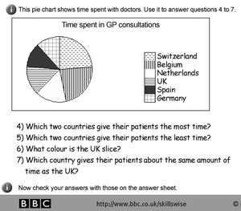
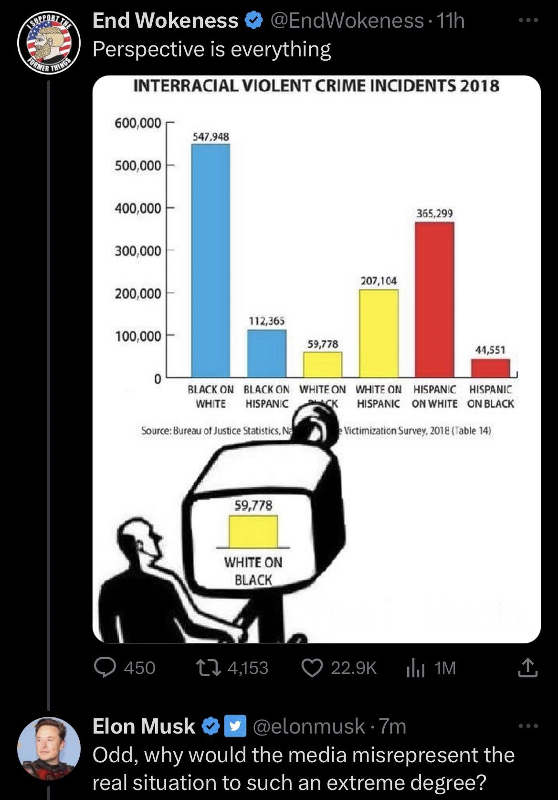

```{r xaringan-themer, include=FALSE, warning=FALSE}
library(xaringanthemer)
style_mono_accent(base_color = "#B31B1B"
                  ,text_font_size = "1.4rem"
                  )
```

```{r setup, include=FALSE}
library(knitr)
knitr::opts_chunk$set(warning = FALSE, message = FALSE, 
                      fig.retina = 3, fig.align = "center")
```

```{r packages-data, include=FALSE}
library(tidyverse)
```

```{r xaringanExtra, echo=FALSE}
xaringanExtra::use_xaringan_extra(c("tile_view"))
```

class: center middle main-title section-title-4

# Welcome to AEM 2850 / 5850!

.class-info[

**Week 1**

AEM 2850 / 5850 : R for Business Analytics<br>
Cornell Dyson<br>
Spring 2024

Acknowledgements:
[Andrew Heiss](https://datavizm20.classes.andrewheiss.com), 
[Claus Wilke](https://wilkelab.org/SDS375/), 
[Grant McDermott](https://github.com/uo-ec607/lectures)

]

---

name: outline

# Plan for today

[Why take R for Business Analytics?](#r-business-analytics)

[Summary of key class details](#class-details)

[Teaser example](#teaser)

[Just show me the data!](#show-me-the-data)

[What makes a great visualization?](#beautiful-visualizations)

[Basic base R (time permitting)](#outline-base-r)


---

layout: false
name: r-business-analytics
class: center middle section-title section-title-2 animated fadeIn

# Why take R for Business Analytics?

---

# Why take R for Business Analytics?

<br>

.center[
</img>
]


---

# Why R for Business Analytics?

</img>

--

</img>


???

The R logo [is distributed](https://www.r-project.org/logo/) under the terms of the Creative Commons Attribution-ShareAlike 4.0 International license ([CC-BY-SA 4.0](https://creativecommons.org/licenses/by-sa/4.0/)).

RStudio tidyverse hex stickers [are distributed](https://github.com/rstudio/hex-stickers) under [CC0.](https://github.com/rstudio/hex-stickers/blob/master/LICENSE.md)

Tidyverse image came from RStudio education blog post [here](https://education.rstudio.com/blog/2020/07/teaching-the-tidyverse-in-2020-part-1-getting-started/)

--

</img>

---

# Why R for Data Visualization?

.pull-left[

<figure>
  
</figure>

]

--

.pull-right[

&nbsp;

<figure>
  
</figure>

]

---


# Why R for Data Visualization?

.center[
<figure>
  
</figure>
]


---

# Why R for Life?

Practical tool that could help you get a job and then do said job

--

.pull-left.center[

<figure>
  
</figure>

.small[[Airbnb, ggplot, and rmarkdown](https://peerj.com/preprints/3182/)]

]

.pull-right.center[

&nbsp;

<figure>
  
</figure>

<figure>
  
</figure>

.small[[The UK's reproducible analysis pipeline](https://dataingovernment.blog.gov.uk/2017/03/27/reproducible-analytical-pipeline/)]

]

???

https://peerj.com/preprints/3182.pdf + https://gdsdata.blog.gov.uk/2017/03/27/reproducible-analytical-pipeline/ 


---

# Why R for Life?

Practical tool that could help you get a job and then do said job

.center[

<figure>
  
</figure>

**Or start making money now!**

]

---

# Why R for Life?

Practical tool that could help you get a job and then do said job

Open source

--

Huge community of users and package developers

--

Here are a few examples of other things you can do using R:
- Make slides like the ones you're looking at right now
- Build websites like [our course site](https://aem2850.toddgerarden.com)
- Write books like [R for Data Science](https://r4ds.hadley.nz)
- Make interactive web apps

--

Skills from this course can also be used for other programming languages


---

layout: false
name: class-details
class: center middle section-title section-title-7 animated fadeIn

# Class details

---

layout: true
class: title title-7

---

# Preface

1. Your success in this class is important to me

2. This course is a work in progress

3. Get the semester off to a good start: **[read the syllabus](https://www.cameo.com/v/5f2b392a0299b100202e624a?utm_campaign=video_share_to_copy)**!


---

# A bit about me

.pull-left[.center[
<figure>
  
</figure>
]]

.pull-right[
- Prof. Todd Gerarden

- Economist

- Came to Cornell in 2018

- Interested in:
  - Energy economics
  - Climate tech
  - Working with data
]

---

# A bit about our TAs

### Graduate TA

Victor Simoes Dornelas

### Undergraduate TAs

Jonathan Gotian

**We will post office hours and contact info on the course site and canvas**


---

# A bit about you

Do you have any programming experience? (None is required or even expected!)

--

What programming language(s) have you used before?
- R
- Python
- SQL
- VBA
- MATLAB
- Stata
- Other

--

First course assignment will be to fill out a survey to tell us more about you

---

# Course objectives

1. Develop basic proficiency in `R` programming
2. Understand data structures and manipulation
3. Describe effective techniques for data visualization and communication
4. Construct effective data visualizations
5. Utilize course concepts and tools for business applications


---

# Plan for the semester

.pull-left[
#### Programming Foundations

`R`, `RStudio`, `Quarto`, the `tidyverse`
]

.pull-right[
<figure>
  
</figure>
]

--

.pull-left[
#### Data Visualization Foundations

the grammar of graphics, `ggplot2`
]

.pull-right[
<figure>
  
</figure>
]

--

.pull-left[
#### Special Topics

annotations, time, space, etc.
]

.pull-right[
<figure>
  
</figure>
]


---

# Plan for each week

We will follow the same general process each week:

- Do readings listed on the course site before Tuesday ([example: Week 1](https://aem2850.toddgerarden.com/content/01-content/))

- **Tuesday:** come to class, where we will discuss material for that week's topic

- **Thursday:** come to class, where we will work through hands-on examples

- Work on the lab, attend office hours as needed

- **Monday (following):** submit lab on canvas by 11:59pm (starting with Week 1)

---

# Assignments

.more-left[
- **Labs** are short weekly homework assignments to practice programming

- **Prelims** are intended to assess programming and data visualization proficiency

- The **group project** is intended to synthesize and reinforce skills in real-world applications

- **Class participation** is the best way to learn the material, attendance and completion of in-class examples is expected
]


```{r assignments-grades, include=FALSE}
assignments <- tribble(
  ~Points,  ~Assignment,
  # 14 * 5  , "Reflections (14 x 5 points each)",
  # 30 , "Labs (13 x 10 points each)",
  35      , "Labs",
  20      , "Prelim 1",
  20      , "Prelim 2",
  20      , "Group project",
  5       , "Class participation"
) %>%
  mutate(Percent = Points / sum(Points),
         Percent = scales::percent(Percent, accuracy = 1))
```

.less.right[
```{r show-assignments-table, echo=FALSE, results="asis"}
assignments_total <- tibble(Assignment = "Total",
                            Points = sum(assignments$Points),
                            Percent = "100%")

bind_rows(assignments, assignments_total) %>%
  dplyr::select(Assignment, Percent) %>% 
  knitr::kable(., align = "lr")
```
]


---

# Contacting us

### Office hours:

- TAs: TBD
<!-- - Grad TA Victor Simoes Dornelas: Mondays 1:30pm - 3:30pm in Warren TBD -->
<!-- - Undergrad TAs: TBD -->
- Tuesdays 11:30am - 12:30pm: Prof. Gerarden in Warren 464
- Other times by appointment: Prof. Gerarden, at [aem2850.youcanbook.me](https://aem2850.youcanbook.me)

### Email:

You can also reach us by email. The best approach is to email both me and our grad TA Victor Simoes Dornelas at the same time. You can do that with one click [here](mailto:gerarden@cornell.edu,vs424@cornell.edu). **Please** read the syllabus for tips on how to make the most of email.


---

# Course websites

### Site for accessing course materials: (↓)
[aem2850.toddgerarden.com](https://aem2850.toddgerarden.com)

### Site for submitting work: (↑)
[canvas.cornell.edu/courses/62697](https://canvas.cornell.edu/courses/62697)
- viewing announcements
- viewing grades
- you can also view and navigate the course site through canvas

---

# Sucking

.small[
> "The bad news is whenever you’re learning a new tool, for a long time you’re going to suck. It's going to be very frustrating.
> 
> But, the good news is that that is typical, it’s something that happens to everyone, and it’s only temporary...
> 
<!-- > Unfortunately, there is no way to go from knowing nothing about a subject to knowing something about a subject and being an expert in it without going through a period of great frustration and much suckiness. -->
<!-- >  -->
<!-- > But remember, when you're getting frustrated, that's a good thing, that's temporary, keep pushing through, and in time [it] will become second nature." -->
> Remember, when you're getting frustrated, that's a good thing, that's temporary, keep pushing through, and in time [it] will become second nature."
]

.small[Hadley Wickham, author of `ggplot2`, *R for Data Science*, and much more]

--

#### I *know* you can succeed in this class. Don't hesitate to get help from me, TAs, office hours, and your peers.

???

[Source for quote](https://twitter.com/Akbaritabar/status/1022057084802748416)

---

layout: false
class: center middle section-title section-title-2 animated fadeIn

# Questions about the class?

---

layout: false
name: teaser
class: center middle section-title section-title-2 animated fadeIn

# Teaser example

---

layout: true
class: title title-2

---

# How does 2024 compare to 2023 so far?

Go to [aem2850.toddgerarden.com/content/01-content](https://aem2850.toddgerarden.com/content/01-content/)

Click the links to download the following files:
- [Weather stations in NY](https://aem2850.toddgerarden.com/slides/data/01-slides/ny-stations.csv)
- [Weather in NY in 2023](https://aem2850.toddgerarden.com/slides/data/01-slides/ny-weather-2023.csv)
- [Weather in NY in 2024](https://aem2850.toddgerarden.com/slides/data/01-slides/ny-weather-2024.csv)

<!-- 1. Compute the difference in average temperature at Cornell University between January 2024 and January 2023 -->

Let's make a plot that compares the evolution of daily max temps (TMAX) over January in 2023 and 2024

Time permitting: do it on your own using software of your choice

---

# How does 2024 compare to 2023 so far?

One way to do this in R. First, we'll need to import and prep the data:

```{r ithaca-weather-data}
# load packages
library(tidyverse); library(lubridate)
# identify the Cornell station
stations <- read_csv("data/01-slides/ny-stations.csv")
cornell <- stations |> filter(str_detect(NAME, "CORNELL"))
# read in and bind relevant data
clean_data <- function(y, s, m) {
  str_glue("data/01-slides/ny-weather-", y, ".csv") |>
    read_csv() |>
    inner_join(s, by = "STATION") |>
    mutate(date = mdy(DATE),
           mon = month(date),
           day = day(date),
           year = year(date)) |>
    filter(mon == m)
}
years <- c(2023, 2024)
cornell_temps <- map(years, clean_data, cornell, 1) |> bind_rows()
```

---

# How does 2024 compare to 2023 so far?

What do the data look like?

```{r}
head(cornell_temps)
```

---

# How does 2024 compare to 2023 so far?

.pull-left[
```{r ithaca-weather-plot1, fig.show="hide", fig.dim=c(4, 3), out.width="100%"}
# plot data
cornell_temps |> 
  ggplot(aes(x = day, 
             y = TMAX)) + 
  geom_point() + 
  theme_bw()
```

What's wrong with this plot?
]

.pull-right[
  `)
]

---

# How does 2024 compare to 2023 so far?

.pull-left[
```{r ithaca-weather-plot2, fig.show="hide", fig.dim=c(4, 3), out.width="100%"}
# plot data
cornell_temps |> 
  ggplot(aes(x = day, 
             y = TMAX, 
             color = as_factor(year))) + #<<
  geom_point() + 
  theme_bw() +
  theme(legend.position = "bottom") #<<
```

What's wrong with this plot?
]

.pull-right[
  `)
]

---

# How does 2024 compare to 2023 so far?

.pull-left[
```{r ithaca-weather-plot3, fig.show="hide", fig.dim=c(4, 3), out.width="100%"}
# plot data
cornell_temps |> 
  ggplot(aes(x = day, 
             y = TMAX, 
             color = as_factor(year))) + 
  geom_point() + 
  geom_smooth(se = FALSE) +  #<<
  theme_bw() +
  theme(legend.position = "bottom") +
  labs(x = "Day of month",  #<<
       y = "Max. daily temperature (F)",  #<<
       color = "Year") #<<
```
]

.pull-right[
  `)
]

---

# How does 2024 compare to 2023 so far?

This approach has two advantages over manually creating figures using software such as excel or sheets:
1. we have a script to **reproduce** our work / share our methods with others
2. we can **generalize** and **scale** this much more easily than manual approach

---

# How does 2024 compare to 2023 so far?

For example we can easily **generalize** this approach to other weather outcomes:

.pull-left[
```{r ithaca-weather-plot4, fig.show="hide", fig.dim=c(4, 3), out.width="100%"}
# plot data
cornell_temps |> 
  ggplot(aes(x = day, 
             y = SNOW, #<<
             color = as_factor(year))) + 
  geom_jitter() + 
  theme_bw() +
  theme(legend.position = "bottom") +
  labs(x = "Day of month",
       y = "Snowfall (inches)", #<<
       color = "Year")
```
]

.pull-right[
  `)
]

???

Note: NOAA publishes data with a slight lag


---

# How does 2024 compare to 2023 so far?

For example we can easily **scale** this approach to more years:

.pull-left[
```{r ithaca-weather-plot5, fig.show="hide", fig.dim=c(4, 3), out.width="100%"}
more_years <- 2020:2024 #<<
more_temps <- map(more_years, clean_data,  #<<
                  cornell, 1) |> 
  bind_rows()
# use old code to plot new data!
more_temps |>  #<<
  ggplot(aes(x = day, 
             y = TMAX,
             color = as_factor(year))) + 
  geom_point(alpha = 0.5) + 
  geom_smooth(se = FALSE) + 
  theme_bw() +
  theme(legend.position = "bottom") +
  labs(x = "Day of month",
       y = "Max. daily temperature (F)",
       color = "Year")
```
]

.pull-right[
  `)
]

???

Note: NOAA publishes data with a slight lag


---

layout: false
name: show-me-the-data
class: center middle section-title section-title-3 animated fadeIn

# Just show me the data!

---

layout: true
class: title title-3

<!-- --- -->

<!-- # What does this have to do with AEM 2850? -->

<!-- .box-inv-2.medium[Truth does not require science or facts] -->

<!-- Facts alone do not necessarily reveal truth -->

<!-- .box-inv-2.medium.sp-after[Truth comes from aesthetic combination of **content** and **form**] -->

<!-- There is no single ideal combination of **content** and **form** for all **audiences** -->

<!-- Keep this in mind as a guiding principle for analyzing, visualizing, and communicating data -->

---

# Just show me the data!

Data is very powerful, but raw data is not usually enough

.pull-left[
```{r ithaca-weather-mean1}
cornell_temps |>
  group_by(year) |>
  summarize(mean_max = mean(TMAX))
```

What's wrong with this calculation?

]

--

.pull-right[
```{r ithaca-weather-mean2}
cornell_temps |>
  group_by(day) |>
  filter(n() != 1) |>
  group_by(year) |>
  summarize(mean_max = mean(TMAX))
```
]

---

# Just show me the data!

```{r load-datasaurus-dozen, echo=FALSE}
dozen <- read_tsv("data/DatasaurusDozen.tsv")
my_data <- dozen %>% 
  filter(dataset == "dino") %>% 
  select(x, y)
```

**Here's another example:**

.pull-left-3[
```{r head-datasaurus}
head(my_data, 10)
```
]

--

.pull-middle-3[
```{r summary-datasaurus, highlight.output=1}
mean(my_data$x)
mean(my_data$y)
cor(my_data$x, my_data$y)
```
]

--

.pull-right-3[
&nbsp;

.box-inv-3[Seems reasonable]

&nbsp;

.box-inv-3[Seems reasonable]

&nbsp;

.box-inv-3[No correlation]
]

---

# Oh no!

.center[
<figure>
  
  <figcaption><a href="https://www.autodeskresearch.com/publications/samestats" target="_blank">The Datasaurus Dozen</a></figcaption>
</figure>
]

---

# Raw data is not enough

.box-inv-3.small[Each of these has the same mean, standard deviation, variance, and correlation]

```{r plot-full-dozen, echo=FALSE, fig.dim=c(8, 4), out.width="85%"}
ggplot(filter(dozen, dataset != "bullseye"), aes(x = x, y = y)) +
  geom_point(size = 1) +
  facet_wrap(vars(dataset))
```

---

layout: false
name: beautiful-visualizations
class: center middle section-title section-title-6 animated fadeIn

# What makes a great visualization?

---

layout: true
class: title title-6

---

# What makes a great visualization?

.center[

.box-inv-6.medium[Truthful]

.box-inv-6.medium[Functional]

.box-inv-6.medium[Beautiful]

.box-inv-6.medium[Insightful]

.box-inv-6.medium[Enlightening]

.box-6.tiny[Alberto Cairo, *The Truthful Art*]

]

???

Alberto Cairo, *The Truthful Art*:

> 1. It is truthful, as it’s based on thorough and honest research.
> 
> 2. It is functional, as it constitutes an accurate depiction of the data, and it’s built in a way that lets people do meaningful operations based on it (seeing change in time).
> 
> 3. It is beautiful, in the sense of being attractive, intriguing, and even aesthetically pleasing for its intended audience—scientists, in the first place, but the general public, too.
> 
> 4. It is insightful, as it reveals evidence that we would have a hard time seeing otherwise.
> 
> 5. It is enlightening because if we grasp and accept the evidence it depicts, it will change our minds for the better.

---

# What makes a great visualization?

.box-inv-6["Graphical excellence is the **well-designed presentation of interesting data**—a matter of substance, of statistics, and of design … [It] consists of complex ideas communicated with clarity, precision, and efficiency. … [It] is that which **gives to the viewer the greatest number of ideas in the shortest time with the least ink in the smallest space** … [It] is nearly always multivariate … And graphical excellence requires **telling the truth about the data**."]

.box-6.tiny[Edward Tufte, *The Visual Display of Quantitative Information*, p. 51]

---

# What makes a great visualization?

.center[

.box-inv-6.medium[Good aesthetics]

.box-inv-6.medium[No substantive issues]

.box-inv-6.medium[No perceptual issues]

.box-inv-6.medium[Honesty + good judgment]

.box-6.tiny[Kieran Healy, *Data Visualization: A Practical Introduction*]

]

---

# What's wrong?

.more-left[
<figure>
  
</figure>
]

.less-right[
Good aesthetics?

No substantive issues?

No perceptual issues?

Honesty + good judgment?
]

---

# What's wrong?

.pull-left[
<figure>
  
</figure>
]

.pull-right[
Good aesthetics?

No substantive issues?

No perceptual issues?

Honesty + good judgment?
]

---

# What's wrong?

.pull-left[
<figure>
  
</figure>
]

.pull-right[
Good aesthetics?

No substantive issues?

No perceptual issues?

Honesty + good judgment?
]

---

# What's wrong?

.pull-left[
<figure>
  
</figure>
]

.pull-right[
Good aesthetics?

No substantive issues?

No perceptual issues?

Honesty + good judgment?

]

???

Source: https://statmodeling.stat.columbia.edu/2023/12/30/how-not-to-be-fooled-by-viral-charts/

---

# What's wrong?

.pull-left[
<figure>
  
</figure>
]

.pull-right[
Good aesthetics?

No substantive issues?

No perceptual issues?

Honesty + good judgment?

**None of the above?**

]

---

# What's wrong?

.pull-left[
<figure>
  
</figure>
]

.pull-right[
Missing context: base rate fallacy <br> (most Americans are white)

Missing context: omits same-race crime

Comparisons confounded by differences in age, wealth, etc.

Measurement of crime may be biased

Source: [Kareem Carr](https://twitter.com/kareem_carr/status/1655614482432012289?s=51&t=4udrKjeRsQs6F0rXVlys_A) (click for more)

]

---

# What's right?

.pull-left[

```{r flatten-the-curve, echo=FALSE, fig.dim=c(4.8, 3.75), out.width="100%"}
high_mean <- 12
high_sd <- 4
flat_mean <- 35
flat_sd <- 12

ggplot(tibble(x = c(0, 70)), aes(x = x)) +
  stat_function(geom = "area", fun = dnorm, n = 1000,
                args = list(mean = high_mean, sd = high_sd),
                fill = "#FF4136", alpha = 0.8) +
  stat_function(geom = "area", fun = dnorm, n = 1000,
                args = list(mean = flat_mean, sd = flat_sd),
                fill = "#0074D9", alpha = 0.8) +
  geom_hline(yintercept = dnorm(flat_mean, flat_mean, flat_sd),
             linetype = "61", color = "grey75") +
  annotate(geom = "text", x = qnorm(0.5, high_mean, high_sd),
           y = dnorm(qnorm(0.5, high_mean, high_sd), high_mean, high_sd) / 2,
           label = "Without\nprotective\nmeasures", color = "white", size = 3,
           family = "Fira Sans Condensed", fontface = "bold") + 
  annotate(geom = "text", x = qnorm(0.5, flat_mean, sd = flat_sd),
           y = dnorm(qnorm(0.5, flat_mean, sd = flat_sd), flat_mean, sd = flat_sd) / 2,
           label = "With protective\nmeasures", color = "white", size = 3,
           family = "Fira Sans Condensed", fontface = "bold") + 
  annotate(geom = "text", x = 40, y = dnorm(flat_mean, flat_mean, sd = flat_sd),
           label = "Healthcare system capacity", vjust = -0.5, hjust = 0, size = 3,
           family = "Fira Sans Condensed", fontface = "bold") + 
  labs(x = "Time since first case",
       y = "# of\ncases",
       title = "Flatten the curve!",
       subtitle = "Slow down community spread by social distancing",
       caption = "Adapted from the CDC and The Economist\nVisit flattenthecurve.com") +
  scale_x_continuous(expand = c(0, 0)) +
  scale_y_continuous(expand = c(0, 0)) +
  theme_minimal(base_family = "Fira Sans Condensed Light") +
  theme(panel.grid = element_blank(),
        axis.line = element_line(color = "black"),
        axis.text = element_blank(),
        axis.title = element_text(family = "Fira Sans Condensed", face = "bold"),
        axis.title.y = element_text(angle = 0, vjust = 0.5),
        plot.title = element_text(family = "Fira Sans Condensed", face = "bold", size = rel(1.7)),
        plot.subtitle = element_text(size = rel(1.2), color = "grey50"),
        plot.caption = element_text(color = "grey50"))
```

]

???

- Aesthetic issues
- Substantive issues
- Perceptual issues
- Honesty + judgment issues

--

.pull-right.center[

<figure>
  
  <figcaption><a href="https://twitter.com/CT_Bergstrom/status/1235865328074153986" target="_blank">Thread by Carl T. Bergstrom</a></figcaption>
</figure>

]

???

[Carl Bergstrom on the flatten the curve visualization](https://twitter.com/CT_Bergstrom/status/1235865328074153986)

---

# Plan for the rest of this week

### Office hours:

- Tuesdays 11:30am - 12:30pm: Prof. Gerarden in Warren 464
- Other times by appointment: Prof. Gerarden, at [aem2850.youcanbook.me](https://aem2850.youcanbook.me)

### Thursday:

- Intro to `R`, `RStudio`, and `R Markdown` / `Quarto`
- You will need your computer for coding exercises every Thursday
- See canvas announcement for instructions to get set up on [posit.cloud](http://posit.cloud/)


---

name: outline-base-r

# Plan for the rest of today

The plan for the rest of today is to introduce ourselves to **base** R

[Introduction to base R](#intro)

[Object-oriented programming in R](#oop)

["Everything is an object"](#eobject)

**Reference material** (cut for time):
  - ["Everything has a name"](#ename) (reserved words and namespace conflicts)
  - [Indexing](#indexing)
  - [Cleaning up](#cleaning)


---
class: inverse, center, middle
name: intro

# Introduction to base R

(Some of this is just for reference, since we also cover it in example-01)

---

# Basic arithmetic

R is a powerful calculator and recognizes all of the standard arithmetic operators:

```{r}
1+2 # add / subtract
5/2 # divide
2+4*1^3 # standard order of precedence (`*` before `+`, etc.)
```

---

# Logic

R also comes equipped with a full set of logical operators and Booleans

```{r}
1 > 2
(1 > 2) & (1 > 0.5) # "&" is the "and" operator
(1 > 2) | (1 > 0.5) # "|" is the "or" operator
```

---

# Logic

We can negate expressions with: `!`

This is helpful for filtering data

```{r}
is.na(1:10)
!is.na(1:10)
```

`NA` means **not available** (i.e., missing)

---

# Logic

For value matching we can use: `%in%`

To see whether an object is contained in a list of items, use `%in%`:
```{r}
1:10
4 %in% 1:10
4 %in% 5:10
```

---

# Logic

To evaluate whether two expressions are equal, we need to use **two** equal signs

```{r, error=T}
1 = 1 # this doesn't work
1 == 1 # this does
1 != 2 # note the single equal sign when combined with a negation
```

---

# Logic

**Evaluation caveat:** What will happen if we evaluate `0.1 + 0.2 == 0.3`?

--

```{r floating1}
0.1 + 0.2 == 0.3
```
<!-- Uh-oh! What went wrong here? -->

--

**Problem:** Computers represent numbers as binary (i.e., base 2) floating-points
- Fast and memory efficient, but can lead to unexpected behavior
- Similar to how decimals can't capture some fractions (e.g., $\frac{1}{3} = 0.3333...$)

--

**Solution:** Use `all.equal()` for evaluating floats (i.e., fractions)

```{r floating2}
all.equal(0.1 + 0.2, 0.3)
```

???
More details [here](https://floating-point-gui.de/basic/)

---

# Assignment

In R, we can use either `<-` or `=` to handle assignment

--

### Assignment with `<-`

`<-` is normally read aloud as "gets". You can think of it as a (left-facing) arrow saying *assign in this direction*.

```{r}
a <- 10 + 5
a
```

---

# Assignment with `=`

You can also use `=` for assignment.

```{r}
b = 10 + 10
b
```

--

### Which assignment operator should you use?

Many R users prefer `<-`, inserted using the keyboard shortcut Alt/Option + -

<!-- , since `=` also has specific role for evaluation *within* functions -->

It doesn't really matter for our purposes, other languages use `=`

**Bottom line:** Use whichever you prefer, just be consistent

---

# Help

For more information on a (named) function or object in R, consult the "help" documentation using `?`

For example:

```R
?plot 
```

---

# Vignettes

For some packages, `vignette()` will provide a detailed intro

```{r, eval = FALSE}
vignette("dplyr")
```

Vignettes are a great way to learn how and when to use a package

---

# Comments


Comments in R code are demarcated by `#`

Use comments to document your logic in `.R` scripts and within `.Rmd` code chunks

```{r, eval = FALSE}
# THIS IS A CODE SECTION ----
# this is a comment
winter <- "ski season" # iykyk
```

--

Comments should be concise (unlike above)

--

Using at least four trailing dashes (`----`) creates a code section, which simplifies navigation and code folding
<!-- - Also works with trailing equals (`====`) or pound signs (`====`) -->

--

**Keyboard shortcut:** use `Ctrl/Cmd+Shift+c` in RStudio to (un)comment whole sections of highlighted code


---
class: inverse, center, middle
name: oop

# Object-oriented programming in R


---

# Object-oriented programming

In R:

> **"Everything is an object and everything has a name."**


---
class: inverse, center, middle
name: eobject

# "Everything is an object"


---

# What are objects? 

There are many different *types* (or *classes*) of objects

Here are some objects that we'll be working with regularly:
- vectors
- matrices
- data frames
- lists
- functions


---

# Data frames

The most important object we will be working with is the **data frame**

You can think of it basically as an excel spreadsheet or google sheet

```{r d}
# create a small data frame called "d"
d <- data.frame(x = 1:2, y = 3:4)
d
```

--

This is essentially just a table with columns named `x` and `y`

--

Each row is an observation telling us the values of `x` and `y`

---

# Aside: built-in data frames

Base R and packages have built-in data frames with special names you can call on

For example, `cars`:

.pull-left[
```{r}
head(cars)
```
]

.pull-right[
```{r plot-cars, fig.width=5, fig.height=4}
plot(cars)
```
]


---

# Back to objects

Each object class has its own set of rules for determining valid operations

```{r d2}
d <- data.frame(x = 1:2, y = 3:4) # create a small data frame called "d"
d*10
```

--

At the same time, you can (usually) convert an object from one type to another

```{r mat}
mat <- as.matrix(d) # convert it to (i.e., create) a matrix call "mat"
mat
```

---

# Working with multiple objects

In R we can have multiple data frames in memory at once

Even though we just made `mat`, `d` still exists:

```{r}
d
```

---

# Ways to learn about objects

Printing an object directly in the console is often handy

--

`View()` is very helpful, and has the same effect as clicking on the object in your RStudio *Environment* pane

--

Use the `str` command to learn about an object's **str**ucture

```{r}
# d <- data.frame(x = 1:2, y = 3:4) # create a small data frame called "d"
str(d) # evaluate its structure
```

--

You can also use `class` to get an object's class without all the other details


---
name: global_env

# Global environment

Let's go back to the simple data frame that we created a few slides earlier.
```{r}
d
```

--

Now, let's try to do a logical comparison of these "x" and "y" variables:

```{r, error=T}
x < y
```

--

Uh-oh. What went wrong here?

---

# Global environment

The error message provides the answer to our question:

```
*## Error in eval(predvars, data, env): object 'x' not found
```

--

R looked in our *Global Environment* and couldn't find `x`

```{r environment, echo=FALSE, out.width='70%'}
knitr::include_graphics("img/02/environment.png")
```

--

We have to tell R that `x` and `y` belong to the object `d`

We will come back to this


---
class: inverse, center, middle

# Reference material

(We don't have time for the rest of this today)

---
class: inverse, center, middle
name: ename

# "Everything has a name"


---

# Reserved words

R has a bunch of key/reserved words that serve specific functions
- You can't (re)assign these, even if you wanted to

See [here](http://stat.ethz.ch/R-manual/R-devel/library/base/html/Reserved.html) for a full list, including (but not limited to):

```R
if 
else 
while # looping
function 
for # looping
TRUE 
FALSE 
NULL # null/undefined
Inf #infinity
NaN # not a number
NA # not available / missing
```

---

# Semi-reserved words

There are other words that are sort of reserved, in that they have a particular meaning
- These are named functions or constants (e.g., `pi`) that you can re-assign if you really want to... but that already come with important meanings from base R

The most important example is `c()`, which binds and concatenates objects together

```{r}
my_vector <- c(1, 2, 5)
my_vector
```

---

# Semi-reserved words (cont.)

What do you think will happen if you type the following?

```{r, eval=FALSE}
c <- 4
c(1, 2 ,5)
```

--

```{r, echo=FALSE}
c <- 4
c(1, 2 ,5)
```

--

In this case, R is "smart" enough to distinguish between the variable `c` and the built-in function `c()`

---

# Semi-reserved words (cont.)

But R won't always distinguish between conflicting definitions! For example:
```{r}
pi
pi <- 2
pi
```
--

**Bottom line:** Don't use (semi-)reserved words!

---

# Namespace conflicts

Try loading the `dplyr` package in RStudio
```{r, eval=FALSE}
library(dplyr)
```

What warning gets reported?

    The following objects are masked from ‘package:stats’:

        filter, lag

    The following objects are masked from ‘package:base’:

        intersect, setdiff, setequal, union

--

The warning *masked from 'package:X'* is about a **namespace conflict**

???

Here, both `dplyr` and the `stats` package (which gets loaded automatically when you start R) have functions named `filter` and `lag`

---

# Namespace conflicts

Whenever a namespace conflict arises, the most recently loaded package will gain preference

The `filter()` function now refers specifically to the `dplyr` variant

--

What if we want the `stats` variant?
1. Use `stats::filter()`
2. Assign `filter <- stats::filter`

---

# Solving namespace conflicts

### 1. Use `package::function()`

Explicitly call a conflicted function from a package using the `package::function()` syntax

--

We can also use `::` to clarify the source of a function or dataset in our code

```{r, eval=FALSE}
dplyr::starwars # print the starwars data frame from the dplyr package
scales::comma(c(1000, 1000000)) # use the comma function, which comes from the scales package
```

--

The `::` syntax also allows us to call functions without loading the package (as long as it is installed)
  
---

# Solving namespace conflicts

### 2. Assign `function <- package::function`

A more persistent option is to assign a conflicted name to a particular package
```{r, eval=F}
filter <- stats::filter # note the lack of parentheses
filter <- dplyr::filter # change it back again
```

???

### General advice

I would generally advocate for the temporary `package::function()` solution.

Another good rule of thumb is that you want to load your most important packages last. (e.g., load the tidyverse after you've already loaded any other packages)
  
Other than that, simply pay attention to any warnings when loading a new package and `?` is your friend if you're ever unsure (e.g., `?filter` will tell you which variant is being used)
- In truth, problematic namespace conflicts are rare. But it's good to be aware of them


---

# User-side namespace conflicts

Namespace conflicts don't just arise from loading packages

Users like you and me can (and probably will!) create them through assignment


---
class: inverse, center, middle
name: indexing

# Indexing


  
---

# Indexing

How do we index in R?

--

We've already seen an example of indexing in the form of R console output:

```{r}
1+2
```

The `[1]` above denotes the first (and, in this case, only) element of our output

--

In this case, a vector of length one equal to the value "3"

---

# Indexing

Try the following in your console to see a more explicit example of indexed output:

```{r}
rnorm(n = 50, mean = 0, sd = 1) # take 50 draws from the standard normal distribution
```


---

# Option 1: [ ]

We can use `[]` to index objects that we create in R
```{r}
a = 1:10
a[4] # get the 4th element of object "a"
a[c(4, 6)] # get the 4th and 6th elements
```

---

# Option 1: [ ]

This also works on larger arrays (vectors, matrices, data frames, and lists)
```{r}
starwars <- dplyr::starwars # assign for convenience
starwars[1, 1] # show the cell corresponding to the 1st row & 1st column of the data frame.
```

--

What does `starwars[1:3, 1]` give you?

--

```{r, echo=FALSE}
starwars[1:3, 1]
```


---

# Option 1: [ ]

We haven't discussed them yet, but **lists** are a more complex type of array object in R

--

They can contain a collection of objects that don't share the same structure

--

For example, you can have lists containing:

- a scalar, a string, and a data frame
- a list of data frames
- a list of lists

---

# Option 1: [ ]

The relevance to indexing is that lists require two square brackets `[[]]` to index the parent list item and then the standard `[]` within that parent item. An example might help to illustrate:
```{r my_list, cache=T}
my_list <- list(
  a = "hello", 
  b = c(1,2,3), 
  c = data.frame(x = 1:5, y = 6:10))
my_list[[1]] # return the 1st list object
my_list[[2]][3] # return the 3rd element of the 2nd list object
```

---

# Option 2: $


Lists provide a nice segue to our other indexing operator: `$`
- Let's continue with the `my_list` example from the previous slide.

```{r}
my_list
```

---
count: false

# Option 2: $


Lists provide a nice segue to our other indexing operator: `$`.
- Let's continue with the `my_list` example from the previous slide

```{r, eval=F}
my_list
```

```
*## $a
## [1] "hello"
## 
*## $b
## [1] 1 2 3
## 
*## $c
##   x  y
## 1 1  6
## 2 2  7
## 3 3  8
## 4 4  9
## 5 5 10
```

Notice how our (named) parent list objects are demarcated: `$a`,`$b` and `$c`

---

# Option 2: $

We can call these objects directly by name using the dollar sign, e.g.
```{r}
my_list$a # return list object "a"
my_list$b[3] # return the 3rd element of list object "b" 
my_list$c$x # return column "x" of list object "c"
```

???

**Aside:** Typing `View(my_list)` (or, equivalently, clicking on the object in RStudio's environment pane) provides a nice interactive window for exploring the nested structure of lists.

---

# Option 2: $

The `$` form of indexing also works for other object types

In some cases, you can also combine the two index options:
```{r}
starwars$name[1]
```

???

Note some key differences between the output from this example and that of our previous `starwars[1, 1]` example. What are they?
- Hint: Apart from the visual cues, try wrapping each command in `str()`.

---

# Option 2: $

Finally, `$` provides another way to avoid the "object not found" problem that we ran into earlier

```{r, error=T}
x < y # doesn't work
d$x < d$y # works!
```

---
class: inverse, center, middle
name: cleaning

# Cleaning up


---

# Removing objects

Use `rm()` to remove an object or objects from your working environment
```{r}
a <- "hello"
b <- "world"
rm(a, b)
```

You can use `rm(list = ls())` to remove all objects in your working environment, though this is [frowned upon](https://www.tidyverse.org/articles/2017/12/workflow-vs-script/)
- Better just to start a new R session

