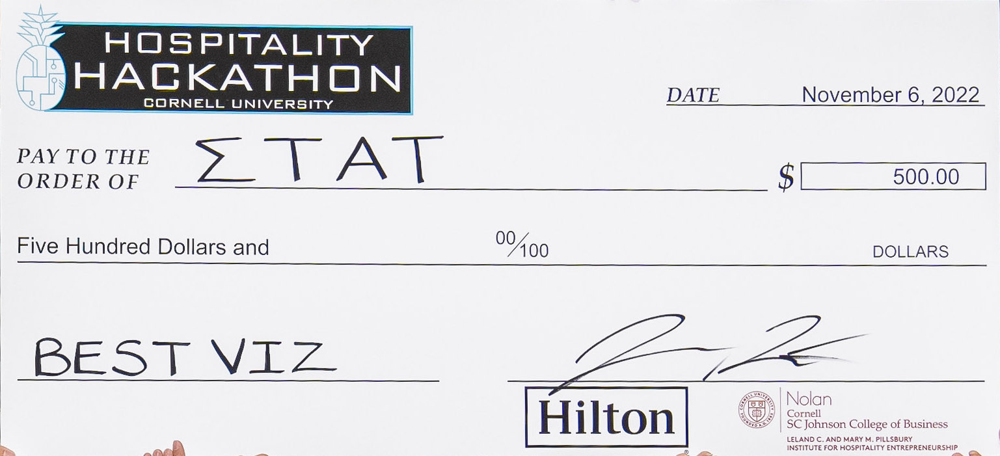
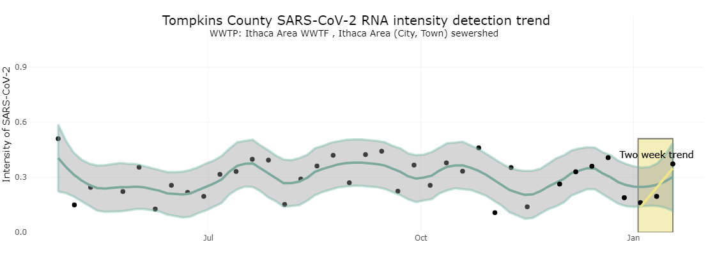
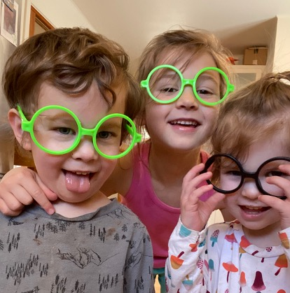

```{r xaringan-themer, include=FALSE, warning=FALSE}
library(xaringanthemer)
style_mono_accent(base_color = "#B31B1B"
                  #,text_font_size = "1.4rem"
                  )
```

```{r setup, include=FALSE}
knitr::opts_chunk$set(warning = FALSE, message = FALSE, 
                      fig.retina = 3, fig.align = "center")
```

```{r packages-data, include=FALSE}
library(tidyverse)
```

```{r xaringanExtra, echo=FALSE}
xaringanExtra::use_xaringan_extra(c("tile_view"))
```

class: center middle main-title section-title-4

# Welcome to AEM 2850 / 5850!

.class-info[

**Week 1.1**

AEM 2850 / 5850 : R for Business Analytics<br>
Cornell Dyson<br>
Spring 2024

Acknowledgements:
[Andrew Heiss](https://datavizm20.classes.andrewheiss.com), 
[Claus Wilke](https://wilkelab.org/SDS375/), 
[Laurent Bergé](https://sites.google.com/site/laurentrberge/)
<!-- [Grant McDermott](https://github.com/uo-ec607/lectures) -->

]

---

name: outline
class: title title-inv-7

# Plan for today

[Why take R for Business Analytics?](#r-business-analytics)

[Summary of key class details](#class-details)

[Teaser example](#teaser)

[Just show me the data!](#show-me-the-data)

[What makes a great visualization?](#beautiful-visualizations)

[Self-introductions (time permitting)](#intros)


---

layout: false
name: r-business-analytics
class: center middle section-title section-title-2 animated fadeIn

# Why take R for Business Analytics?

---

# Why take R for Business Analytics?

<br>

.center[
</img>
]


---

# Why R for Business Analytics?

</img>

--

</img>


???

The R logo [is distributed](https://www.r-project.org/logo/) under the terms of the Creative Commons Attribution-ShareAlike 4.0 International license ([CC-BY-SA 4.0](https://creativecommons.org/licenses/by-sa/4.0/)).

RStudio tidyverse hex stickers [are distributed](https://github.com/rstudio/hex-stickers) under [CC0.](https://github.com/rstudio/hex-stickers/blob/master/LICENSE.md)

Tidyverse image came from RStudio education blog post [here](https://education.rstudio.com/blog/2020/07/teaching-the-tidyverse-in-2020-part-1-getting-started/)

--

</img>

---

# Why R for Data Visualization?

.pull-left[

<figure>
  
</figure>

]

--

.pull-right[

&nbsp;

<figure>
  
</figure>

]

---


# Why R for Data Visualization?

.center[
<figure>
  
</figure>
]


---

# Why R for Life?

Practical tool that could help you get a job and then do said job

--

.pull-left.center[

<figure>
  
</figure>

.small[[Airbnb, ggplot, and rmarkdown](https://peerj.com/preprints/3182/)]

]

.pull-right.center[

&nbsp;

<figure>
  
</figure>

<figure>
  
</figure>

.small[[The UK's reproducible analysis pipeline](https://dataingovernment.blog.gov.uk/2017/03/27/reproducible-analytical-pipeline/)]

]

???

https://peerj.com/preprints/3182.pdf + https://gdsdata.blog.gov.uk/2017/03/27/reproducible-analytical-pipeline/ 


---

# Why R for Life?

Practical tool that could help you get a job and then do said job

.center[

<figure>
  
</figure>

**Or start making money now!**

]

---

# Why R for Life?

Practical tool that could help you get a job and then do said job

Open source

--

Huge community of users and package developers

--

Here are a few examples of other things you can do using R:
- Make slides like the ones you're looking at right now
- Build websites like [our course site](https://aem2850.toddgerarden.com)
- Write books like [R for Data Science](https://r4ds.had.co.nz)
- Make interactive web apps
- Much, much more

--

Skills you develop in this course can also be used for other programming languages


---

layout: false
name: class-details
class: center middle section-title section-title-7 animated fadeIn

# Class details

---

layout: true
class: title title-7

---

# Preface

1. Your success in this class is important to me

2. This course is a work in progress

3. Get the semester off to a good start: **[read the syllabus](https://www.cameo.com/v/5f2b392a0299b100202e624a?utm_campaign=video_share_to_copy)**!


---

# A bit about me

.pull-left[.center[
<figure>
  
</figure>
]]

.pull-right[
- Prof. Todd Gerarden

- Economist

- Joined Cornell in 2018

- Interested in:
  - Renewable energy
  - Innovation in energy tech
  - Working with data
]

---

# A bit about our TAs

### Graduate TA

Hui Zhou

### Undergraduate TAs

Sophie McComb

Jonathan Gotian

**We will post office hours and contact information on the course site and canvas**


---

# A bit about you

Do you have any programming experience? (None is required or even expected!)

--

What programming language(s) have you used before?
- R
- Python
- SQL
- VBA
- MATLAB
- Stata
- Other

--

First course assignment will be to fill out a survey to tell us more about you

--

We'll also do brief self-introductions at the end of class today if time permits

---

# Course objectives

1. Develop basic proficiency in `R` programming
2. Understand data structures and manipulation
3. Describe effective techniques for data visualization and communication
4. Construct effective data visualizations
5. Utilize course concepts and tools for business applications


---

# Plan for the semester

.pull-left[
### Programming Foundations

`R`, `RStudio`, `R Markdown` / `Quarto`, the `tidyverse`
]

.pull-right[
<figure>
  
</figure>
]

--

.pull-left[
### Data Visualization Foundations

the grammar of graphics, `ggplot2`
]

.pull-right[
<figure>
  
</figure>
]

--

.pull-left[
### Special Topics

annotations, time, space, etc.
]

.pull-right[
<figure>
  
</figure>
]


---

# Plan for each week

We will follow the same general process each week:

- Do readings listed on the course site before Tuesday ([example: Week 1](https://aem2850.toddgerarden.com/content/01-content/))

- **Tuesday:** come to class, where we will discuss material for that week's topic

- **Thursday:** come to class, where we will work through hands-on examples

- Work on the lab before the next Tuesday’s class, attending office hours as needed

- **The following Monday:** submit lab on canvas by 11:59pm (starting with Week 1)

---

# Assignments

.pull-left[
<!-- - **Reflections** are short weekly writing assignments, intended as an easy way to get points and a nudge to engage with readings -->

- **Labs** are short weekly homework assignments that require you to practice programming

- **Prelims** are intended to assess programming and data visualization proficiency

- The **group project** is intended to synthesize and reinforce skills in real-world applications

- **Class participation** is the best way to learn the material, attendance is expected

Students in AEM 5850 complete extra assignments
]


```{r assignments-grades, include=FALSE}
assignments <- tribble(
  ~Points,  ~Assignment,
  # 14 * 5  , "Reflections (14 x 5 points each)",
  # 30 , "Labs (13 x 10 points each)",
  35      , "Labs",
  20      , "Prelim 1",
  20      , "Prelim 2",
  20      , "Group project",
  5       , "Class participation"
) %>%
  mutate(Percent = Points / sum(Points),
         Percent = scales::percent(Percent, accuracy = 1))
```

.pull.right[
```{r show-assignments-table, echo=FALSE, results="asis"}
assignments_total <- tibble(Assignment = "Total",
                            Points = sum(assignments$Points),
                            Percent = "100%")

bind_rows(assignments, assignments_total) %>%
  dplyr::select(Assignment, Percent) %>% 
  knitr::kable(., align = "lr")
```
]

---

# Contacting us

### Office hours:

- TAs: TBD
<!-- - Grad TA Hui Zhou: Mondays 1:30pm - 3:30pm in Warren TBD -->
<!-- - Undergrad TAs: TBD -->
- Tuesdays 11:00am - 12:00pm: Prof. Gerarden in Warren 466
- Other times by appointment: Prof. Gerarden, at [aem2850.youcanbook.me](https://aem2850.youcanbook.me)

### Email:

You can also reach us by email. The best approach is to email both me and our grad TA Hui Zhou at the same time. You can do that with one click [here](mailto:gerarden@cornell.edu,hz423@cornell.edu). Please read the syllabus for tips on how to make the most of email.


---

# Course websites

### Site for accessing course materials: (↓)
[aem2850.toddgerarden.com](https://aem2850.toddgerarden.com)

### Site for submitting work: (↑)
[canvas.cornell.edu/courses/50706](https://canvas.cornell.edu/courses/50706)
- viewing announcements
- viewing grades
- for convenience, you can also view and navigate the course site through canvas (Home, Syllabus)

---

# Sucking

> "The bad news is whenever you’re learning a new tool, for a long time you’re going to suck. It's going to be very frustrating.
> 
> But, the good news is that that is typical, it’s something that happens to everyone, and it’s only temporary.
> 
> Unfortunately, there is no way to go from knowing nothing about a subject to knowing something about a subject and being an expert in it without going through a period of great frustration and much suckiness.
> 
> But remember, when you're getting frustrated, that's a good thing, that's temporary, keep pushing through, and in time [it] will become second nature."

.box-inv-7.tiny[Hadley Wickham, author of `ggplot2`, *R for Data Science*, and much more]

--

#### I *promise* you can succeed in this class. Don't hesitate to get help from me, TAs, office hours, and your peers.

???

[Source for quote](https://twitter.com/Akbaritabar/status/1022057084802748416)

---

layout: false
class: center middle section-title section-title-2 animated fadeIn

# Questions about the class?

---

layout: false
name: teaser
class: center middle section-title section-title-2 animated fadeIn

# Teaser example

---

layout: true
class: title title-2

---

# How does 2023 compare to 2022 so far?

Go to [aem2850.toddgerarden.com/content/01-content](https://aem2850.toddgerarden.com/content/01-content/)

Click the links to download the following files:
- [Weather stations in NY](https://aem2850.toddgerarden.com/slides/data/01-slides/ny-stations.csv)
- [Weather in NY in 2022](https://aem2850.toddgerarden.com/slides/data/01-slides/ny-weather-2022.csv)
- [Weather in NY in 2023](https://aem2850.toddgerarden.com/slides/data/01-slides/ny-weather-2023.csv)

<!-- 1. Compute the difference in average temperature at Cornell University between January 2023 and January 2022 -->

Make a plot that compares the evolution of daily max temps (TMAX) over January in 2022 and 2023

Use any software you like!

Feel free to work in small groups

---

# How does 2023 compare to 2022 so far?

One way to do this in R. First, we'll need to import and prep the data:

```{r ithaca-weather-data}
library(tidyverse); library(lubridate)

# identify the Cornell station
stations <- read_csv("data/01-slides/ny-stations.csv")
cornell <- stations |>
  filter(str_detect(NAME, "CORNELL"))
  
# read in and bind relevant data
clean_data <- function(y, s, m) {
  str_glue("data/01-slides/ny-weather-", y, ".csv") |>
    read_csv() |>
    inner_join(s, by = "STATION") |>
    mutate(mon = month(DATE),
           day = day(DATE),
           year = year(DATE)) |>
    filter(mon == m)
}
years <- c(2022, 2023)
cornell_temps <- map(years, clean_data, cornell, 1) |>
  bind_rows()
```

---

# How does 2023 compare to 2022 so far?

.pull-left[
```{r ithaca-weather-plot1, fig.show="hide", fig.dim=c(4, 3), out.width="100%"}
# plot data
cornell_temps |> 
  ggplot(aes(x = day, 
             y = TMAX)) + 
  geom_point() + 
  theme_bw()
```

What's wrong with this plot?
]

.pull-right[
  `)
]

---

# How does 2023 compare to 2022 so far?

.pull-left[
```{r ithaca-weather-plot2, fig.show="hide", fig.dim=c(4, 3), out.width="100%"}
# plot data
cornell_temps |> 
  ggplot(aes(x = day, 
             y = TMAX, 
             color = as_factor(year))) + #<<
  geom_point() + 
  theme_bw() +
  theme(legend.position = "bottom") #<<
```

What's wrong with this plot?
]

.pull-right[
  `)
]

---

# How does 2023 compare to 2022 so far?

.pull-left[
```{r ithaca-weather-plot3, fig.show="hide", fig.dim=c(4, 3), out.width="100%"}
# plot data
cornell_temps |> 
  ggplot(aes(x = day, 
             y = TMAX, 
             color = as_factor(year))) + 
  geom_point() + 
  geom_smooth() +  #<<
  theme_bw() +
  theme(legend.position = "bottom") +
  labs(x = "Day of month",  #<<
       y = "Max. daily temperature (F)",  #<<
       color = "Year") #<<
```

Two advantages of this approach are:
1. we have a script to **reproduce** our work / share our methods with others
2. we could **generalize** and **scale** this much more easily than manual work in excel (for example)
]

.pull-right[
  `)
]

---

# How does 2023 compare to 2022 so far?

For example we can **generalize** this approach to other weather outcomes:

.pull-left[
```{r ithaca-weather-plot4, fig.show="hide", fig.dim=c(4, 3), out.width="100%"}
# plot data
cornell_temps |> 
  ggplot(aes(x = day, 
             y = SNOW, #<<
             color = as_factor(year))) + 
  geom_point() + 
  theme_bw() +
  theme(legend.position = "bottom") +
  labs(x = "Day of month",
       y = "Snowfall (inches)", #<<
       color = "Year")
```
]

.pull-right[
  `)
]

Note: NOAA publishes data with a slight lag so this does not reflect snow since last week


---

layout: false
name: show-me-the-data
class: center middle section-title section-title-3 animated fadeIn

# Just show me the data!

---

layout: true
class: title title-3

<!-- --- -->

<!-- # What does this have to do with AEM 2850? -->

<!-- .box-inv-2.medium[Truth does not require science or facts] -->

<!-- Facts alone do not necessarily reveal truth -->

<!-- .box-inv-2.medium.sp-after[Truth comes from aesthetic combination of **content** and **form**] -->

<!-- There is no single ideal combination of **content** and **form** for all **audiences** -->

<!-- Keep this in mind as a guiding principle for analyzing, visualizing, and communicating data -->

---

# Just show me the data!

Data is very powerful, but raw data is not usually enough

.pull-left[
```{r ithaca-weather-mean1}
cornell_temps |>
  group_by(year) |>
  summarize(mean_max = mean(TMAX))
```

What's wrong with this calculation?

]

--

.pull-right[
```{r ithaca-weather-mean2}
cornell_temps |>
  group_by(day) |>
  filter(n() != 1) |>
  group_by(year) |>
  summarize(mean_max = mean(TMAX))
```
]

---

# Just show me the data!

```{r load-datasaurus-dozen, echo=FALSE}
dozen <- read_tsv("data/DatasaurusDozen.tsv")
my_data <- dozen %>% 
  filter(dataset == "dino") %>% 
  select(x, y)
```

**Here's another example:**

.pull-left-3[
```{r head-datasaurus}
head(my_data, 10)
```
]

--

.pull-middle-3[
```{r summary-datasaurus, highlight.output=1}
mean(my_data$x)
mean(my_data$y)
cor(my_data$x, my_data$y)
```
]

--

.pull-right-3[
&nbsp;

.box-inv-3[Seems reasonable]

&nbsp;

.box-inv-3[Seems reasonable]

&nbsp;

.box-inv-3[No correlation]
]

---

# Oh no!

.center[
<figure>
  
  <figcaption><a href="https://www.autodeskresearch.com/publications/samestats" target="_blank">The Datasaurus Dozen</a></figcaption>
</figure>
]

---

# Raw data is not enough

.box-inv-3.small[Each of these has the same mean, standard deviation, variance, and correlation]

```{r plot-full-dozen, echo=FALSE, fig.dim=c(8, 4), out.width="85%"}
ggplot(filter(dozen, dataset != "bullseye"), aes(x = x, y = y)) +
  geom_point(size = 1) +
  facet_wrap(vars(dataset))
```

---

layout: false
name: beautiful-visualizations
class: center middle section-title section-title-6 animated fadeIn

# What makes a great visualization?

---

layout: true
class: title title-6

---

# What makes a great visualization?

.center[

.box-inv-6.medium[Truthful]

.box-inv-6.medium[Functional]

.box-inv-6.medium[Beautiful]

.box-inv-6.medium[Insightful]

.box-inv-6.medium[Enlightening]

.box-6.tiny[Alberto Cairo, *The Truthful Art*]

]

???

Alberto Cairo, *The Truthful Art*:

> 1. It is truthful, as it’s based on thorough and honest research.
> 
> 2. It is functional, as it constitutes an accurate depiction of the data, and it’s built in a way that lets people do meaningful operations based on it (seeing change in time).
> 
> 3. It is beautiful, in the sense of being attractive, intriguing, and even aesthetically pleasing for its intended audience—scientists, in the first place, but the general public, too.
> 
> 4. It is insightful, as it reveals evidence that we would have a hard time seeing otherwise.
> 
> 5. It is enlightening because if we grasp and accept the evidence it depicts, it will change our minds for the better.

---

# What makes a great visualization?

.box-inv-6["Graphical excellence is the **well-designed presentation of interesting data**—a matter of substance, of statistics, and of design … [It] consists of complex ideas communicated with clarity, precision, and efficiency. … [It] is that which **gives to the viewer the greatest number of ideas in the shortest time with the least ink in the smallest space** … [It] is nearly always multivariate … And graphical excellence requires **telling the truth about the data**."]

.box-6.tiny[Edward Tufte, *The Visual Display of Quantitative Information*, p. 51]

---

# What makes a great visualization?

.center[

.box-inv-6.medium[Good aesthetics]

.box-inv-6.medium[No substantive issues]

.box-inv-6.medium[No perceptual issues]

.box-inv-6.medium[Honesty + good judgment]

.box-6.tiny[Kieran Healy, *Data Visualization: A Practical Introduction*]

]

---

# What's wrong?

.center[
<figure>
  
</figure>
]

???

- Aesthetic issues
- Substantive issues
- Perceptual issues
- Honesty + judgment issues

---

# What's wrong?

.center[
<figure>
  
</figure>
]

???

- Aesthetic issues
- Substantive issues
- Perceptual issues
- Honesty + judgment issues

---

# What's wrong?

.center[
<figure>
  
</figure>
]

???

- Aesthetic issues
- Substantive issues
- Perceptual issues
- Honesty + judgment issues

---

# What's right?

.pull-left[

```{r flatten-the-curve, echo=FALSE, fig.dim=c(4.8, 3.75), out.width="100%"}
high_mean <- 12
high_sd <- 4
flat_mean <- 35
flat_sd <- 12

ggplot(tibble(x = c(0, 70)), aes(x = x)) +
  stat_function(geom = "area", fun = dnorm, n = 1000,
                args = list(mean = high_mean, sd = high_sd),
                fill = "#FF4136", alpha = 0.8) +
  stat_function(geom = "area", fun = dnorm, n = 1000,
                args = list(mean = flat_mean, sd = flat_sd),
                fill = "#0074D9", alpha = 0.8) +
  geom_hline(yintercept = dnorm(flat_mean, flat_mean, flat_sd),
             linetype = "61", color = "grey75") +
  annotate(geom = "text", x = qnorm(0.5, high_mean, high_sd),
           y = dnorm(qnorm(0.5, high_mean, high_sd), high_mean, high_sd) / 2,
           label = "Without\nprotective\nmeasures", color = "white", size = 3,
           family = "Fira Sans Condensed", fontface = "bold") + 
  annotate(geom = "text", x = qnorm(0.5, flat_mean, sd = flat_sd),
           y = dnorm(qnorm(0.5, flat_mean, sd = flat_sd), flat_mean, sd = flat_sd) / 2,
           label = "With protective\nmeasures", color = "white", size = 3,
           family = "Fira Sans Condensed", fontface = "bold") + 
  annotate(geom = "text", x = 40, y = dnorm(flat_mean, flat_mean, sd = flat_sd),
           label = "Healthcare system capacity", vjust = -0.5, hjust = 0, size = 3,
           family = "Fira Sans Condensed", fontface = "bold") + 
  labs(x = "Time since first case",
       y = "# of\ncases",
       title = "Flatten the curve!",
       subtitle = "Slow down community spread by social distancing",
       caption = "Adapted from the CDC and The Economist\nVisit flattenthecurve.com") +
  scale_x_continuous(expand = c(0, 0)) +
  scale_y_continuous(expand = c(0, 0)) +
  theme_minimal(base_family = "Fira Sans Condensed Light") +
  theme(panel.grid = element_blank(),
        axis.line = element_line(color = "black"),
        axis.text = element_blank(),
        axis.title = element_text(family = "Fira Sans Condensed", face = "bold"),
        axis.title.y = element_text(angle = 0, vjust = 0.5),
        plot.title = element_text(family = "Fira Sans Condensed", face = "bold", size = rel(1.7)),
        plot.subtitle = element_text(size = rel(1.2), color = "grey50"),
        plot.caption = element_text(color = "grey50"))
```

]

???

- Aesthetic issues
- Substantive issues
- Perceptual issues
- Honesty + judgment issues

--

.pull-right.center[

<figure>
  
  <figcaption><a href="https://twitter.com/CT_Bergstrom/status/1235865328074153986" target="_blank">Thread by Carl T. Bergstrom</a></figcaption>
</figure>

]

???

[Carl Bergstrom on the flatten the curve visualization](https://twitter.com/CT_Bergstrom/status/1235865328074153986)


---

# What's wrong? What's right?

Plot of recent COVID levels in Ithaca Area wastewater

.center[
<figure>
  
</figure>
]

???

- Aesthetic issues
- Substantive issues
- Perceptual issues
- Honesty + judgment issues

---

# Plan for the rest of this week

### Office hours:

- Tuesdays 11:00am - 12:00pm: Prof. Gerarden in Warren 466
- Other times by appointment: Prof. Gerarden, at [aem2850.youcanbook.me](https://aem2850.youcanbook.me)

### Thursday:

- Intro to `R`, `RStudio`, and `R Markdown` / `Quarto`
- You will need your computer for coding exercises
- See canvas announcement for instructions to get set up on [posit.cloud](http://posit.cloud/) (formerly rstudio.cloud)


---

layout: false
name: intros
class: center middle section-title section-title-7 animated fadeIn

# Introductions

---

layout: true
class: title title-7

---

# Self-introductions

Today we'll do some brief self-introductions
  - Goal is to foster a collaborative environment: Who's my professor? Who's in my class?

---

# Self-introductions

.pull-left[
1. Name: 
  - 

2. Where you're from:
  - 
  
3. One other thing about you:
  - 
]

---

# Self-introductions

.pull-left[
1. Name: 
  - Todd Gerarden

2. Where you're from:
  - Virginia, USA
  
3. One other thing about you:
  - I rode a bicycle across the country
]

.pull-right[
<figure>
  
</figure>
]

