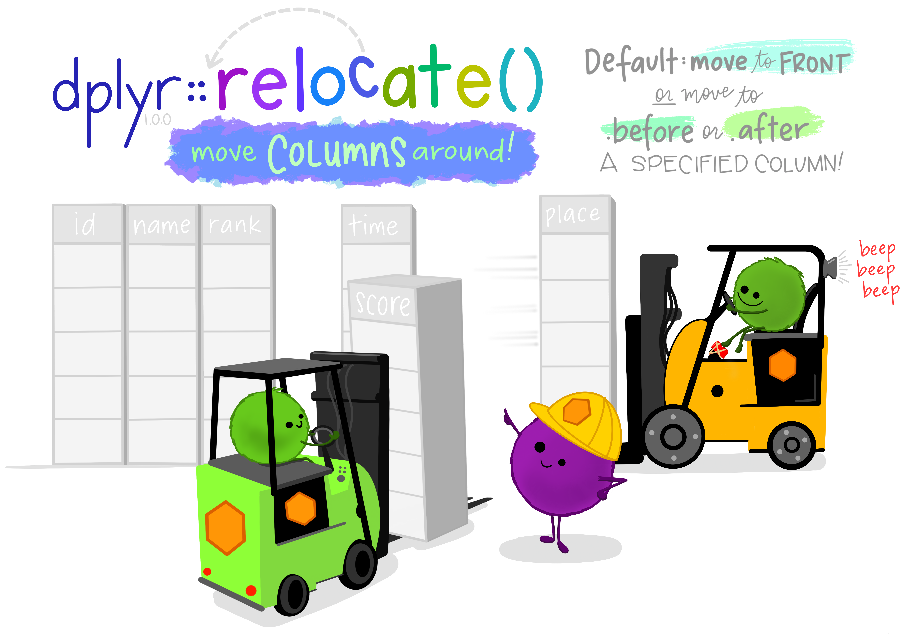

```{r xaringan-themer, include=FALSE, warning=FALSE}
library(xaringanthemer)
style_mono_accent(base_color = "#B31B1B",
                  text_font_size = "1.4rem")
```

```{r setup, include=FALSE}
library(knitr)
opts_chunk$set(#warning = FALSE, message = FALSE, 
                      #cache = TRUE,
                      fig.retina = 3, fig.align = "center",
                      fig.width=14, fig.height=7)
```

```{r packages, include=FALSE}
# do not load tidyverse here in order to show output below # library(tidyverse)
```

```{r xaringanExtra, echo=FALSE}
xaringanExtra::use_xaringan_extra(c("tile_view"))
```


class: center middle main-title section-title-4

# Welcome to the tidyverse

.class-info[

**Week 2**

AEM 2850 / 5850 : R for Business Analytics<br>
Cornell Dyson<br>
Spring 2024

Acknowledgements: 
<!-- [Andrew Heiss](https://datavizm20.classes.andrewheiss.com),  -->
<!-- [Claus Wilke](https://wilkelab.org/SDS375/),  -->
[Grant McDermott](https://github.com/uo-ec607/lectures),
[Allison Horst](https://github.com/allisonhorst/stats-illustrations)

]


---

# Announcements

If you are new to the class, please review canvas and [course site](https://aem2850.toddgerarden.com)

**Prelim dates:** March 2 and May 9 in class
- SDS: we will use the Alternative Testing Program, submit form by Feb. 8

**TA office hours:** Mondays 12:30pm - 3:30pm in Warren 372

**My office hours:** Tuesdays 11am - 12pm in Warren 466; [aem2850.youcanbook.me](https://aem2850.youcanbook.me)

**Other reminders:**
- Bookmark [the schedule](https://aem2850.toddgerarden.com/schedule) and visit often
- Submit assignments via canvas by Monday at 11:59pm going forward

---

# Friday office hours poll

Hui Zhou will host additional TA office hours on Fridays

Informal poll: what times **do not** work for you on Fridays?
- 10:30 - 11:30
- 11:30 - 12:30
- 12:30 - 1:30
- 3:00 - 4:00

--

Questions before we get started?

---

# Plan for today

[Prologue](#prologue)

[Tidyverse basics](#basics)
  - [tibbles](#tibbles) and [pipes](#pipes)

[Data transformation with dplyr](#dplyr)
  - [select](#select)
  - [filter](#filter)
  - [arrange](#arrange)
  - [mutate](#mutate)
  - [summarize](#summarize)
  - [other goodies](#goodies)


---
class: inverse, center, middle
name: prologue

# Prologue


---

# How we feel about the course, in a few words

<!-- I haven't read all the surveys yet, but here are some common phrases that came up: -->

> excited

<br>

> its lit

<br>

--

> hope this class is not too hard haha

<br>

--

> maybe the speaking speed is too fast

  
---

# Where we're from

```{r, prep-where_were_from, include = FALSE}
# LOAD PACKAGES (WILL UNLOAD BEFORE SHOWING HOW TIDYVERSE LOADS) ----
library(ggplot2)
library(dplyr)

# GET MAP DATA ----
us_states <- map_data("state")
countries <- map_data("world") |> mutate(region = tolower(region))

# IMPORT DATA ----
responses <- readr::read_csv("data/survey-responses/lab-1-survey.csv")
responses_timestamp <- file.mtime("data/survey-responses/lab-1-survey.csv")

where_were_from <- responses |> 
  select(contains("from?")) |> 
  rename(state = `Which state are you from?`,
         country = `What country are you from?`,
         province = `Which province (or equivalent) are you from?`) |> 
  rbind(c(country = "United States of America", "virginia", NA))

# clean up for merging to us_states
plot_states <- where_were_from |>
  rename(region = state) |>
  group_by(region) |>
  summarize(count = n())

# clean up for merging to world
plot_countries <- where_were_from |> 
  mutate(
    region = case_when(
      country == "United States of America" ~ "usa",
      TRUE ~ stringr::str_to_lower(country)
    )
  ) |> 
  count(region)

# SUMMARIZE SHARE OF STUDENTS FROM NY ----
ny_share <- plot_states |> 
  mutate(total = sum(count),
         percent = count/total*100) |> 
  filter(region=="new york") |> 
  select(region, percent) |> 
  rename(origin = region)
```

How can we use your `r nrow(responses)` survey responses to construct our origin story without having to read them one by one?

--

- **Caveat:** This is based on submissions as of `r paste0(lubridate::hour(responses_timestamp), ":", lubridate::minute(responses_timestamp), " ", lubridate::wday(responses_timestamp, label = TRUE, abbr = FALSE))`

--

We can use R for this!

--

I won't go through details now

<!-- I won't go through details now, but here is one way to approach it: -->

<!-- - use `readr` function `read_csv()` to import data from csv file -->
<!-- - use `dplyr` functions to manipulate data -->
<!-- - make maps using `ggplot2` -->

By the end of the course you should be able to do this kind of thing easily


---

# Are we all from New York?

What share of us are from the state of New York?

--

```{r}
# step 1: do a bunch of stuff that's omitted for clarity
# step 2: show us the answer!
ny_share
```

---

# Are we all from New York?


```{r us-map, echo = FALSE, fig.width=14, fig.height=7}
# MAKE MAP OF STATES ----
our_states <- left_join(us_states, plot_states, by = "region")

ggplot(data = our_states,
       mapping = aes(x = long, y = lat, group = group, fill = count)) +
  geom_polygon(color = "gray90", linewidth = 0.1) +
  coord_sf(
      crs = 5070, default_crs = 4326,
       xlim = c(-125, -70), ylim = c(25, 52)
    ) +
  theme_minimal(base_size = 24) +
  viridis::scale_fill_viridis() +
  labs(x = NULL, y = NULL, fill = "# of us")
```


---

# Are we all from the U.S.?


```{r world-map, echo = FALSE, fig.width=14, fig.height=7}
# MAKE MAP OF COUNTRIES ----
our_countries <- left_join(countries, plot_countries, by = "region")

our_countries |> 
  filter(region != "antarctica") |> 
  ggplot(aes(x = long, y = lat, group = group, fill = n)) +
  geom_polygon(color = "gray90", linewidth = 0.1) +
  theme_minimal(base_size = 24) +
  viridis::scale_fill_viridis() +
  labs(x = NULL, y = NULL, fill = "# of us")
```


---

# R "dialects"

Last week we *briefly* introduced several R programming concepts:
  - logical expressions
  - assignment
  - object types
  - [object names, namespace conflicts]
  - [indexing]

We did this using base R
  - **pro:** comes in the box, close parallels to other programming languages
  - **con:** can be confusing for new programmers (esp. indexing operations)

---

# R "dialects"

.more-left[
This course will primarily use the tidyverse

You can think of it as a particular "dialect" of R

This dialect is similar to human language

Intuitive if you're new to programming

Base R and `data.table` are alternative "dialects"
]

.less-right[
```{r echo=FALSE, out.width='100%'}
knitr::include_graphics("img/02/r_first_then.png")
```
]

---
class: inverse, center, middle
name: basics

# Tidyverse basics

---

# Tidyverse vs. base R

Lots of debate over tidyverse vs. base R

--

Why we're using the tidyverse:
- Consistent philosophy and syntax
- Great documentation and community support
- For data wrangling and plotting, tidyverse is 🔥

--

<br>

Base R is still great, can do some things tidyverse can't

**data.table** is another great alternative for data wrangling

---

# Tidyverse vs. base R

Often a correspondence between tidyverse and base R commands:

| tidyverse  |  base |
|---|---|
| `?readr::read_csv`  | `?utils::read.csv` |
|  `?dplyr::if_else` |  `?base::ifelse` |
|  `?tibble::tibble` |  `?base::data.frame` |

Tidyverse alternatives typically offer extra features

--

**Remember:** There are always multiple ways to do something in R

---

# Let's load the tidyverse meta-package

```{r, include = FALSE}
# UNLOAD PACKAGES TO ILLUSTRATE HOW TIDYVERSE LOADS ----
detach(package:ggplot2)
detach(package:dplyr)
```

```{r tverse, cache = FALSE, eval = FALSE}
library(tidyverse)
```

--

```{r tverse-output, cache = FALSE, echo = FALSE}
library(tidyverse)
```

--

We just loaded a bunch of packages: **ggplot2**, **dplyr**, **tidyr**, **tibble**, etc.

We also see some **namespace conflicts**

---

# Tidyverse packages

When you install the tidyverse, you actually get a lot more packages:
```{r tverse_pkgs}
tidyverse_packages()
```

--

These other packages have to be loaded separately

---

# Tidyverse packages

Today we'll focus on [**dplyr**](https://dplyr.tidyverse.org/)

But first let's talk about tibbles and pipes


---
name: tibbles

# Review: What are objects? 

There are many different *types* (or *classes*) of objects

Here are some objects that we'll be working with regularly:
- vectors
- matrices
- data frames
- lists
- functions


---

# Review: Data frames

The most important object we'll work with is the **data frame**

You can think of it as an Excel spreadsheet

```{r d}
# Create a small data frame called "d"
d <- data.frame(x = 1:2, y = 3:4) 
d
```

This is essentially just a table with columns named `x` and `y`

Each row is an observation telling us the values of both `x` and `y`

---

# Tibbles are data frames with opinions

For this class you can think of tibbles and data frames as synonymous

Tibbles have some advantages, such as pretty printing

--

We will primarily use tibbles in this course

Two functions may come in handy:
- `as_tibble()` converts data frames to tibbles
- `tibble()` creates new tibbles from scratch

See `vignette("tibble")` for more

---

# Printing a data.frame

```{r data.frame}
as.data.frame(starwars)
```

---

# How could we make this look nicer?

```{r data.frame.nicer}
as.data.frame(starwars)
```

---

# Printing a data.frame with head()

```{r data.frame.head}
head(as.data.frame(starwars))
```

---

# Printing a tibble

```{r tibble, highlight.output = c(1, 3, 14, 15)}
starwars
```

---
name: pipes

# Pipes

**Generic programming question:** Does anyone know what pipes do?

--

Pipes allow us to pass information through a sequence of operations

--

The tidyverse loads the `magrittr` pipe, denoted `%>%`

R now has a native pipe, denoted `|>` (since R version 4.1.0)

--

They are identical for simple cases, but have some differences

--

We will use `|>` in class

**Keyboard shortcut:** use `Ctrl/Cmd+Shift+m` to insert the pipe (with spaces)
- You can [set the RStudio keyboard shortcut](https://r4ds.hadley.nz/workflow-pipes.html) to use either `%>%` or `|>`

---

# Pipe usage

To see why using pipes is so powerful, consider this contrived example based on what we did this morning:

1. Wake up
2. Get out of bed
4. Get dressed
5. Drink coffee
6. Go to class


---

# A day without pipes

You could code this through a series of assignment operations:

```{r, eval = FALSE}
me <- wake_up(me)
me <- get_out_of_bed(me)
me <- get_dressed(me)
me <- drink(me, "coffee")
me <- go(me, "class")
```

Or by putting all these operations in a single line of code:

```{r, eval = FALSE}
me <- go(drink(get_dressed(get_out_of_bed(wake_up(me))), "coffee"), "class")
```

Neither is ideal

---

# Pipes are the best of both worlds

We can do everything at once, in order:

```{r, eval = FALSE}
me |> 
  wake_up() |> 
  get_out_of_bed() |> 
  get_dressed() |> 
  drink("coffee") |> 
  go("class")
```

Emphasis is on verbs (e.g., `wake_up`, `get_out_of_bed`, etc.), not nouns (i.e., `me`)

---

# Pipes: Best practices

Write linear code

Spread code out for readability: use one line per verb

Don't use pipes...
- when you need more than 10 (use intermediate objects instead)
- for multiple inputs or outputs
- for non-linear relationships

--

**Reminder:** `|>` and `%>%` can both be used, though they have some important differences for more advanced work. We will us `|>` in this class.

---
class: inverse, center, middle
name: dplyr

# dplyr

---

# What is dplyr?

```{r echo=FALSE, out.width='60%'}
knitr::include_graphics("img/02/dplyr_wrangling.png")
```

---

# What is dplyr?

The dplyr package provides a **grammar of data manipulation**

--

dplyr's functions are **verbs** that correspond to things we want to **do**

--

dplyr functions all have these things in common:
1. their first argument is a data frame
2. their other arguments describe what you want to do
3. their output is a new data frame

--

**1** + **3** + **pipes** allow us to combine simple steps to achieve complex results

---

# dplyr has five key verbs we will use

1. `filter`: subset rows based on their values

2. `arrange`: reorder rows based on their values

3. `select`: select columns (i.e., variables)

4. `mutate`: create new columns

5. `summarize`: collapse multiple rows into a single summary value


---

# dplyr verbs operate on different things

- Rows:
  - `filter`: subset rows based on their values
  - `arrange`: reorder rows based on their values
- Columns:
  - `select`: select columns (i.e., variables)
  - `mutate`: create new columns
- Groups of rows:
  - `summarize`: collapse multiple rows into a single summary value

--

Let's study these commands together using the `starwars` data frame that comes pre-packaged with dplyr

---

# Starwars

This is what the `starwars` dataset looks like:

```{r}
starwars
```


---
name: select

# 1) dplyr::select

`select` allows us to select columns / variables:

.pull-left[
```{r select0, highlight.output = 1}
starwars |> select(name)
```
]

--

.pull-right[
`select` returns a tibble even though you only asked for one variable

To get a vector, you can use:
- `starwars |> pull(name)`
]

---

# 1) dplyr::select

You can get fancy: use commas to select multiple columns, deselect a column using "-", and select consecutive columns using "first:last"
```{r select1}
starwars |> 
  select(name:skin_color, species, -height)
```

---

# 1) dplyr::select

You can also rename your selected variables at the same time:
```{r select2}
starwars |>
  select(alias = name, crib = homeworld)
```

---

# 1) dplyr::select

If you just want to rename columns without subsetting them, use `rename`:
```{r rename2}
starwars |>
  rename(alias = name, crib = homeworld)
```

---

# 1) dplyr::select

`select(contains(PATTERN))` provides a handy shortcut:
```{r select3}
starwars |> 
  select(name, contains("color"))
```

---

# 1) dplyr::select

`select(..., everything())` is another useful shortcut to move important variables to the "front" of a data frame

```{r select4}
starwars |> 
  select(species, homeworld, everything()) |>
  head(5)
```

---

# 1) dplyr::~~select~~ relocate

You can also use `relocate` to reorder columns without subsetting:
```{r relocate4}
starwars |> 
  relocate(species, homeworld) |>
  head(5)
```

---
# 1) dplyr::~~select~~ relocate

```{r echo=FALSE, out.width='65%'}

```


---
class: inverse, center, middle
name: example

# Let's all work through an example on Posit Cloud


---
name: filter

# 2) dplyr::filter

```{r echo=FALSE, out.width='85%'}
knitr::include_graphics("img/02/dplyr_filter.jpg")
```

---

# 2) dplyr::filter

`filter` allows us to focus on certain rows / observations

--

For example, you may only be interested in droids:

```{r filter0}
starwars |> 
  filter(species == "Droid") 
```

---

# 2) dplyr::filter

Or perhaps you want to subset the humans that are taller than I am:

```{r filter1, eval = FALSE}
starwars |> 
  filter( 
    species == "Human", 
    height >= 194
    ) 
```

Can you name one? *Hint: there's only one*

--

```{r filter1b, echo = FALSE, highlight.output = c(4)}
starwars |> 
  filter( 
    species == "Human", 
    height >= 194
    ) 
```


---

# 2) dplyr::filter

Regular expressions work here too, with the help of the `stringr` package:
```{r filter2}
starwars |> 
  filter(stringr::str_detect(name, "Skywalker"))
```

--

Or you can use `grepl` to achieve the same goal:
```{r filter2b, eval = FALSE}
starwars |> 
  filter(grepl("Skywalker", name))
```

---

# 2) dplyr::filter

A very common `filter` use case is identifying/removing missing data:
```{r filter3}
starwars |> 
  filter(is.na(height))
```

---

# 2) dplyr::filter

How could you build on this to remove missing observations?

--

```{r filter4}
starwars |> 
  filter(!is.na(height)) # use ! for negation
```

---
name: arrange

# 3) dplyr::arrange

`arrange` sorts the data frame based on the variable(s) you supply:

```{r arrange1}
starwars |> 
  arrange(birth_year)
```

---

# 3) dplyr::arrange

We can also arrange items in descending order using `arrange(desc())`:
```{r arrange2}
starwars |> 
  arrange(desc(birth_year))
```

---
name: mutate

# 4) dplyr::mutate

```{r echo=FALSE, out.width='55%'}
knitr::include_graphics("img/02/dplyr_mutate.png")
```

---

# 4) dplyr::mutate

You can create new columns from scratch or by transforming existing columns:
```{r mutate1}
starwars |> 
  select(name, birth_year) |>
  mutate(dog_years = birth_year * 7) |>
  mutate(comment = paste0(name, " is ", dog_years, " in dog years."))
```

---


# 4) dplyr::mutate

`mutate` creates variables in order, so we can chain them together in a single call:
```{r mutate2}
starwars |> 
  select(name, birth_year) |>
  mutate(dog_years = birth_year * 7, # separate with a comma
         comment = paste0(name, " is ", dog_years, " in dog years."))
```

---

# 4) dplyr::mutate

Boolean, logical, and conditional operators all work well with `mutate`:
```{r mutate3, eval = FALSE}
starwars |> 
  select(name, height) |>
  filter(name %in% c("Luke Skywalker", "Anakin Skywalker")) |> 
  mutate(tall1 = height > 180) |>
  mutate(tall2 = ifelse(height > 180, "Tall", "Short")) # same effect, but can choose labels
```

How many rows do you think this will return? How many columns?

--

```{r mutate3b, echo = FALSE}
starwars |> 
  select(name, height) |>
  filter(name %in% c("Luke Skywalker", "Anakin Skywalker")) |> 
  mutate(tall1 = height > 180) |>
  mutate(tall2 = ifelse(height > 180, "Tall", "Short")) # same effect, but can choose labels
```

---
name: summarize

# 5) dplyr::summarize

Often we want to get summary statistics or *collapse* our data

`summarize` provides an easy way to do this

--

**Example:** "What are the mininum, maximum, and average prices of `diamonds`?"
```{r summ0}
diamonds |> 
  summarize(min = min(price),      # calculate the min price
            max = max(price),      # calculate the max price
            average = mean(price)) # calculate the mean price
```

---

# 5) dplyr::summarize

Including `na.rm = TRUE` keeps NAs from propagating to the end result:

.pull-left[
```{r summ2l}
# Probably not what we want
starwars |> 
  summarize(mh = mean(height))
```
]

.pull-right[
```{r summ2r}
# Much better
starwars |> 
  summarize(mh = mean(height, na.rm = TRUE))
```
]

--

Is this a feature or a bug?

--

It depends on the context!

---

# Bonus: dplyr::group_by

`summarize` is particularly useful in combination with `group_by`:
```{r summ1}
starwars |> 
  group_by(species, gender) |> # for each species-gender combo
  summarize(mean_height = mean(height, na.rm = TRUE)) # calculate the mean height
```

---

# Bonus: dplyr::ungroup

```{r echo=FALSE, out.width='65%'}
knitr::include_graphics("img/02/group_by_ungroup.png")
```

Groups are persistent (sort of), `ungroup` removes them

---
class: inverse, center, middle
name: goodies

# Other dplyr goodies for your reference

---

# Other dplyr goodies: across

```{r echo=FALSE, out.width='70%'}
knitr::include_graphics("img/02/dplyr_across.png")
```

---

# Other dplyr goodies: across

Combining `mutate` with `across` allows you to work on a subset of variables:

```{r, mutate4}
starwars |> 
  select(name:eye_color) |> 
  mutate(across(where(is.character), toupper)) |> # capitalize all character variables #<< 
  head(5)
```

---

# Other dplyr goodies: across

We can also use `across` within `summarize`:

```{r, summ4}
starwars |> 
  group_by(species) |> 
  summarize(across(where(is.numeric), mean, na.rm=T)) |> # take the mean of all numeric variables #<< 
  head(5)
```
---

# Other dplyr goodies: count

`count` to get the number of observations:
.pull-left[
```{r}
starwars |> 
  count(species)
```
]

.pull-right[
```{r}
starwars |> 
  group_by(species) |> summarize(num = n())
```
]

---

# Other dplyr goodies: distinct

`distinct` to isolate unique observations:
```{r}
starwars |> distinct(species)
```


---

# Other dplyr goodies: window functions

[Window functions](https://cran.r-project.org/web/packages/dplyr/vignettes/window-functions.html) make it easy to get leads and lags, percentiles, cumulative sums, etc.
- These are often used in conjunction with grouped mutates
- See `vignette("window-functions")`

--

<br>

The final set of dplyr "goodies" worth mentioning are the family of join operations, but we'll come back to those later

