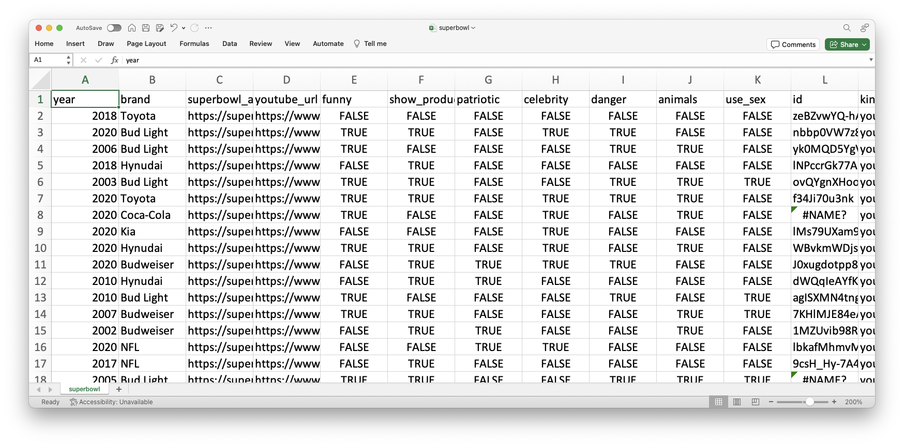

```{r xaringan-themer, include=FALSE, warning=FALSE}
library(xaringanthemer)
style_mono_accent(base_color = "#B31B1B",
                  text_font_size = "1.4rem")
xaringanExtra::use_xaringan_extra(c("tile_view"))
```

```{r setup, include=FALSE}
library(knitr)
opts_chunk$set(#warning = FALSE, message = FALSE, 
                      #cache = TRUE,
                      fig.retina = 3, fig.align = "center",
                      fig.width=14, fig.height=7)
```

```{r packages, include=FALSE}
library(tidyverse)
```


class: center middle main-title section-title-4

# Data import and tidying

.class-info[

**Week 3**

AEM 2850 / 5850 : R for Business Analytics<br>
Cornell Dyson<br>
Spring 2025

Acknowledgements: 
<!-- [Andrew Heiss](https://datavizm20.classes.andrewheiss.com),  -->
<!-- [Claus Wilke](https://wilkelab.org/SDS375/),  -->
[Grant McDermott](https://github.com/uo-ec607/lectures),
[Allison Horst](https://github.com/allisonhorst/stats-illustrations),
[R4DS (2e)](https://r4ds.hadley.nz/data-tidy.html)

]


---

# Announcements

Submit assignments via canvas
- Homework - Week 2 was due yesterday (Monday) at 11:59pm

We will not assign any late penalties for the survey and homework-02

Late assignments will be penalized going forward
- If something comes up, please email me, Victor, and Xiaorui **in advance**

Questions before we get started?

---

# Plan for today

[Prologue](#prologue)

[Data import](#readr)
  - [read_csv](#read_csv)
  - [write_csv](#write_csv)
  - [read_excel](#read_excel)

[Tidy data](#tidyr)
  - [pivot_longer](#pivot_longer)
  - [pivot_wider](#pivot_wider)

[Summary](#summary)


---
class: inverse, center, middle
name: prologue

# Prologue


---

# What are our concentrations?

Take a guess: what's the most common concentration among classmates?

--

Let's figure this out using the course survey

--

First, let's **import** the data:

```{r}
responses <- read_csv("data/survey-responses/homework-1-survey.csv")
```

---

# What are our concentrations?

```{r, eval=FALSE}
responses |> 
  select(Concentration)
```

```{r, echo=FALSE}
# customize slightly to be representative
responses |> 
  select(Concentration) |> 
  arrange(desc(row_number())) |> 
  filter(row_number()!=1)
```

What is the "level of observation" in this data frame? (i.e., what are the rows?)

---

# What are our concentrations?

After some processing to get concentration counts, we get:

```{r, echo = FALSE}
load("data/survey-responses/survey-data.RData")
concentrations |> select(-degree, -concentration, -program) |> 
  summarize_all(sum, na.rm = TRUE) |> 
   relocate(sort(tidyselect::peek_vars()))
```

What is the "level of observation" in this data frame? (i.e., what are the rows?)

--

Is the best way to organize concentration counts?

--

How would you use counts to compute shares in this data frame?

---

# What are our "tidy" concentrations?

Let's `pivot_longer` and `slice_max` to get the top 3:

```{r, echo = FALSE}
# now show off what we can do with pivot_longer()
concentrations |> select(-degree, -concentration, -program) |> 
  summarize_all(sum, na.rm = TRUE) |> 
  pivot_longer(everything(), names_to = "concentration", values_to = "count") |> 
  filter(concentration!="other") |>
  slice_max(count, n = 3)
```

--

How would you use what we learned last week to compute shares?

--

```{r, eval = FALSE}
tidy_concentrations |> mutate(share = count / sum(count)) # easy!
```

```{r, echo = FALSE}
concentrations |> select(-degree, -concentration, -program) |> 
  summarize_all(sum, na.rm = TRUE) |> 
  pivot_longer(everything(), names_to = "concentration", values_to = "count") |> 
  mutate(share = count / sum(count)) |> 
  filter(concentration!="other") |> 
  slice_max(count, n = 3)
```

---
class: inverse, center, middle
name: readr

# Data import


---

# Data import

Plain-text rectangular files are a common way to store and share data:
- comma delimited files (`readr::read_csv`)
- tab delimited files (`readr::read_tsv`)
- fixed width files (`readr::read_fwf`)

We will just cover csv files since `readr` syntax is transferable

---

# Super bowl ads: a csv example

```{r echo=FALSE, out.width='60%'}
knitr::include_graphics("img/03/superbowl-ads.png")
```

???
Image source: [FiveThirtyEight](https://github.com/fivethirtyeight/superbowl-ads)

---

# Super bowl ads in csv format

```{r echo=FALSE, out.width='100%'}
knitr::include_graphics("img/03/superbowl-raw.png")
```

???
Data source: [FiveThirtyEight](https://github.com/fivethirtyeight/superbowl-ads)

---

# Super bowl ads in csv format

```{r echo=FALSE, out.width='100%'}

```

---

# Getting from a csv to a data frame

How are data frames and csv files similar?

--
- both are rectangular
- csv lines often correspond to rows
- csv commas delineate columns

--

How are they different?

--
- csv files do not store column types!

---
name: read_csv

# 1) readr::read_csv

`read_csv` helps us get from point a to point b:
1. you give it the path to your csv file
2. it takes the first line of data as column names by default
3. it guesses column types and builds up a data frame

Most csv files can be read using the defaults, so we will focus on that

If you run into special cases, consult `?read_csv`

---

# An aside on paths

We need to figure out what "path" to give `read_csv`

--

The simplest thing is to provide a "relative path" from the working directory

**But where is the working directory?**

**R scripts (.R)** in an R Project: default working directory is the project directory

**Quarto (.qmd)**: default working directory is the location of the .qmd file

In our RStudio Cloud projects, these will both be `/cloud/project`, which is the default directory for our projects and where we store our .qmd templates

---

# 1) readr::read_csv

Here is an example for the file `superbowl.csv` inside the folder `data`:

```{r read-ads}
ads <- read_csv("data/superbowl.csv")
```

--

That was easy!

???
Note: readr intentionally never guesses that columns are integers as a safeguard ([source](https://github.com/tidyverse/readr/issues/1094#issuecomment-628612430))

---

# Now we're back to our old tricks

.less-left[
```{r}
ads |> 
  count(funny)
```
]

--

.more-right[
```{r}
ads |> 
  group_by(brand) |> 
  summarize(likes = sum(like_count, na.rm = TRUE)) |> 
  arrange(desc(likes))
```
]

---
name: write_csv

# 2) readr::write_csv

Use `write_csv` to write data to a `.csv`:

```{r write-ads, eval = FALSE}
# overwrite the raw data (bad idea!)
ads |> 
  write_csv("data/superbowl.csv")
```

--

```{r write-urls, eval = FALSE}
# modify the data and then output it to a new file
ads |> 
  select(year, brand, youtube_url) |> 
  write_csv("superbowl-urls.csv")
```

---
name: read_excel

# Importing excel data

Wait, what about getting data from excel spreadsheets?

--

Use `readxl::read_excel()` for data that is stored in `.xls` or `.xlsx` format

`readxl` isn't loaded as part of the core tidyverse, so we need to load it first:

```{r readxl}
library(readxl) # already installed as part of the tidyverse, but not loaded by default
read_excel("data/readxl/datasets.xlsx", sheet = "mtcars") |> head()
```

---
class: inverse, center, middle
name: example

# Let's work through an example on Posit Cloud


---
class: inverse, center, middle
name: tidyr

# Tidy data


---

```{r echo=FALSE, out.width='100%'}
knitr::include_graphics("img/03/tidydata_1.jpg")
```


---

# *Why* "tidy" data?

---

```{r echo=FALSE, out.width='100%'}
knitr::include_graphics("img/03/tidydata_3.jpg")
```


---

# Which of these do you think is most tidy?

.pull-left.small[
```{r, eval=FALSE}
table1
#> # A tibble: 4 × 4
#>   country      year  cases population
#>   <chr>       <dbl>  <dbl>      <dbl>
#> 1 Afghanistan  1999    745   19987071
#> 2 Afghanistan  2000   2666   20595360
#> 3 Brazil       1999  37737  172006362
#> 4 Brazil       2000  80488  174504898
```

```{r, eval=FALSE}
table2
#> # A tibble: 4 × 3
#>   country      year rate             
#>   <chr>       <dbl> <chr>            
#> 1 Afghanistan  1999 745/19987071     
#> 2 Afghanistan  2000 2666/20595360    
#> 3 Brazil       1999 37737/172006362  
#> 4 Brazil       2000 80488/174504898  
```
]

.pull-right.small[
```{r, eval=FALSE}
table3
#> # A tibble: 8 × 4
#>   country      year type           count
#>   <chr>       <dbl> <chr>          <dbl>
#> 1 Afghanistan  1999 cases            745
#> 2 Afghanistan  1999 population  19987071
#> 3 Afghanistan  2000 cases           2666
#> 4 Afghanistan  2000 population  20595360
#> 5 Brazil       1999 cases          37737
#> 6 Brazil       1999 population 172006362
#> # … with 2 more rows
```
]

--

Here, `table1`. Though in general, it can depend on your objectives!

---

# Why is `table1` a good choice?

The `dplyr` functions from last week are designed to work with tidy data:

```{r, echo=FALSE}
table1 <- tibble(
  country = c("Afghanistan", "Afghanistan", "Brazil", "Brazil"),
  year = c(1999, 2000, 1999, 2000),
  cases = c(745, 2666, 37737, 80488),
  population = c(19987071, 20595360, 172006362, 174504898)
)
```

.pull-left[
```{r}
# compute rate per 10,000 people
table1 |>
  mutate(rate = cases / population * 10000)
```
]

--

.pull-right[
```{r}
# compute cases per year
table1 |>
  group_by(year) |> 
  summarize(cases = sum(cases))
```
]


---

# Why is `table1` a good choice?

The `ggplot2` functions we will learn are designed to work with tidy data:

.pull-left[
```{r ggplot2-example, fig.show="hide", fig.dim=c(4, 3), out.width="100%"}
# visualize changes over time
table1 |> 
  ggplot(aes(
    x = year, 
    y = cases,
    color = country
    )) +
  geom_line() +
  geom_point() +
  scale_x_continuous(breaks = c(1999, 2000)) +
  theme_bw() +
  theme(legend.position = "bottom")
```
]

.pull-right[
  `)
]


---

# HOW can we "tidy" data?

**Key tidyr verbs**

1. `pivot_longer`: Pivot wide data into long format

2. `pivot_wider`: Pivot long data into wide format

---
name: pivot_longer

# Let's start with an untidy dataset

```{r, echo=FALSE}
set.seed(12345)
stocks <- tibble( # could use "tibble" instead of "data.frame" if you prefer
  date = Sys.Date() - 0:1,
  AAPL = rnorm(2, 225, 15),
  GOOG = rnorm(2, 200, 10),
  MSFT = rnorm(2, 400, 20)
  )
```

```{r pivot_longer1}
stocks
```

We have 4 columns, the date and the stocks

Why do I think this is untidy?

--

1. stock names `AAPL`, `GOOG`, `MSFT` are values, not variables
2. cells contain prices, but there is no variable `price`

---

# 1) tidyr::pivot_longer

Let's use `pivot_longer()` to get this in tidy form

We want to pivot the stock name columns `AAPL`, `GOOG`, `MSFT` "longer"

--

We need to give three key pieces of information to `pivot_longer()`:

1. **Which columns to pivot** using `c(AAPL, GOOG, MSFT)` or `-date`
2. **What variable will hold the names** using `names_to = "stock"`
3. **What variable will hold the values** using `values_to = "price"`

--

Here is what that syntax looks like:

```{r pivot_longer1a, eval=FALSE}
stocks |> 
  pivot_longer(cols = c(AAPL, GOOG, MSFT), names_to = "stock", values_to = "price")
```

---

# 1) tidyr::pivot_longer

Here is what that syntax does:

```{r pivot_longer1b}
stocks |> pivot_longer(cols = c(AAPL, GOOG, MSFT), names_to = "stock", values_to = "price")
```

--

Let's save the "tidy" (i.e., long) stocks data frame for later use

```{r pivot_longer2}
tidy_stocks <- stocks |> 
  pivot_longer(cols = -date, names_to = "stock", values_to = "price")
```

---

# 1) tidyr::pivot_longer: How does it work?

```{r, eval=FALSE}
df |> 
  pivot_longer(
    cols = col1:col2,
    names_to = "name",
    values_to = "value"
  )
```

.less-left[
Existing variables such as `var` need to be repeated, once for each column in `cols`
]

.more-right[
```{r echo=FALSE, out.width='85%'}
knitr::include_graphics("img/03/pivot-longer-variables.png")
```
]

---

# 1) tidyr::pivot_longer: How does it work?

```{r, eval=FALSE}
df |> 
  pivot_longer(
    cols = col1:col2,
    names_to = "name",
    values_to = "value"
  )
```

.less-left[
Column names become values in a new variable, whose name is given by `names_to`
  - repeated once for each row in the original
]

.more-right[
```{r echo=FALSE, out.width='85%'}
knitr::include_graphics("img/03/pivot-longer-column-names.png")
```
]

---

# 1) tidyr::pivot_longer: How does it work?

```{r, eval=FALSE}
df |> 
  pivot_longer(
    cols = col1:col2,
    names_to = "name",
    values_to = "value"
  )
```

.less-left[
Cell values become values in a new variable, with a name given by `values_to`
]

.more-right[
```{r echo=FALSE, out.width='85%'}
knitr::include_graphics("img/03/pivot-longer-cell-values.png")
```
]


---
name: pivot_wider

# 2) tidyr::pivot_wider

We can use `pivot_wider()` to make data "wide"

Let's say we want to convert `tidy_stocks` back to `stocks`

.pull-left[
```{r}
tidy_stocks
```

]

.pull-right[
```{r}
stocks
```

]

---

# 2) tidyr::pivot_wider

.less-left[
```{r}
tidy_stocks
```
]

.more-right[
We need to give two key pieces of information to `pivot_wider()`:

1. **What variable to get names from:** `names_from = "stock"`
2. **What variable to get values from:** `values_from = "price"`

`pivot_wider()` figures out the rest
]

---

# 2) tidyr::pivot_wider

```{r pivot_wider1a}
tidy_stocks |> pivot_wider(names_from = stock, values_from = price)
```

--

We just got our original data back!

```{r}
stocks
```

---

# 2) tidyr::pivot_wider

```{r pivot_wider1b}
tidy_stocks |> pivot_wider(names_from = date, values_from = price)
```

--

Reversing the arguments effectively transposed the original data

```{r}
stocks
```

---

# tidyr resources

[Data tidying with tidyr : : CHEATSHEET](https://rstudio.github.io/cheatsheets/tidyr.pdf)

[Vignette](https://cran.r-project.org/web/packages/tidyr/vignettes/tidy-data.html) (from the **tidyr** package)
```{r, eval = FALSE}
vignette("tidy-data")
```

[Ch. 5 of R for Data Science (2e)](https://r4ds.hadley.nz/data-tidy)

[Original paper](https://vita.had.co.nz/papers/tidy-data.pdf) (Hadley Wickham, 2014 JSS)


---
class: inverse, center, middle
name: summary

# Summary

---

# Key verbs so far

.pull-left-3[
### Import
#### readr
1. `read_csv`
2. `write_csv`

#### readxl
1. `read_excel`
]

.pull-middle-3[
### Tidy
#### tidyr
1. `pivot_longer`
2. `pivot_wider`
]

.pull-right-3[
### Transform
#### dplyr
1. `filter`
2. `arrange`
3. `select`
4. `mutate`
5. `summarize`
]


---
class: inverse, center, middle
name: example

# Let's work through an example on Posit Cloud

