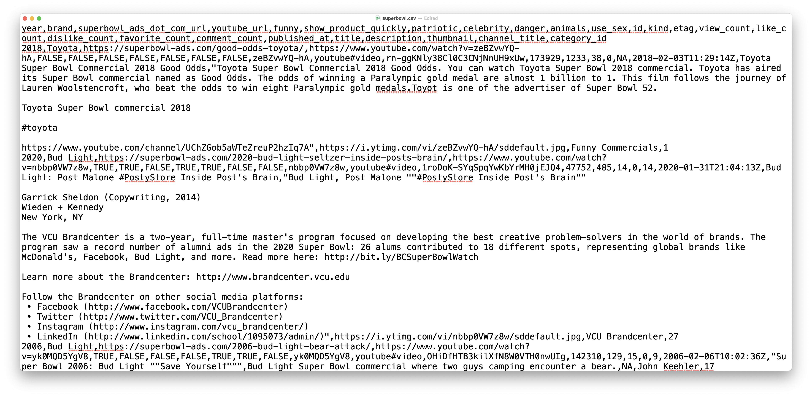
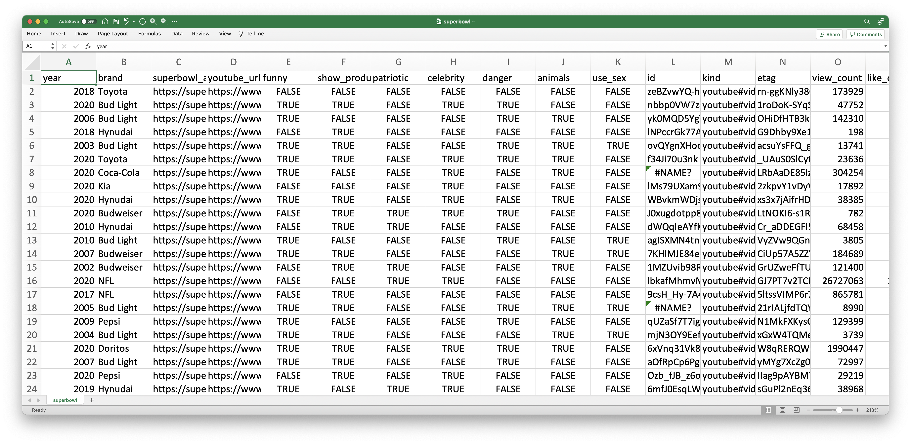

```{r xaringan-themer, include=FALSE, warning=FALSE}
library(xaringanthemer)
style_mono_accent(base_color = "#B31B1B",
                  text_font_size = "1.4rem")
xaringanExtra::use_xaringan_extra(c("tile_view"))
```

```{r setup, include=FALSE}
library(knitr)
opts_chunk$set(#warning = FALSE, message = FALSE, 
                      #cache = TRUE,
                      fig.retina = 3, fig.align = "center",
                      fig.width=14, fig.height=7)
```

```{r packages, include=FALSE}
library(tidyverse)
```


class: center middle main-title section-title-4

# Data import, tidy data, and relational data

.class-info[

**Week 4**

AEM 2850: R for Business Analytics<br>
Cornell Dyson<br>
Spring 2022

Acknowledgements: 
<!-- [Andrew Heiss](https://datavizm20.classes.andrewheiss.com),  -->
<!-- [Claus Wilke](https://wilkelab.org/SDS375/),  -->
[Grant McDermott](https://github.com/uo-ec607/lectures),
[Jenny Bryan](https://stat545.com/join-cheatsheet.html),
[Allison Horst](https://github.com/allisonhorst/stats-illustrations)

]


---

# Announcements

**Late assignments will get a ✔− going forward**
- If something comes up, email me and Hui in advance

Reminders:
- Submit assignments via canvas
  - Lab 3 was due yesterday (Monday) at 11:59pm
  - Reflection - Week 4 is due Wednesday at 11:59pm
- Bring your laptop to class on Thursday

Questions before we get started?

---

# Plan for today

[Prologue](#prologue)

[Data import](#readr)

[Tidy data](#tidyr)
  <!-- - [pivot_longer](#pivot_longer) / [pivot_wider](#pivot_wider) -->
  <!-- - [separate](#separate) -->
  <!-- - [unite](#unite) -->

[Relational data](#joins)

[Summary](#summary)


---
class: inverse, center, middle
name: prologue

# Prologue


---

# What are our concentrations?

Take a guess: what's the most common concentration among classmates?

--

```{r, echo = FALSE}
load("data/survey-responses/survey-data.RData")
as_tibble(concentrations_raw)
```

---

# What are our concentrations?

After some processing to get concentration counts, we get:

```{r, echo = FALSE}
concentrations %>% select(-response) %>% 
  summarize_all(sum, na.rm = TRUE) %>% 
   relocate(sort(tidyselect::peek_vars()))
```

What is the "level of observation" in this data frame? (i.e., what are the rows?)

--

Is the best way to organize concentration counts?

--

How would you use counts to compute shares in this data frame?

---

# What are our "tidy" concentrations?

Let's `pivot_longer` and `arrange` to get the top 3:

```{r, echo = FALSE}
# now show off what we can do with pivot_longer()
concentrations %>% select(-response) %>% 
  summarize_all(sum, na.rm = TRUE) %>% 
  pivot_longer(everything(), names_to = "concentration", values_to = "count") %>% 
  arrange(desc(count)) %>% 
  head(3)
```

--

How would you use counts to compute shares in this data frame?

--

```{r, eval = FALSE}
tidy_concentrations %>% mutate(share = count / sum(count)) # easy!
```

```{r, echo = FALSE}
concentrations %>% select(-response) %>% 
  summarize_all(sum, na.rm = TRUE) %>% 
  pivot_longer(everything(), names_to = "concentration", values_to = "count") %>% 
  arrange(desc(count)) %>% 
  mutate(share = count / sum(count)) %>% 
  head(3)
```

---
class: inverse, center, middle
name: readr

# Data import


---

# Data import

Plain-text rectangular files are a common way to store and share data:
- comma delimited files (`readr::read_csv`)
- tab delimited files (`readr::read_tsv`)
- fixed width files (`readr::read_fwf`)

We will just cover csv files since `readr` syntax is transferable

---

# Super bowl ads: a csv example

```{r echo=FALSE, out.width='60%'}
knitr::include_graphics("img/04/superbowl-ads.png")
```

???
Image source: [FiveThirtyEight](https://github.com/fivethirtyeight/superbowl-ads)

---

# Super bowl ads in csv format

```{r echo=FALSE, out.width='100%'}

```

???
Data source: [FiveThirtyEight](https://github.com/fivethirtyeight/superbowl-ads)

---

# Super bowl ads in csv format

```{r echo=FALSE, out.width='100%'}

```

---

# Getting from a csv to a data frame

How are data frames and csv files similar?

--
- both are rectangular
- csv lines often correspond to rows
- csv commas delineate columns

--

How are they different?

--
- csv files do not store column types!

---

# 1) readr::read_csv

`read_csv` helps us get from point a to point b:
- you give it the path to your csv file
- it takes the first line of data as column names by default
- it guesses column types and builds up a data frame

Most csv files can be read using the defaults, so we will focus on that

If you run into special cases, consult `?read_csv`

---

# An aside on paths

First we need to figure out what path to give `read_csv`

--

We have several options:
- absolute paths
  - `/Users/todd/aem2850/slides/data/superbowl.csv`
  - `C:\aem2850\slides\data\superbowl.csv`
- relative paths
  - `data/superbowl.csv`
- links
  - [`https://raw.githubusercontent.com/superbowl-ads.csv`](https://raw.githubusercontent.com/fivethirtyeight/superbowl-ads/main/superbowl-ads.csv)
- others
  - see `?read_csv`

---

# An aside on paths

Relative paths are nice: work if you move R code to another directory or device

**But what are they relative to?**

--

The working directory

**But where is the working directory?**

--

**R scripts (.R)** in an R Project: default working directory is the project directory

**R Markdown (.Rmd)**: default working directory is the location of the .Rmd file

--

In our RStudio Cloud projects, these will both be `/cloud/project`, which is the default directory for our projects and where we store our .Rmd templates

---

# An aside on paths

More generally, can check your working directory using `getwd()`

--

For example, here's the working directory the .Rmd source code for these slides:
```{r get-wd}
getwd()
```

`setwd()` will alter the working directory

---

# An aside on paths

Just for context, here is a list of (some) directories below the working directory

```{r get-path-a, echo = FALSE}
# list the directories below where this .Rmd file is
fs::dir_tree(recurse = FALSE, type = "directory", glob = "*slides_*", invert = TRUE)
```

--

Now list (some of) the .csv files in the folder `data`:

```{r get-path-b, echo = FALSE}
fs::dir_tree("data", glob = "*superbowl.csv") # could instead list the *.csv files within data
```

`data/superbowl.csv` is the relative path from our working directory to our csv


???

Omitted code that uses `fs::dir_tree` to print pretty directory trees

---

# 1) readr::read_csv

So all we need to do is give that relative path to `read_csv`:

```{r read-ads}
ads <- read_csv("data/superbowl.csv")
```

--

That was easy!

???
Note: readr intentionally never guesses that columns are integers as a safeguard ([source](https://github.com/tidyverse/readr/issues/1094#issuecomment-628612430))

---

# Now we're back to our old tricks

.pull-left[
```{r}
ads %>% 
  group_by(funny) %>% 
  count() %>% 
  arrange(desc(n))
```
]

.pull-right[
```{r}
ads %>% 
  group_by(brand) %>% 
  summarize(likes = sum(like_count, na.rm = T)) %>% 
  arrange(desc(likes))
```
]

---

# 2) readr::write_csv

Use `write_csv` to write data to a `.csv`:

```{r write-ads, eval = FALSE}
write_csv(ads, "data/superbowl.csv") # overwrite the raw data (bad idea!)

ads %>% 
  select(year, brand, youtube_url) %>% 
  write_csv("superbowl-urls.csv") # write modified output to a new file
```

---

# csv is not always the best storage medium

To preserve column specifications and save time when working in R, use `write_rds()` and `read_rds()` to save and open data frames in .RDS format

For multiple objects, `save()` and `load()` are handy functions from base R that work with the .RData format

---

# Importing excel data

Wait, what about getting data from excel spreadsheets?

--

Use `readxl::read_excel()` for data that is stored in `.xls` or `.xlsx` format

`readxl` isn't loaded as part of the core tidyverse, so we need to load it first:

```{r readxl}
library(readxl)
excel_sheets("data/readxl/datasets.xlsx") # list the sheets in datasets.xlsx
```

---

# Importing excel data

```{r}
read_excel("data/readxl/datasets.xlsx", sheet = "mtcars")
```

---

# Importing excel data

Can also use arguments like `range` to get data using excel lingo

```{r}
read_excel("data/readxl/datasets.xlsx", 
           range = "mtcars!A1:D6") # note the combination of sheet and cell range
```


---
class: inverse, center, middle
name: tidyr

# Tidy data


---

# WHAT is "tidy" data?

---

```{r echo=FALSE, out.width='100%'}
knitr::include_graphics("img/04/tidydata_1.jpg")
```


---

```{r echo=FALSE, out.width='100%'}
knitr::include_graphics("img/04/tidydata_2.jpg")
```


---

# WHY "tidy" data?

---

```{r echo=FALSE, out.width='100%'}
knitr::include_graphics("img/04/tidydata_3.jpg")
```


---

# HOW can we "tidy" data?

**Key tidyr verbs**

1. `pivot_longer`: Pivot wide data into long format (updated version of `gather`) 

2. `pivot_wider`: Pivot long data into wide format (updated version of `spread`) 

3. `separate`: Split one column into multiple columns

4. `unite`: Combine multiple columns into one


---
name: pivot_longer

# Let's start with an untidy dataset

```{r pivot_longer1}
stocks <- data.frame( # could use "tibble" instead of "data.frame" if you prefer
  time = as.Date('2009-01-01') + 0:1,
  X = rnorm(2, 0, 1),
  Y = rnorm(2, 0, 2),
  Z = rnorm(2, 0, 4)
  )
stocks
```

We have 4 columns, the date and the stocks

How do we get this in tidy form?

---

# 1) tidyr::pivot_longer

We need to pivot the stock name columns `X`, `Y`, `Z` longer

1. Choose columns using `X:Z` or `-time`
2. Decide what variable holds the names: `names_to = "stock"`
3. Decide what variable holds the values: `values_to = "price"`

---

# 1) tidyr::pivot_longer

```{r pivot_longer1b}
stocks %>% pivot_longer(X:Z, names_to = "stock", values_to = "price")
```

--

Let's save the "tidy" (i.e., long) stocks data frame for use on the next slide

```{r pivot_longer2}
tidy_stocks <- stocks %>% 
  pivot_longer(-time, names_to = "stock", values_to = "price")
```

---
name: pivot_wider

# 2) tidyr::pivot_wider

```{r pivot_wider1, dependson=tidy_stocks}
tidy_stocks %>% pivot_wider(names_from = stock, values_from = price)
tidy_stocks %>% pivot_wider(names_from = time, values_from = price)
```

--

Note that the second example effectively transposed the original data

---
name: separate

# 3) tidyr::separate

```{r echo = FALSE, eval = FALSE}
# economists <- data.frame(name = c("Adam.Smith", "Paul.Samuelson", "Milton.Friedman"))
```

```{r sep1}
halftime_openers <- data.frame(name = c("Dr.Dre", "Snoop.Dogg"))
halftime_openers
```

--

```{r sep1a}
halftime_openers %>% separate(name, c("first_name", "last_name")) 
```

--

This command is clever: it splits at non-alphanumeric values. To avoid ambiguity, you can specify the separation character with `separate(..., sep=".")`

---

# 3) tidyr::separate

```{r sep1b}
halftime_performers <- data.frame(name = c("Dr..Dre", "Snoop.Dogg", "Eminem", "Mary.J.Blige",
                                           "Kendrick.Lamar", "50.Cent", "Anderson..Paak"))
```
--
```{r sep1c}
halftime_performers %>% separate(name, c("first_name", "last_name"))
```

What happened? Did we lose any information?

???
No "Blige", no . in "Dr." or ".Paak"

---
name: unite

# 4) tidyr::unite

```{r unite1}
gdp <- data.frame(
  yr = rep(2016, times = 4),
  mnth = rep(1, times = 4),
  dy = 1:4,
  gdp = rnorm(4, mean = 100, sd = 2)
  )
gdp 
```

---

# 4) tidyr::unite

```{r unite1b}
# combine "yr", "mnth", and "dy" into one "date" column
gdp %>% unite(date, c("yr", "mnth", "dy"), sep = "-")
```

---

# 4) tidyr::unite

Note that `unite` will automatically create a character variable:
```{r unite2, highlight.lines = 3}
gdp_u <- gdp %>% unite(date, c("yr", "mnth", "dy"), sep = "-") %>% as_tibble()
gdp_u
```

--

To convert it to something else (e.g., date or numeric), modify it using `mutate`

---

# 4) tidyr::unite

```{r unite3, message=F}
library(lubridate) # the lubridate package has helpful date conversion functions
gdp_u %>% mutate(date = ymd(date))
```

???
https://lubridate.tidyverse.org/

---

# tidyr resources

[Data tidying with tidyr : : CHEAT SHEET](https://raw.githubusercontent.com/rstudio/cheatsheets/main/tidyr.pdf) (link downloads a pdf)

[Vignette](https://cran.r-project.org/web/packages/tidyr/vignettes/tidy-data.html) (from the **tidyr** package)
```{r, eval = FALSE}
vignette("tidy-data")
```

[Original paper](https://vita.had.co.nz/papers/tidy-data.pdf) (Hadley Wickham, 2014 JSS)


---
class: inverse, center, middle
name: joins

# Relational data


---

# What are relational data?

--

Multiple tables of data with pairwise relations

Relations across >2 data tables are determined by the relations between each pair

---

# Relational data verbs from dplyr

1. **Mutating joins**: add new variables
  - `left_join()`
  - `right_join()`
  - `inner_join()`
  - `full_join()`

2. **Filtering joins**: filter observations
  - `semi_join()`
  - `anti_join()`


<!-- --- -->

<!-- # How do join verbs work? -->


<!-- From Ivan Rudik's slides: -->

<!-- We need two datasets (e.g., housing prices and pollution) -->

<!-- Each dataset has the same set of **key** variables (e.g. county) -->

<!-- When we join, we match up the two datasets on the key, and combine them into one -->

<!-- In our housing example, each row of the joined dataset would now tell us the house price, the county it's in, and the county's pollution -->

???

You can visualize the operations [here](https://r4ds.had.co.nz/relational-data.html)

---

# Joins

Let's learn these join commands using two small data frames

```{r echo = FALSE}
superheroes <- tibble::tribble(
       ~name, ~alignment,  ~gender,          ~publisher,
   "Magneto",      "bad",   "male",            "Marvel",
     "Storm",     "good", "female",            "Marvel",
  "Mystique",      "bad", "female",            "Marvel",
    "Batman",     "good",   "male",                "DC",
     "Joker",      "bad",   "male",                "DC",
  "Catwoman",      "bad", "female",                "DC",
   "Hellboy",     "good",   "male", "Dark Horse Comics"
  )

publishers <- tibble::tribble(
  ~publisher, ~yr_founded,
        "DC",       1934L,
    "Marvel",       1939L,
     "Image",       1992L
  )
```

.pull-left[
```{r}
superheroes
```
]

.pull-right[
```{r}
publishers
```
]

???
Source: https://stat545.com/join-cheatsheet.html


---

# 1) dplyr::left_join(x, y)

```{r ljoin}
left_join(superheroes, publishers)
```

`left_join` is a **mutating join**: it adds variables to `x`

`left_join` returns all rows from `x`

---

# 2) dplyr::right_join(x, y)

```{r rjoin}
right_join(superheroes, publishers)
```

`right_join` is a **mutating join**: it adds variables to `y`

`right_join` returns all rows from `y`

---

# 3) dplyr::inner_join(x, y)

```{r ijoin}
inner_join(superheroes, publishers)
```

How is `inner_join` different from `left_join` and `right_join`?

--

`inner_join` returns all rows in `x` **AND** `y`

---

# 4) dplyr::full_join(x, y)

```{r fjoin, eval = FALSE}
full_join(superheroes, publishers) # how many rows will this produce?
```

--

```{r fjoinb, echo = FALSE}
full_join(superheroes, publishers)
```

`full_join` returns all rows in `x` **OR** `y`

---

# 5) dplyr::semi_join(x, y)

.pull-left[
```{r}
superheroes
```
]

.pull-right[
```{r sjoin}
semi_join(superheroes, publishers)
```
]

`semi_join` is a **filtering join**: it keeps observations in `x` that have a match in `y`

Note that the variables do not change

---

# 6) dplyr::anti_join(x, y)

.pull-left[
```{r}
superheroes
```
]

.pull-right[
```{r ajoin}
anti_join(superheroes, publishers)
```
]

`anti_join` is a **filtering join**: it keeps obs. in `x` that **DO NOT** have a match in `y`

Note that the variables do not change


---
class: inverse, center, middle
name: summary

# Summary

---

# Key verbs

.pull-left-4[
### Import
#### readr
1. `read_csv`
2. `write_csv`

#### readxl
1. `read_excel`
]

.pull-midleft-4[
### Tidy
#### tidyr
1. `pivot_longer`
2. `pivot_wider`
3. `separate`
4. `unite`
]

.pull-midright-4[
### Join
#### dplyr
1. `left_join`
2. `right_join`
3. `inner_join`
4. `full_join`
5. `semi_join`
6. `anti_join`
]

.pull-right-4[
### Transform
#### dplyr
1. `filter`
2. `arrange`
3. `select`
4. `mutate`
5. `summarize`
]


