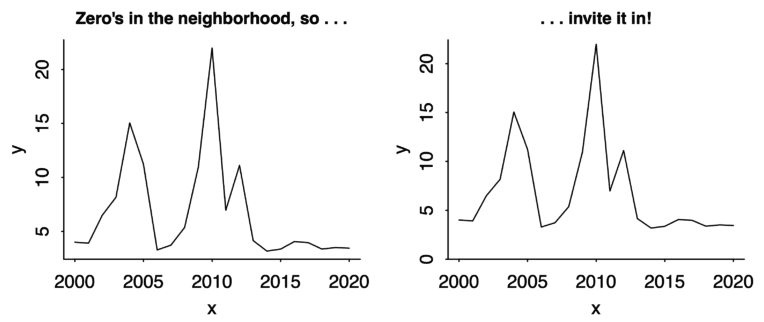
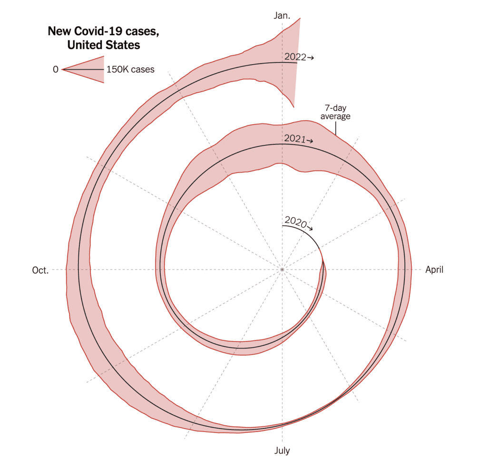

```{r xaringan-themer, include=FALSE, warning=FALSE}
library(xaringanthemer)
style_mono_accent(base_color = "#B31B1B",
                  text_font_size = "1.4rem")
xaringanExtra::use_xaringan_extra(c("tile_view"))
```

```{r setup, include=FALSE}
library(knitr)
opts_chunk$set(warning = FALSE, message = FALSE, 
                      #cache = TRUE,
                      fig.retina = 3, fig.align = "center",
                      fig.width=14, fig.height=7)
```

```{r, download-gme-prices, eval=FALSE}
# do this once, manually
tidyquant::tq_get("GME", get = "stock.prices", from = "1990-01-01") %>% 
  write_csv(., "content/slides/data/gme-prices.csv")
```

```{r download-fred-data, eval=FALSE}
# do this once, manually
fred_raw <- tidyquant::tq_get(c("RSXFSN",  # Advance retail sales
                                "GDPC1",  # GDP
                                "ICSA",  # Initial unemployment claims
                                "FPCPITOTLZGUSA",  # Inflation
                                "UNRATE",  # Unemployment rate
                                "USREC"),  # Recessions
                              get = "economic.data",  # Use FRED
                              from = "1990-01-01")
write_csv(fred_raw, "content/slides/data/fred_raw.csv")
```

```{r packages-data, include=FALSE}
library(tidyverse)
library(scales)
library(viridis)
library(gapminder)
library(ggridges)
library(scales)
library(gganimate)
library(lubridate)
library(ggrepel)
library(patchwork)
library(tsibble)
library(fable)
library(ggtext)

set.seed(1234)

gme_prices <- read_csv("data/gme-prices.csv")
solar_data <- read_csv("data/solar-data.csv") %>% 
  mutate(date = yq(paste0(year,"-",quarter))) %>% 
  select(date, p, q) %>% 
  mutate(q = q/1e3) %>%
  rename("Price ($/Watt)" = p, "Quantity (GW)" = q)
fred_raw <- read_csv("data/fred_raw.csv")
measles <- read_csv("data/cdc-measles.csv") %>% 
  group_by(Year) %>% 
  slice(1) %>% 
  ungroup()
```


class: center, middle

# Time

.class-info[

**Week 10**

AEM 2850 / 5850 : R for Business Analytics<br>
Cornell Dyson<br>
Spring 2023

Acknowledgements: 
[Andrew Heiss](https://datavizm20.classes.andrewheiss.com)
<!-- [Claus Wilke](https://wilkelab.org/SDS375/) -->
<!-- [Grant McDermott](https://github.com/uo-ec607/lectures), -->
<!-- [Jenny Bryan](https://stat545.com/join-cheatsheet.html), -->
<!-- [Allison Horst](https://github.com/allisonhorst/stats-illustrations) -->

]

---

# Announcements

Reminders:
- Mini Project 1 due April 1 ([link](https://aem2850.toddgerarden.com/assignment/01-mini-project/))

Questions before we get started?


---

# Plan for today

[Prologue: Axis issues](#axis-issues)

[Visualizing time](#visualizing-time)

[Starting, ending, and decomposing time](#decomposing)

[Dates and times in R](#working-with-time)


---
class: inverse, center, middle
name: axis-issues

# Prologue: Axis issues

---

# Is truncating the y-axis misleading?

```{r truncation-yes-no, echo=FALSE, fig.width=12, fig.height=7}
tibble(y = seq(0, 0.995, 0.005)) %>% 
  mutate(fill = y <= 0.989) %>% 
  ggplot(aes(ymin = y, ymax = y + 0.005, xmin = 0, xmax = 1, fill = fill)) +
  geom_rect() +
  annotate(geom = "text", x = 0.5, y = 0.995, label = "No", color = "#FFDC00",
           family = "Fira Sans Condensed Black", fontface = "plain", size = 25) +
  annotate(geom = "text", x = 0.5, y = 0.985, label = "Yes", color = "#FFDC00",
           family = "Fira Sans Condensed Black", fontface = "plain", size = 25) +
  scale_x_continuous(expand = c(0, 0)) +
  scale_y_continuous(labels = percent_format(accuracy = 0.1)) +
  scale_fill_manual(values = c("#FF4136", "#0074D9"), guide = "none") +
  labs(x = NULL, y = "Percent of the time") +
  coord_cartesian(ylim = c(.98, 1)) +
  theme_minimal(base_size = 25, base_family = "Fira Sans Condensed") +
  theme(panel.grid = element_blank(),
        axis.text.x = element_blank())
```

---

# Don't be too extreme!

It is actually more legal to truncate the y-axis than you might think

When do you think it is okay to truncate?

--

When small movements matter

--

When the scale itself is distorted

--

When zero values are impossible

---

# When is it okay to truncate?

.center[**When small movements matter**]

--

.pull-left[
<figure>
  
</figure>
]

--

.pull-right[
<figure>
  
</figure>
]

???

Stock prices too

https://qz.com/418083/its-ok-not-to-start-your-y-axis-at-zero/

---

# When is it okay to truncate?

.center[**When the scale itself is distorted**]

--

.pull-left.center[
<figure>
  
</figure>
]

--

.pull-right.center[
<figure>
  
</figure>
]

???

https://www.buzzfeed.com/carolineodonovan/the-fault-in-five-stars

http://www.businessinsider.com/leaked-charts-show-how-ubers-driver-rating-system-works-2015-2


---

# When is it okay to truncate?

.center[**When zero values are impossible**]

--

.pull-left[
<figure>
  
</figure>
]

--

.pull-right[
<figure>
  
</figure>
]

???

https://qz.com/418083/its-ok-not-to-start-your-y-axis-at-zero/

---

# Never on bar charts

.center[
<figure>
  
</figure>
]

---

# Zero is okay too!

Just because you don't *have to* start at 0 doesn't mean you should *never* start at 0

Andrew Gelman's heuristic: **"If zero is in the neighborhood, invite it in."**

.center[
<figure>
  
</figure>
]

???

https://statmodeling.stat.columbia.edu/2021/12/17/graphing-advice-if-zero-is-in-the-neighborhood-invite-it-in/

---

# Keep scales consistent and flag missing data

&nbsp;

.center[
<figure>
  
</figure>
]

???

Alberto Cairo, *The Truthful Art*, chapter 8, figure 8.21

---

# Don’t impute across categories

.pull-left[
```{r likert-imputation-bad, echo=FALSE, fig.width=4.8, fig.height=4.2, out.width="100%"}
fake_survey <- tribble(
  ~response, ~count,
  "Strongly agree", 5,
  "Agree", 10,
  "Neutral", 11,
  "Disagree", 8,
  "Strongly disagree", 2
) %>% 
  mutate(response = fct_rev(fct_inorder(response)))

ggplot(fake_survey, aes(x = response, y = count, group = 1)) +
  geom_line(size = 1, color = "grey50") +
  geom_point(aes(color = response), size = 9) +
  scale_color_viridis(discrete = TRUE) +
  expand_limits(y = 0) +
  labs(title = "This is BAD", x = NULL, y = "Count") +
  guides(color = "none")
```
]

--

.pull-right[
```{r likert-good, echo=FALSE, fig.width=4.8, fig.height=4.2, out.width="100%"}
ggplot(fake_survey, aes(x = response, y = count)) +
  geom_pointrange(aes(ymin = 0, ymax = count, color = response), size = 2) +
  scale_color_viridis(discrete = TRUE) +
  labs(title = "This is BETTER", x = NULL, y = "Count") +
  guides(color = "none")
```
]


---
class: inverse, center, middle
name: visualizing-time

# Visualizing time

---

# Showing changes over time

Time is just a variable that can be mapped to an aesthetic

--

Can be used as `x`, `y`, `color`, `fill`, `facet`, and even animation

--

Can use all sorts of `geom`s: lines, columns, points, heatmaps, densities, maps, etc.

--

In general, follow reading conventions to show time progression:

→ & ↓

---

# Time on x-axis + `geom_point()`

.left-code[
```{r gme-point, tidy=FALSE, fig.show="hide", fig.dim=c(4, 3), out.width="100%"}
gme_prices %>% 
  ggplot(aes(x = date, y = adjusted)) +
  geom_point(size = 0.5) + #<<
  labs(x = NULL, y = "Share price ($)",
       title = "GME to the moon")
```
How would you add a line to this?
]

.right-plot[
`)
]


---

# Time on x-axis + `geom_point()`

.left-code[
```{r gme-point-line, tidy=FALSE, fig.show="hide", fig.dim=c(4, 3), out.width="100%"}
gme_prices %>% 
  ggplot(aes(x = date, y = adjusted)) +
  geom_point(size = 0.5) +
  geom_line() + #<<
  labs(x = NULL, y = "Share price ($)",
       title = "GME to the moon")
```
]

.right-plot[
`)
]


---

# Time on x-axis: points vs lines

Points emphasize observations

Lines emphasize trends

Using lines for time series is often fine since data are evenly spaced and usually complete

But lines are effectively made-up data, so be careful how you use them!

---

# Time on x-axis + `geom_line/col()`

.left-code[
```{r gme, tidy=FALSE, fig.show="hide", fig.dim=c(4, 3), out.width="100%"}
gme_prices %>% 
  ggplot(aes(x = date, y = adjusted)) +
  geom_line() +
  labs(x = NULL, y = "Share price ($)",
       title = "GME to the moon")
```
]

.right-plot[
`)
]


---

# Time on x-axis + `geom_line/col()`

Can also use a fill for the area under a line, **as long as the y-axis starts at zero**

.left-code[
```{r gme-fill, tidy=FALSE, fig.show="hide", fig.dim=c(4, 3), out.width="100%"}
gme_prices %>% 
  ggplot(aes(x = date, y = adjusted)) +
  geom_area(fill = "skyblue", color = "black") + #<<
  labs(x = NULL, y = "Share price ($)",
       title = "GME to the moon")
```
]

.right-plot[
`)
]


---

# Line plots don't have to be boring

.more-left.center[
```{r covid-unemp-claims, echo=FALSE, fig.width=6, fig.height=4, out.width="100%"}
# Wrangle the recession dates so that we just have start and end dates
recessions_raw <- fred_raw %>% 
  filter(symbol == "USREC") %>% 
  mutate(recession_delta = price - lag(price)) %>% 
  filter(recession_delta != 0)

recessions_fake_end <- recessions_raw %>% 
  bind_rows(tibble(date = ymd("2021-06-01"),
                   recession_delta = -1))

recessions <- tibble(start = filter(recessions_fake_end, recession_delta == 1)$date,
                     end = filter(recessions_fake_end, recession_delta == -1)$date)

claims <- fred_raw %>% 
  filter(symbol == "ICSA") %>% 
  rename(claims = price)

ggplot() +
  geom_rect(data = recessions, aes(xmin = start, xmax = end, ymin = -Inf, ymax = Inf),
            fill = "#FF851B", alpha = 0.2) +
  geom_line(data = claims, aes(x = date, y = claims), size = 0.5, color = "#85144b") +
  scale_x_date(date_breaks = "5 years", date_labels = "%Y") +
  scale_y_continuous(labels = comma) +
  labs(x = NULL, y = "Initial unemployment claims",
       title = "HOLY CRAP",
       caption = "Source: Initial weekly unemployment claims (ICSA); FRED\nRecessions highlighted in orange") +
  theme_bw(base_family = "Fira Sans Condensed") +
  theme(plot.title = element_text(face = "bold"),
        panel.grid.minor.x = element_blank())

```
]

.less-right.center[
<figure>
  
</figure>
]

???

Monthly change in jobs since end of WWII

The New York Times front page, May 9, 2020

https://www.nytimes.com/issue/todayspaper/2020/05/09/todays-new-york-times

https://static01.nyt.com/images/2020/05/09/nytfrontpage/scan.pdf

---

# Time on y-axis + `geom_density()`

```{r density-ridges, echo=FALSE, fig.width=7, fig.height=3.25, out.width="90%"}
gapminder %>% 
    mutate(year_factor = factor(year)) %>% 
    ggplot(
      aes(x = lifeExp, 
          y = fct_rev(year_factor), 
          fill = after_stat(x))
      ) +
    geom_density_ridges_gradient(
      color = "white", 
      quantile_lines = TRUE, 
      quantiles = 2
      ) +
    guides(fill = "none") +
    scale_fill_viridis() + 
    labs(x = "Life expectancy", 
         y = NULL, fill = NULL) + 
    theme_minimal()
```

.center[How would you make this plot?]

---

# Let's start simple

.left-code[
```{r density-ridges-howto, tidy=FALSE, fig.show="hide", fig.dim=c(4, 3), out.width="100%"}
library(ggridges) # geom_density_ridges() package #<<

gapminder %>% 
    mutate(year_factor = factor(year)) %>% #<<
    ggplot(
      aes(x = lifeExp, 
          y = year_factor) # map time to y #<<
      ) +
    geom_density_ridges() # add geom #<<
```

How could we modify this to follow ↓ convention for time?
]

.right-plot[
`)
]

---

# Follow ↓ convention for time

.left-code[
```{r density-ridges-howto-rev, tidy=FALSE, fig.show="hide", fig.dim=c(4, 3), out.width="100%"}
gapminder %>% 
    mutate(year_factor = factor(year)) %>% 
    ggplot(
      aes(x = lifeExp, 
          y = fct_rev(year_factor)) # reverse year #<<
      ) +
    geom_density_ridges()
```

How could we change the black lines to white?
]

.right-plot[
`)
]

---

# Add color to help visually separate densities

.left-code[
```{r density-ridges-howto-white, tidy=FALSE, fig.show="hide", fig.dim=c(4, 3), out.width="100%"}
gapminder %>% 
    mutate(year_factor = factor(year)) %>% 
    ggplot(
      aes(x = lifeExp, 
          y = fct_rev(year_factor))
      ) +
    geom_density_ridges(
      color = "white"  # separate densities #<<
      )
```

How could we add a line at the median of each density?
]

.right-plot[
`)
]

---

# Add a line at the median of each density

.left-code[
```{r density-ridges-howto-median, tidy=FALSE, fig.show="hide", fig.dim=c(4, 3), out.width="100%"}
gapminder %>% 
    mutate(year_factor = factor(year)) %>% 
    ggplot(
      aes(x = lifeExp, 
          y = fct_rev(year_factor))
      ) +
    geom_density_ridges(
      color = "white", 
      quantile_lines = TRUE, # add quantile lines #<<
      quantiles = 2          # median #<<
      )
```

How could we add a color gradient to the densities?
]

.right-plot[
`)
]

---

# Fill the densities along the x axis

.left-code[
```{r density-ridges-howto-fill, tidy=FALSE, fig.show="hide", fig.dim=c(4, 3), out.width="100%"}
gapminder %>% 
    mutate(year_factor = factor(year)) %>% 
    ggplot(
      aes(x = lifeExp, 
          y = fct_rev(year_factor),
          fill = after_stat(x)) # fill by x value #<<
      ) +
    geom_density_ridges_gradient( #<<
      # this is a special geom to fill along x #<<
      color = "white", 
      quantile_lines = TRUE, 
      quantiles = 2
      )
```

Use **after_stat** to shade the *densities*, not the data itself
]

.right-plot[
`)
]

---

# Finish by cleaning the plot up

.left-code[
```{r density-ridges-howto-fancy, tidy=FALSE, fig.show="hide", fig.dim=c(4, 3), out.width="100%"}
gapminder %>% 
    mutate(year_factor = factor(year)) %>% 
    ggplot(
      aes(x = lifeExp, 
          y = fct_rev(year_factor),
          fill = after_stat(x))
      ) +
    geom_density_ridges_gradient(
      color = "white", 
      quantile_lines = TRUE, 
      quantiles = 2
      ) +
    guides(fill = "none") +       # omit legend #<<
    scale_fill_viridis() +        # nicer shading #<<
    labs(x = "Life expectancy",   # modify label #<<
         y = NULL, fill = NULL) + # omit labels #<<
    theme_minimal()               # cleaner theme #<<
```
]

.right-plot[
`)
]

---

# Time in animation + `geom_point()`

.center[
<figure>
  
</figure>
]

---

# How can we make this animation in R?

First, how would we make a static plot of the data?

--

.left-code[
```{r gapminder-static, tidy=FALSE, fig.show="hide", fig.dim=c(8, 6), out.width="100%"}
gapminder %>% 
  ggplot(aes(gdpPercap, lifeExp,  #<<
             size = pop, color = country)) + #<<
  geom_point(alpha = 0.5, show.legend = FALSE) + #<<
  facet_wrap(~continent) + #<<
  scale_color_manual(
    values = gapminder::country_colors
    ) +
  scale_size_continuous(range = c(1, 15)) +
  scale_x_log10(labels = scales::dollar) +
  theme_minimal(base_size = 14) +
  labs(x = "GDP per capita", 
       y = "Life expectancy",
       title = "Year: 1952-2007")
```
]

.right-plot[
`)
]


???

https://towardsdatascience.com/how-to-create-animated-plots-in-r-adf53a775961

---

# Converting a static plot to an animation

Second, let's use `gganimate` to visualize changes over time

.left-code[
```{r gapminder-dynamic, eval=FALSE, tidy=FALSE, message=FALSE}
library(gganimate) # plot animation package #<<

gapminder %>% 
  ggplot(aes(gdpPercap, lifeExp, 
             size = pop, color = country)) +
  geom_point(alpha = 0.5, show.legend = FALSE) +
  facet_wrap(~continent) +
  scale_color_manual(
    values = gapminder::country_colors
    ) +
  scale_size_continuous(range = c(1, 15)) +
  scale_x_log10(labels = scales::dollar) +
  theme_minimal(base_size = 14) +
  labs(x = "GDP per capita", 
       y = "Life expectancy",
       title = "Year: {frame_time}") + #<<
  transition_time(year) + #<<
  ease_aes('linear') # default progression #<<
```
]

--

.right-plot[
<figure>
  
</figure>
]

???

https://towardsdatascience.com/how-to-create-animated-plots-in-r-adf53a775961

---

# Saving gifs

Third, use `anim_save()` to write a `.gif` that you can text to your mom

```{r gapminder-animation, eval=FALSE, tidy=FALSE, fig.dim=c(8, 6), out.width="100%"}
library(gganimate) # plot animation package

my_gapminder_animation <- gapminder %>% 
  ggplot(aes(gdpPercap, lifeExp, size = pop, color = country)) +
  geom_point(alpha = 0.5, show.legend = FALSE) +
  scale_color_manual(values = gapminder::country_colors) +
  scale_size_continuous(range = c(1, 15)) +
  scale_x_log10(labels = scales::dollar) +
  facet_wrap(~continent) +
  theme_minimal(base_size = 14) +
  labs(x = "GDP per capita", 
       y = "Life expectancy",
       title = "Year: {frame_time}") +
  transition_time(year) +
  ease_aes('linear')

anim_save("content/slides/img/09/my-gapminder-animation.gif",  #<<
          my_gapminder_animation) #<<
```

???

https://towardsdatascience.com/how-to-create-animated-plots-in-r-adf53a775961

---

# Time in maps

.center[
<figure>
  
  <figcaption>Map of the spread of Walmart by Jorge Camões</figcaption>
</figure>
]

???

Alberto Cairo, *The Truthful Art*, chapter 8, figure 8.30

---

# Connected scatter plots

.pull-left[
Sometimes connected scatter plots of time series data make sense

What is a connected scatter plot?

How would you make one using these data?
]

.pull-right[
```{r solar-data-facet, echo=FALSE, fig.dim=c(4, 3), out.width="100%"}
solar_data %>% 
  pivot_longer(-date, 
               names_to = "key", 
               values_to = "value") %>% 
  ggplot(aes(x = date, 
             y = value, 
             color = key)) + 
  geom_line() + 
  facet_wrap(~key, ncol = 1, 
             scales = "free_y") + 
  guides(color = "none") +
  theme_minimal() + 
  labs(x = NULL, y = NULL) +
  scale_y_continuous(limits = c(0,NA))
```
]

---

# Connected scatter plots

.left-code[
```{r solar-data-connected, tidy=FALSE, fig.show="hide", fig.dim=c(4, 3), out.width="100%"}
solar_data %>% 
  ggplot(aes(x = `Quantity (GW)`,  # not time #<<
             y = `Price ($/Watt)`, # not time #<<
             color = date)) +      # time! #<<
  geom_point() + 
  geom_path() + # connect by time, not x #<<
  scale_x_log10() + 
  scale_y_log10() + 
  scale_color_viridis() +
  guides(color = "none") +
  theme_minimal()
```

Note the log axes
]

.right-plot[
`)
]


---

# Is this a good use case?

.pull-left[
```{r solar-data-connected-2, echo=FALSE, fig.dim=c(4, 3), out.width="100%"}
solar_data %>% 
  ggplot(aes(x = `Quantity (GW)`,  # not time #<<
             y = `Price ($/Watt)`, # not time #<<
             color = date)) +      # time! #<<
  geom_point() + 
  geom_path() + # connect by time, not x #<<
  geom_smooth(method = "lm", alpha = 0.5) +
  scale_x_log10() +
  scale_y_log10() +
  scale_color_viridis() +
  guides(color = "none") +
  theme_minimal()
```
]

--

.pull-right[
Looks a lot like a demand curve!

$log(Q) = \alpha + \beta log(P) + \varepsilon$

We could use OLS to estimate $\beta$

How might we interpret $\beta$?
]


---

# Often it's better to use multiple plots

.pull-left[
```{r unemp-inflation-path, echo=FALSE, fig.width=4.8, fig.height=4.2, out.width="100%"}
unemp_inflation <- fred_raw %>% 
  filter(symbol %in% c("UNRATE", "FPCPITOTLZGUSA")) %>% 
  pivot_wider(id_cols = date, names_from = symbol, values_from = price) %>% 
  rename(inflation = FPCPITOTLZGUSA, unemployment = UNRATE) %>% 
  mutate(year = year(date)) %>% 
  mutate_at(vars(inflation, unemployment), ~ . / 100) %>% 
  filter(year >= 1990, year < 2020) %>% 
  arrange(date)

unemp_inflation_small <- unemp_inflation %>% 
  group_by(year) %>% 
  summarize(inflation = mean(inflation, na.rm = TRUE),
            unemployment = mean(unemployment))

ggplot(unemp_inflation_small, aes(x = unemployment, y = inflation)) +
  geom_path(size = 1, color = "grey50") +
  geom_point() +
  geom_text_repel(aes(label = year), vjust = -0.5, family = "Fira Sans Condensed") +
  scale_x_continuous(labels = percent_format(accuracy = 1)) +
  scale_y_continuous(labels = percent_format(accuracy = 1)) +
  labs(x = "Unemployment", y = "Inflation") +
  theme_minimal(base_family = "Fira Sans Condensed")
```
]

--

.pull-right[
```{r unemp-inflation-good, echo=FALSE, fig.width=4.8, fig.height=4.2, out.width="100%"}
plot_inflation <- ggplot(drop_na(unemp_inflation, inflation), 
                         aes(x = date, y = inflation)) +
  geom_line(size = 1, color = "#F012BE") +
  scale_y_continuous(labels = percent_format(accuracy = 1)) +
  labs(x = NULL, y = "Inflation") +
  theme_minimal(base_family = "Fira Sans Condensed")

plot_unempl <- ggplot(unemp_inflation, aes(x = date, y = unemployment)) +
  geom_line(size = 1, color = "#FF851B") +
  scale_y_continuous(labels = percent_format(accuracy = 1)) +
  labs(x = NULL, y = "Unemployment") +
  theme_minimal(base_family = "Fira Sans Condensed")

plot_inflation / plot_unempl
```

]

---

# Don't go wild with time mapping!

.pull-left.center[
<figure>
  
</figure>
]

--

.pull-right.center[
<figure>
  
</figure>
]

???

Image source: https://www.nytimes.com/2022/01/06/opinion/omicron-covid-us.html

Discussion: https://junkcharts.typepad.com/junk_charts/2022/01/think-twice-before-you-spiral.html

---
class: inverse, center, middle
name: decomposing

# Starting, ending, and decomposing time

---

# You have to start (and end) somewhere

You always have to choose start and end points

Start and end at reasonable times that help maintain the context of your story


---

# Measles vaccine was pretty effective

```{r measles-partial, echo=FALSE, fig.width=6, fig.height=3.75, out.width="75%"}
measles_1963 <- filter(measles, Year == 1963)

ggplot(measles, aes(x = Year, y = Cases)) +
  geom_line(size = 1, color = "#3D9970") +
  scale_y_continuous(labels = comma) +
  annotate(geom = "segment", x = 1963, xend = 1963, 
           y = 320000, yend = 360000,
           arrow = arrow(angle = 15, length = unit(0.3, "lines")),
           color = "#F012BE", size = 0.5) +
  annotate(geom = "text", x = 1963, y = 300000, 
           label = "Vaccine introduced in 1963", hjust = 0.5, vjust = 0.5,
           family = "Fira Sans Condensed", color = "#F012BE") +
  annotate(geom = "point", x = measles_1963$Year, y = measles_1963$Cases, 
           color = "#F012BE", size = 2) +
  coord_cartesian(xlim = c(1960, 1965), ylim = c(0, 500000)) +
  labs(x = NULL, y = "Cases per year", 
       caption = "Source: CDC, Epidemiology and Prevention of\nVaccine-Preventable Diseases, 13th Edition") +
  theme_minimal(base_family = "Fira Sans Condensed")
```


???

Data sources listed here: 

https://commons.m.wikimedia.org/wiki/File:Measles_US_1938-2019.png

I used [this big PDF table from the CDC](https://web.archive.org/web/20190120205018/https://www.cdc.gov/vaccines/pubs/pinkbook/downloads/appendices/e/reported-cases.pdf), used some random online PDF → CSV converter, and cleaned up the data by hand in Excel:

---

# Measles vaccine was *incredible*!

```{r measles-full, echo=FALSE, fig.width=6, fig.height=3.75, out.width="75%"}
ggplot(measles, aes(x = Year, y = Cases)) +
  geom_line(size = 1, color = "#3D9970") +
  scale_x_continuous(breaks = seq(1950, 2020, 10)) +
  scale_y_continuous(labels = comma) +
  annotate(geom = "segment", x = 1967, xend = 1965, 
           y = measles_1963$Cases, yend = measles_1963$Cases,
           arrow = arrow(angle = 15, length = unit(0.3, "lines")),
           color = "#F012BE", size = 0.5) +
  annotate(geom = "text", x = 1967.5, y = measles_1963$Cases, 
           label = "Vaccine introduced in 1963", hjust = 0, vjust = 0.5,
           family = "Fira Sans Condensed", color = "#F012BE") +
  annotate(geom = "point", x = measles_1963$Year, y = measles_1963$Cases, 
           color = "#F012BE", size = 2) +
  labs(x = NULL, y = "Cases per year", 
       caption = "Source: CDC, Epidemiology and Prevention of\nVaccine-Preventable Diseases, 13th Edition") +
  theme_minimal(base_family = "Fira Sans Condensed")
```

---

# Seasonality

Don't mistake seasonality for actual trends

```{r process-fred-seasonality, echo=FALSE}
# Clean up retail sales data
retail_sales <- fred_raw %>%
  filter(symbol == "RSXFSN") %>%
  filter(date > "1999-12-31") %>%
  rename(sales = price) %>%
  mutate(year_month = yearmonth(date)) %>%
  as_tsibble(index = year_month, key = symbol)

# Decompose sales
sales_model <- retail_sales %>%
  # Probably best to use multiplicative errors, but then the values are less
  # easily interpretable
  model(ets = ETS(sales ~ error("A") + trend("Ad") + season("A")))

# Tidy decomposed data
sales_model_components <- sales_model %>%
  components() %>%
  select(-slope) %>%
  pivot_longer(cols = c(sales, level, season, remainder),
               names_to = "component", values_to = "value") %>%
  filter(year_month > yearmonth(ymd("1999-12-31"))) %>%
  mutate(is_component = component != "sales") %>%
  mutate(component = recode(component, sales = "Total retail sales in the United States, 2000–2019",
                            level = "Trend",
                            season = "Seasonality",
                            remainder = "Remainder")) %>%
  mutate(component = fct_inorder(component))
```

.pull-left[

```{r seasonality-zoomed-in, echo=FALSE, fig.width=4.8, fig.height=3.75, out.width="100%"}
ggplot(filter(retail_sales,
              date >= "2019-01-01",
              date <= "2019-12-31"),
       aes(x = date, y = sales)) +
  geom_line(size = 1, color = "#85144b") +
  scale_x_date(breaks = "1 month", date_labels = "%B",
               guide = guide_axis(n.dodge = 2)) +
  scale_y_continuous(labels = comma) +
  labs(x = NULL, y = "Millions of dollars",
       title = "Total 2019 retail sales in the United States",
       caption = "Source: RSXFSN from FRED") +
  theme_minimal(base_family = "Fira Sans Condensed") +
  theme(panel.grid.minor.x = element_blank(),
        plot.title = element_text(face = "bold", size = rel(1.3)))
```

]

--

.pull-right[

```{r seasonality-zoomed-out, echo=FALSE, fig.width=4.8, fig.height=3.75, out.width="100%"}
ggplot(retail_sales,
       aes(x = date, y = sales)) +
  geom_rect(data = filter(recessions, start > "1999-12-31"),
            aes(xmin = start, xmax = end, ymin = -Inf, ymax = Inf),
            inherit.aes = FALSE, fill = "#B10DC9", alpha = 0.1) +
  geom_line(size = 0.5, color = "#85144b") +
  scale_y_continuous(labels = comma) +
  labs(x = NULL, y = "Millions of dollars",
       title = "Total retail sales in the United States, 2000–2019",
       caption = "Source: RSXFSN from FRED. Recessions highlighted in <span style='color: #B10DC9;'>purple</span>.") +
  theme_minimal(base_family = "Fira Sans Condensed") +
  theme(plot.title = element_text(face = "bold", size = rel(1.3)),
        plot.caption = element_markdown())
```

]

---

# Seasonal adjustment

```{r retail-decomposition, echo=FALSE, fig.width=6, fig.height=4.35, out.width="65%"}
ggplot(sales_model_components, aes(x = year_month, y = value)) +
  geom_rect(data = filter(recessions, start > "1999-12-31"),
            aes(xmin = start, xmax = end, ymin = -Inf, ymax = Inf),
            inherit.aes = FALSE, fill = "#B10DC9", alpha = 0.1) +
  geom_line(aes(color = is_component), size = 0.5) +
  scale_x_yearmonth(expand = c(0, 0)) +
  scale_y_continuous(labels = comma) +
  scale_color_manual(values = c("grey60", "#111111")) +
  labs(x = NULL, y = "Millions of dollars",
       caption = "Source: RSXFSN from FRED. Recessions highlighted in <span style='color: #B10DC9;'>purple</span>.") +
  guides(color = "none") +
  facet_wrap(vars(component), ncol = 1, scales = "free_y") +
  theme_minimal(base_family = "Fira Sans Condensed") +
  theme(strip.text = element_text(hjust = 0, face = "bold", size = rel(1.3)),
        plot.caption = element_markdown())
```


---

# Birthday decomposition

.center[
<figure>
  
  <figcaption>Cover of Andrew Gelman, et al., <i>Bayesian Data Analysis</i></figcaption>
</figure>
]

???

http://www.stat.columbia.edu/~gelman/book/

---
class: inverse, center, middle
name: working-with-time

# Dates and times in R

---

# Are dates and times special?

We made a bunch of plots without really thinking about data types

We can map "dates" to x regardless of whether they are `date` or `numeric` objects

.pull-left-3[
```{r}
class(gme_prices$date)
```
]

.pull-middle-3[
```{r}
class(solar_data$date)
```
]

.pull-right-3[
```{r}
class(measles$Year)
```
]

When do we need to pay attention to the details?

--

1. Converting from strings to dates

--

2. Getting components of date-time data

--

3. Computing time spans

---

# Dates and times in R

R has "native" classes for storing calendar dates and times

- For background, see `?Dates` and `?DateTimeClasses`

--

The `lubridate` package offers convenient tools for working with dates and times

- See [`vignette("lubridate")`](https://cran.r-project.org/web/packages/lubridate/vignettes/lubridate.html) and [Chapter 16 of R4DS](https://r4ds.had.co.nz/dates-and-times.html)

---

# Converting from strings to dates

Use `lubridate::ymd` to parse dates with **y**ear, **m**onth, and **d**ay components

```{r}
independence_declared <- ymd("1776-07-04")
independence_declared
class(independence_declared)
```

--

`lubridate` offers many other functions for parsing dates. For example:

```{r}
emancipation_proclaimed <- mdy("January 1, 1863")
emancipation_proclaimed
class(emancipation_proclaimed)
```

---

# Getting components of date-time data

What year was the Emancipation Proclamation?

--

```{r}
year(emancipation_proclaimed)
```

--
.pull-left[
What day of the week was that?
```{r}
wday(emancipation_proclaimed)
wday(emancipation_proclaimed, label = TRUE)
```
]

--

.pull-right[
What month was that?

```{r}
month(emancipation_proclaimed)
month(emancipation_proclaimed, label = TRUE)
```
]

---

# Computing time spans

How many days passed between independence and emancipation?
```{r}
emancipation_proclaimed - independence_declared
```

--

How many days are left until classes end?
```{r}
ymd(20220510) - today()
```

--

These are **durations**

See [Chapter 16 of R4DS](https://r4ds.had.co.nz/dates-and-times.html) for functions to compute **periods** and **intervals**
