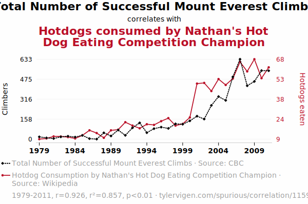

```{r xaringan-themer, include=FALSE, warning=FALSE}
library(xaringanthemer)
style_mono_accent(base_color = "#B31B1B",
                  text_font_size = "1.4rem")
xaringanExtra::use_xaringan_extra(c("tile_view"))
```

```{r setup, include=FALSE}
library(knitr)
opts_chunk$set(warning = FALSE, message = FALSE, 
                      # cache = TRUE,
                      fig.retina = 3, fig.align = "center",
                      fig.width=14, fig.height=7)
```

```{r packages-data, include=FALSE}
library(tidyverse)
library(ggridges)
library(broom)
library(scales)
set.seed(1234)
```

class: center middle main-title section-title-4

# Relationships

.class-info[

**Week 10**

AEM 2850 / 5850 : R for Business Analytics<br>
Cornell Dyson<br>
Fall 2025

Acknowledgements: 
[Andrew Heiss](https://datavizm20.classes.andrewheiss.com)
<!-- [Claus Wilke](https://wilkelab.org/SDS375/) -->
<!-- [Grant McDermott](https://github.com/uo-ec607/lectures), -->
<!-- [Jenny Bryan](https://stat545.com/join-cheatsheet.html), -->
<!-- [Allison Horst](https://github.com/allisonhorst/stats-illustrations) -->

]

---

# Announcements

Group projects are due Friday, November 14
- Make a plan and start early!

--

Questions before we get started?

---

# Plan for this week

.pull-left[
### Tuesday
[Prologue: The dangers of dual y-axes](#dual-y-axes)

[Visualizing relationships between a numerical and a categorical variable](#correlations-categorical)

[Visualizing correlations](#correlations)

[example-10-1](#example-10-1)
]

.pull-right[
### Thursday
[Visualizing regressions](#regressions)

[example-10-2](#example-10-2)
]


---
class: inverse, center, middle
name: dual-y-axes

# Prologue: The dangers of dual y-axes

---

# Oh no!

.small.center[
<figure style="padding-top: 5px;">
  
  <figcaption>Source: <a href="https://www.tylervigen.com/spurious-correlations" target="_blank">Tyler Vigen's spurious correlations</a></figcaption>
</figure>
]

???

Source: https://www.tylervigen.com/spurious/correlation/1159_total-number-of-successful-mount-everest-climbs_correlates-with_hotdogs-consumed-by-nathans-hot-dog-eating-competition-champion

---

# GPT 3.5 and DALL·E 3 explainer

.pull-left[
"As the number of successful Mount Everest climbs rises, so does the peak appetite for adventure. This, in turn, creates a sausage-yetis-faction where competitors are relishing the thrill of the challenge like never before, and they're on a roll to claim the title. It's a summit showdown of epic proportions, where each contender is truly reaching their peak performance..."
]

.pull-right[
<figure>
  
</figure>
]

---

# Why not use two y-axes?

--

You have to choose where the y-axes start and stop, which means...

--

...you can force the two trends to line up however you want.


---

# It even happens in *The Economist*!

.center[
<figure>
  
</figure>

The revised axes ranges reflect a comparable proportional change
]

???

<https://medium.economist.com/mistakes-weve-drawn-a-few-8cdd8a42d368>

---

# What could we do instead?

--

.pull-left[
**Use multiple plots (e.g., facets)**

```{r solar-data-facet, echo=FALSE, fig.dim=c(4, 3), out.width="100%"}
solar_data <- read_csv("data/solar-data.csv") |> 
  mutate(date = yq(paste0(year,"-",quarter))) |> 
  select(date, p, q) |> 
  mutate(q = q/1e3) |>
  rename("Price ($/Watt)" = p, "Quantity (GW)" = q)

solar_data |> 
  pivot_longer(-date, 
               names_to = "key", 
               values_to = "value") |> 
  ggplot(aes(x = date, 
             y = value, 
             color = key)) + 
  geom_line() + 
  facet_wrap(vars(key), ncol = 1, 
             scales = "free_y") + 
  guides(color = "none") +
  theme_minimal(base_size = 14) + 
  labs(x = NULL, y = NULL) +
  scale_y_continuous(limits = c(0,NA))
```
]

--

.pull-right[
**Use scatter plots**

```{r solar-data-scatter, echo=FALSE, fig.dim=c(4, 3), out.width="100%"}
solar_data |> 
  ggplot(aes(x = `Quantity (GW)`, 
             y = `Price ($/Watt)`)) + 
  geom_point() + 
  theme_minimal(base_size = 14) + 
  # labs(x = NULL, y = NULL) +
  scale_x_log10() +
  scale_y_log10()
```
]


---

# When are dual y-axes defensible?

--

When the two axes measure the same thing (e.g., indexing, conversion, etc.)

--

```{r ithaca-weather-dual-nice, echo=FALSE, message=FALSE, fig.dim=c(7, 3), out.width="100%"}
ithaca_weather <- read_csv("data/ithaca-weather-2021.csv")

ggplot(ithaca_weather, aes(x = DATE, y = TMAX)) +
  geom_line() +
  geom_smooth() +
  scale_x_date(
    date_breaks = "1 month",
    date_labels = "%b"
  ) +
  scale_y_continuous(sec.axis = 
                       sec_axis(trans = ~ (32 - .) * -5/9,
                                name = "Celsius")) +
  labs(x = NULL, y = "Fahrenheit",
       title = "Daily high temperatures at Cornell",
       subtitle = "January 1 2021–December 31, 2021",
       caption = "Source: NOAA") +
  theme_minimal() +
  theme(plot.title = element_text(face = "bold"))
```

---

class: inverse, center, middle
name: correlations-categorical

# Visualizing relationships between<br>a numerical and a categorical variable

---

# We already did this! When?

--

.pull-left[
```{r listings-facet, echo=FALSE, fig.dim=c(4, 3.5), out.width="100%"}
# import data and assign them to all_listings
listings <- read_csv("data/10-slides/listings.csv") |>
  filter(price<1000)

listings |>
  ggplot(aes(x = price, fill = room_type)) +
  geom_density(alpha = 0.2) +
  guides(fill = "none") +
  facet_wrap(vars(room_type), ncol = 1) +
  labs(y = NULL) +
  theme_minimal()
```
]

.pull-right[
```{r listings-ridgeline, echo=FALSE, fig.dim=c(4, 3.5), out.width="100%"}
# suggestions:
# visualize the distribution of prices in each neighbourhood_group
listings |>
  filter(room_type == "Entire home/apt") |>
  ggplot(
    aes(
    x = price,
    y = fct_rev(fct_infreq(neighbourhood_group)),
    fill = neighbourhood_group
    )
  ) +
  geom_boxplot() +
  guides(fill = "none") +
  labs(y = NULL) +
  theme_minimal()
```
]

---

class: inverse, center, middle
name: correlations-numerical

# Visualizing relationships between<br>two numerical variables

---

class: inverse, center, middle
name: correlations

# Visualizing correlations

---

# What does "correlation" mean to you?

--

As the value of X goes up, Y is very / a little / not at all likely to go up (down)

$$
\rho_{X, Y} = \frac{\operatorname{cov}(X, Y)}{\sigma_X \sigma_Y}
$$

Says nothing about *how much* Y changes when X changes

---

# Correlation values

.pull-left[
&nbsp;

<table>
  <tr>
    <th class="cell-left">$$\rho$$</th>
    <th class="cell-left">Rough meaning</th>
  </tr>
  <tr>
    <td class="cell-left">±0.1–0.3&emsp;</td>
    <td class="cell-left">Weak</td>
  </tr>
  <tr>
    <td class="cell-left">±0.3–0.5</td>
    <td class="cell-left">Moderate</td>
  </tr>
  <tr>
    <td class="cell-left">±0.5–0.8</td>
    <td class="cell-left">Strong</td>
  </tr>
  <tr>
    <td class="cell-left">±0.8–0.9</td>
    <td class="cell-left">Very strong</td>
  </tr>
</table>
]

.pull-right[

```{r correlation-grid, echo=FALSE, fig.dim=c(4.8, 4.2), out.width="100%"}
make_correlated_data <- function(r, n = 200) {
  MASS::mvrnorm(n = n, 
                mu = c(0, 0), 
                Sigma = matrix(c(1, r, r, 1), nrow = 2), 
                empirical = TRUE) |> 
    magrittr::set_colnames(c("x", "y")) |> 
    as_tibble()
}

cor_grid <- tibble(r = c(0.2, 0.4, 0.75, 0.9)) |> 
  mutate(data = map(r, make_correlated_data)) |> 
  unnest(data)

ggplot(cor_grid, aes(x = x, y = y)) +
  geom_point(size = 2, color = "white", fill = "black", pch = 21) +
  facet_wrap(vars(r), labeller = label_both) +
  # theme_minimal() +
  theme(strip.text = element_text(face = "bold", size = rel(1.3), hjust = 0))
```

]


---

# Scatter plots

The humble scatter plot is often the best place to start when studying the association between two variables

--

**Example:** max and min temperature in Ithaca each day of the year
  - Do you think they are highly correlated, somewhat correlated, or not at all correlated?
  - What sign do you think this correlation has?
  - How would you make a scatter plot of these data in R?

---

# Scatter plots

.left-code[
```{r ithaca-weather-scatterplot-1, tidy=FALSE, message=FALSE, warning=FALSE, fig.show="hide", fig.dim=c(4.8, 3.75), out.width="100%"}
ithaca_weather |> 
  ggplot(aes(x = TMIN, y = TMAX)) +
  geom_point()

ithaca_weather |> 
  summarize(cor(TMIN, TMAX)) #<<
```

**Strong positive correlation**
]

.right-plot[
`)
]

---

# What about min temp and snowfall?

--

.left-code[
```{r ithaca-weather-scatterplot-2, tidy=FALSE, message=FALSE, warning=FALSE, fig.show="hide", fig.dim=c(4.8, 3.75), out.width="100%"}
ithaca_weather |> 
  ggplot(aes(x = TMIN, y = SNOW)) +
  geom_point()

ithaca_weather |> 
  summarize(cor(TMIN, SNOW)) #<<
```

**Weak negative correlation**
]

.right-plot[
`)
]

---
class: inverse, center, middle
name: example-10-1

# example-10-1:<br>relationships-practice.R

---

class: inverse, center, middle
name: regressions

# Visualizing regressions

---

# Linear regression reminder

$$
y = \beta_0 + \beta_1 x_1 + \varepsilon
$$

<table>
  <tr>
    <!-- <td class="cell-center">\(y\)</td> -->
    <td class="cell-center">\(y\)</td>
    <td class="cell-left">&ensp;Outcome variable (DV)</td>
  </tr>
  <tr>
    <!-- <td class="cell-center">\(x\)</td> -->
    <td class="cell-center">\(x_1\)</td>
    <td class="cell-left">&ensp;Explanatory variable (IV)</td>
  </tr>
  <tr>
    <!-- <td class="cell-center">\(a\)</td> -->
    <td class="cell-center">\(\beta_1\)</td>
    <td class="cell-left">&ensp;Slope</td>
  </tr>
  <tr>
    <!-- <td class="cell-center">\(b\)</td> -->
    <td class="cell-center">\(\beta_0\)</td>
    <td class="cell-left">&ensp;y-intercept</td>
  </tr>
  <tr>
    <!-- <td class="cell-center">&emsp;&emsp;</td> -->
    <td class="cell-center">&emsp;\(\varepsilon\)&emsp;</td>
    <td class="cell-left">&ensp;Error (residuals)</td>
  </tr>
</table>

---

# Linear regression is just drawing lines

.pull-left[

```{r review-line, echo=FALSE, fig.dim=c(4.8, 4.2), out.width="100%"}
reviews <- read_csv("data/10-slides/review_summary.csv")

colnames(reviews) <- colnames(reviews) |> 
  str_remove("review_scores_")
  
reviews_subset <- reviews |> 
  filter(rating>=4 & accuracy>=4) |> 
  sample_n(20)

reviews_subset |> 
  ggplot(aes(x = accuracy, y = rating)) +
  geom_point(alpha = 0.5) +
  labs(x = "Accuracy rating",
       y = "Overall rating",
       title = "Airbnb reviews")
```

]

--

.pull-right[

```{r review-residuals, echo=FALSE, fig.dim=c(4.8, 4.2), out.width="100%"}
review_model <- lm(rating ~ accuracy, data = reviews_subset)
review_fitted <- augment(review_model, se_fit = TRUE)

reviews_subset |> 
  ggplot(aes(x = accuracy, y = rating)) +
  geom_point(alpha = 0.25) +
  labs(x = "Accuracy rating",
       y = "Overall rating",
       title = "Airbnb reviews") +
  geom_segment(data = review_fitted, 
               aes(x = accuracy, xend = accuracy,
                   y = rating, yend = .fitted),
               alpha = 0.25) +
  geom_smooth(method = "lm", formula = "y ~ x", se = FALSE)
```

]

---

# Building models in R

Base R has some basic modeling tools:
```{r model-template, eval=FALSE}
<MODEL> <- lm(<Y> ~ <X>, data = <DATA>) # use lm to fit simple linear models

summary(<MODEL>) # see model details
```

--

The `broom` package provides helpful tools for tidying model output:
```{r broom examples, eval=FALSE}
library(broom)

# convert model estimates to a data frame for plotting
tidy(<MODEL>)

# return a data frame that includes predictions, residuals, etc.
augment(<MODEL>)
```

---

# Modeling Airbnb reviews

Let's use some real-world data to explore linear regression

Put yourself in the shoes of an Airbnb host trying to decide how much to invest in improvements across these categories:

.center[
<figure>
  
</figure>
]

Let's see how well "accuracy" reviews predict an Airbnb's overall rating

---

# Modeling Airbnb reviews

.pull-left[
$$
\text{rating} = \beta_0 + \beta_1 \text{accuracy} + \varepsilon
$$

```{r build-review-model}
review_model <- lm(
  rating ~ accuracy, 
  data = reviews
  )
```

Note how we didn't write anything for the $\beta_0$ or $\varepsilon$ terms

What do you think the sign on $\beta_1$ is?

How large do you think $\beta_1$ is?

]

--

.pull-right[
```{r print-review-model, highlight.output=c(2,3,5,6,7)}
review_model
```
]

---

# Modeling Airbnb reviews
```{r summarize-review-model, highlight.output=c(2,3,9,10,11,12)}
summary(review_model)
```

---

# Modeling Airbnb reviews

```{r tidy-review-model}
tidy(review_model, conf.int = TRUE)
```

<!-- -- -->

```{r glance-review-model, include=FALSE}
glance(review_model)
```

---

# Interpretation for a continuous variable

$$
y = \beta_0 + \beta_1 x_1 + \varepsilon
$$

--

On average, a one unit increase in $x_1$ is *associated* with a $\beta_1$ change in $y$

--

$$
\text{rating} = \beta_0 + \beta_1 \text{accuracy} + \varepsilon
$$

$$
\widehat{\text{rating}} = 0.76 + 0.83 \times \text{accuracy}
$$
On average, a one unit increase in accuracy rating is associated with 0.83 higher overall rating

--

**This is easy to visualize: it's a line!**

---

# Visualization of a continuous variable

.pull-left[
```{r tidy-review-model-small}
tidy(review_model) |> 
  select(term, estimate)
```

$$
\widehat{\text{rating}} = 0.76 + 0.83 \times \text{accuracy}
$$
Note: this is an example where `alpha` helps with overplotting
]

.pull-right[
```{r review-line-again, echo=FALSE, fig.dim=c(4.8, 4.2), out.width="100%"}
reviews |> 
  ggplot(aes(x = accuracy, y = rating)) +
  geom_point(alpha = 0.25) +
  labs(x = "Accuracy rating",
       y = "Overall rating",
       title = "Airbnb reviews")
```

]

---

# Visualization of a continuous variable

.pull-left[
```{r tidy-review-model-small-again-again}
tidy(review_model) |> 
  select(term, estimate)
```

$$
\widehat{\text{rating}} = 0.76 + 0.83 \times \text{accuracy}
$$
Note: this is an example where `alpha` helps with overplotting
]

.pull-right[
```{r review-line-again-again, echo=FALSE, fig.dim=c(4.8, 4.2), out.width="100%"}
reviews |> 
  ggplot(aes(x = accuracy, y = rating)) +
  geom_point(alpha = 0.25) +
  geom_smooth(method = "lm", formula = "y ~ x", se = FALSE) +
  labs(x = "Accuracy rating",
       y = "Overall rating",
       title = "Airbnb reviews")
```

]

---

# Visualization of a continuous variable

.pull-left[
.small[Recall: `geom_smooth(method = "lm")` allows us to skip the estimation step!]

```{r tidy-review-model-geom_smooth-code, eval=FALSE, fig.dim=c(4.8, 4.2), out.width="100%"}
reviews |> 
  ggplot(aes(x = accuracy, y = rating)) +
  geom_point(alpha = 0.25) +
  geom_smooth(       #<<
    method = "lm",   # smoothing function #<<
    se = FALSE       # omit confidence bands #<<
  )                  #<<
```
]

.pull-right[
```{r tidy-review-model-geom_smooth-plot, echo=FALSE, fig.dim=c(4.8, 4.2), out.width="100%"}
reviews |> 
  ggplot(aes(x = accuracy, y = rating)) +
  geom_point(alpha = 0.25) +
  geom_smooth( #<<
    method = "lm",     # smoothing function #<<
    se = FALSE         # omit confidence bands #<<
  ) +                  #<<
  labs(x = "Accuracy rating",
       y = "Overall rating",
       title = "Airbnb reviews")
```
]

---

# Multiple regression

We're not limited to just one explanatory variable!

--

$$
y = \beta_0 + \beta_1 x_1 + \beta_2 x_2 + \cdots + \beta_n x_n + \varepsilon
$$
<br>

--

```{r build-review-model-big}
review_model_big <- lm(rating ~ accuracy + cleanliness + 
                         communication + location + 
                         checkin + value, 
                       data = reviews)
```

$$
\begin{aligned}
\widehat{\text{rating}} =& \widehat{\beta}_0 + \widehat{\beta}_1 \text{accuracy} + \widehat{\beta}_2 \text{cleanliness} + \\
&\widehat{\beta}_3 \text{communication} + \widehat{\beta}_4 \text{location} + \\
&\widehat{\beta}_5 \text{checkin} + \widehat{\beta}_6 \text{value}
\end{aligned}
$$

---

# Multiple regression

We started by estimating this **univariate** (aka **bivariate**) regression model:

$$
\text{rating} = \beta_0 + \beta_1 \text{accuracy} + \varepsilon
$$

--

Now we are estimating this **multivariate** regression model:

$$
\begin{aligned}
\text{rating} =& \beta_0 + \beta_1 \text{accuracy} + \beta_2 \text{cleanliness} + \\
&\beta_3 \text{communication} + \beta_4 \text{location} + \\
&\beta_5 \text{checkin} + \beta_6 \text{value} + \varepsilon
\end{aligned}
$$
--

Why are we doing this? Wasn't it complicated enough already?!

--

We want to use these data to inform our Airbnb hosting strategy. What are the pros and cons of the two models for this purpose?

---

# Multiple regression

Will the coefficient on `accuracy` will be smaller, larger, or the same? Why?

--

.small-code[
```{r tidy-review-model-big, highlight.output=c(5)}
tidy(review_model_big, conf.int = TRUE)
```
]

--

$$
\begin{aligned}
\widehat{\text{rating}} =& -0.12 + 0.22 \times \text{accuracy} + 0.23 \times \text{cleanliness} + \\
&0.17 \times \text{communication} + 0.04 \times \text{location} + \\
&0.06 \times \text{checkin} + 0.31 \times \text{value}
\end{aligned}
$$

---

# Interpretation for continuous variables

$$
y = \beta_0 + \beta_1 x_1 + \beta_2 x_2 + \cdots + \beta_n x_n + \varepsilon
$$

--

***Holding everything else constant***, a one unit increase in $x_n$ is *associated* with a $\beta_n$ change in $y$, on average

--

$$
\begin{aligned}
\widehat{\text{rating}} =& -0.12 + 0.22 \times \text{accuracy} + 0.23 \times \text{cleanliness} + \\
&0.17 \times \text{communication} + 0.04 \times \text{location} + \\
&0.06 \times \text{checkin} + 0.31 \times \text{value}
\end{aligned}
$$

On average, a one unit increase in accuracy rating is associated with 0.22 higher overall rating, holding everything else constant

--

.tiny[
For the earlier model we had said

> On average, a one unit increase in accuracy rating is associated with 0.83 higher overall rating

]

---

# Good luck visualizing all this!

&nbsp;

.large[You can't just draw a single line! There are too many moving parts!]

---

# Main challenges

--

Each coefficient has its own estimate and standard errors

--

**Solution:** Plot the coefficients and their errors with a *coefficient plot*

--

The results change as you move sliders (continuous variables) up and down or flip switches (categorical variables) on and off

--

**Solution:** Plot the *marginal effects* for the coefficients you're interested in

---

# Coefficient plots

Convert the model results to a data frame with `tidy()`

.small-code[
```{r tidy-coef-plot-review}
# tidy the estimates (reformatting names is not required)
review_coefs <- tidy(
  review_model_big, # get the model's coefficients
  conf.int = TRUE   # include confidence intervals
) |> 
  filter(term!="(Intercept)")

review_coefs
```
]

---

# Coefficient plots

Plot the point estimate and confidence intervals with `geom_pointrange()`

.left-code[
```{r coef-plot-review, tidy=FALSE, message=FALSE, fig.show="hide", fig.dim=c(4.8, 3.75), out.width="100%"}
review_coefs |> 
  ggplot(aes(x = estimate, 
             y = fct_reorder(term, estimate))) +
  geom_pointrange(aes(xmin = conf.low,  #<<
                      xmax = conf.high)) + #<<
  geom_vline(xintercept = 0, color = "red") + #<<
  labs(x = "relationship with overall rating",
       y = NULL)
```

What do you take away from this?

Should this inform where you decide to focus your investment as a host?
]

.right-plot[
`)
]

---

# Marginal effects plots

**Remember we interpret individual coefficients while holding others constant**

We move one slider while leaving all the other sliders and switches alone

--

**The same principle applies to visualizing a variable's effect**

--

Plug a bunch of values into the model and find the predicted outcome

--

Plot the values and predicted outcome

--

*We will not cover the process of creating marginal effects plots due to time constraints*

---

# Marginal effects plots

How do the multivariate and univariate regression lines compare?

--

.pull-left[
```{r mfx-plot-compare, echo=FALSE, tidy=FALSE, message=FALSE, fig.show="hide", fig.dim=c(4.8, 3.75), out.width="100%"}
reviews_new_data <- reviews |> 
  select(rating, accuracy, cleanliness, checkin, communication, location, value) |> 
  mutate(   # use mutate to modify existing variables #<<
    across( # transform multiple columns the same way #<<
      c(cleanliness, checkin, communication, location, value), # specify columns #<<
      \(x) mean(x, na.rm = TRUE)                               # specify transformation #<<
    ) #<<
  ) #<<

predicted_reviews <- augment(
  review_model_big,           # our estimated model
  newdata = reviews_new_data, # our new data for plotting
  interval = "confidence"     # add confidence intervals
)

mfx_plot <- predicted_reviews |>
  ggplot(aes(x = accuracy, y = rating)) +
  geom_point(alpha = 0.25) +
  geom_line( # multivariate predictions #<<
    aes(y = .fitted), #<<
    color = "#B31B1B", #<<
    linewidth = 1 #<<
  ) + #<<
  geom_ribbon( # confidence intervals #<<
    aes(ymin = .lower, ymax = .upper), #<<
    fill = "#B31B1B", #<<
    alpha = 0.5 #<<
  ) + #<<
  labs(x = "Accuracy rating",
       y = "Overall rating")

mfx_plot +
  # add the univariate regression line
  geom_smooth(method = "lm")
```

`)
]

.pull-right[
<span style="color:#B31B1B; font-weight:bold">Red line:</span> multivariate

<span style="color:#3366FF; font-weight:bold">Blue line:</span> univariate

What do you take away from this?

Should this affect how much you invest in accuracy?
]


---

# Stepping back

Which of these plots would be more useful to Airbnb hosts? Why?

.pull-left[
`)
]

.pull-right[
`)
]

---

# Not just OLS!

The same techniques work for pretty much any statistical model R can run

--

- OLS with high-dimensional fixed effects

- Logistic, probit, and multinomial regression (ordered and unordered)

- Multilevel (i.e., mixed and random effects) regression

- Bayesian models

- Machine learning models

--

If it has coefficients and/or makes predictions, you can (and should) visualize it!

---
class: inverse, center, middle
name: example-10-2

# example-10-2:<br>regression-practice.R

