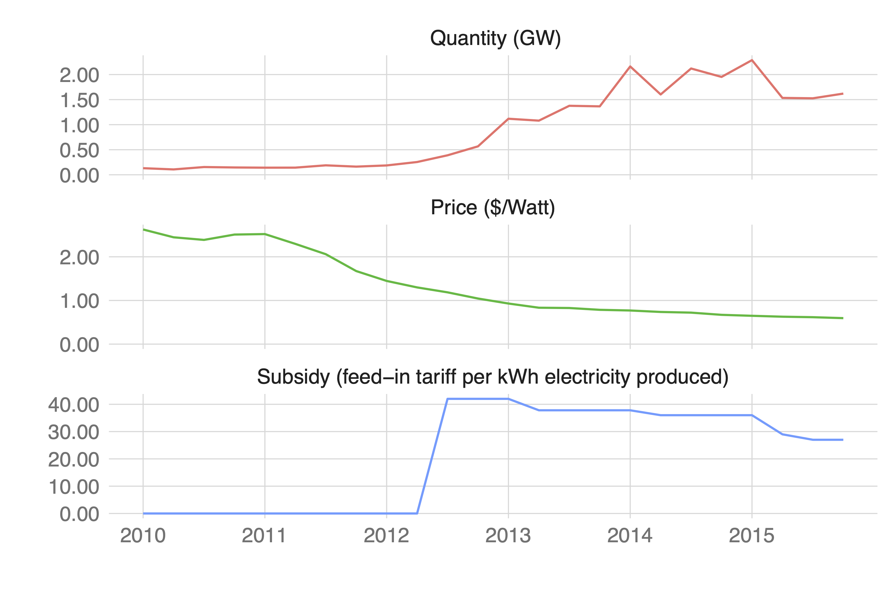

```{r xaringan-themer, include=FALSE, warning=FALSE}
library(xaringanthemer)
style_mono_accent(base_color = "#B31B1B",
                  text_font_size = "1.4rem")
xaringanExtra::use_xaringan_extra(c("tile_view"))
```

```{r setup, include=FALSE}
library(knitr)
opts_chunk$set(warning = FALSE, message = FALSE, 
                      #cache = TRUE,
                      fig.retina = 3, fig.align = "center",
                      fig.width=14, fig.height=7)
```

```{r packages-data, include=FALSE}
library(tidyverse)
library(broom)
library(scales)
set.seed(1234)
```

class: center middle main-title section-title-4

# Relationships

.class-info[

**Week 10**

AEM 2850 / 5850 : R for Business Analytics<br>
Cornell Dyson<br>
Spring 2023

Acknowledgements: 
[Andrew Heiss](https://datavizm20.classes.andrewheiss.com)
<!-- [Claus Wilke](https://wilkelab.org/SDS375/) -->
<!-- [Grant McDermott](https://github.com/uo-ec607/lectures), -->
<!-- [Jenny Bryan](https://stat545.com/join-cheatsheet.html), -->
<!-- [Allison Horst](https://github.com/allisonhorst/stats-illustrations) -->

]

---

# Announcements

Reminders:
- Group project due April 14 ([link](https://aem2850.toddgerarden.com/assignment/group-project/))
  - We set up group-specific workspaces on Posit Cloud for the project to allow simultaneous collaborative editing
  - Instructions are posted there and on canvas
  - Make a plan and start early!
- Local R install instructions posted ([link](https://aem2850.toddgerarden.com/resource/install/))
  - You are welcome to work locally if that's what your group prefers

Questions before we get started?

---

# Plan for today

<!-- [Prologue](#prologue) -->

[Prologue: The dangers of dual y-axes](#dual-y-axes)

[Visualizing correlations](#correlations)

[Visualizing regressions](#regressions)


---
class: inverse, center, middle
name: dual-y-axes

# Prologue: The dangers of dual y-axes

---

# Oh no!

.small.center[
<figure>
  
  <figcaption>Source: <a href="https://www.tylervigen.com/spurious-correlations" target="_blank">Tyler Vigen's spurious correlations</a></figcaption>
</figure>
]

---

# Why not use two y-axes?

--

You have to choose where the y-axes start and stop, which means...

--

...you can force the two trends to line up however you want!


---

# It even happens in *The Economist*!

.center[
<figure>
  
</figure>
]

???

<https://medium.economist.com/mistakes-weve-drawn-a-few-8cdd8a42d368>

---

# The rare triple y-axis

.small.center[
<figure>
  
  <figcaption>Source: Daron Acemoglu and Pascual Restrepo, "The Race Between Man and Machine: Implications of Technology for Growth, Factor Shares and Employment"</figcaption>
</figure>
]

???

Daron Acemoglu and Pascual Restrepo, ["The Race Between Man and Machine: Implications of Technology for Growth, Factor Shares and Employment"](https://economics.mit.edu/files/10866)

---

# What could we do instead?

--

Use multiple plots!

.center[
<figure>
  <figcaption>Solar panels in Japan</figcaption>
  
</figure>
]

???

Source: Gerarden (2021) "Demanding Innovation: The Impact of Consumer Subsidies on Solar Panel Production Costs"

---

# How could we make multiple plots in R?

--

**1. Facets** are great when using a common geometry (we've already seen that)

**2. Combining multiple plot objects** can be more flexible

--

Let's use Ithaca weather data to see an example of combining plots:

```{r}
ithaca_weather <- read_csv("data/ithaca-weather-2021.csv")

ithaca_weather |> 
  select(STATION, NAME, DATE, TMAX, SNOW) |> 
  head(3)
```


---

# Alternative: Use multiple plots

.left-code[
```{r ithaca-weather-patchwork, tidy=FALSE, message=FALSE, fig.show="hide", fig.dim=c(4.8, 4.2), out.width="100%"}
library(patchwork) #<<

# make a plot of temperatures
temp_plot <- ggplot(ithaca_weather, 
                    aes(x = DATE, y = TMAX)) +
  geom_line() + geom_smooth() +
  labs(x = NULL, y = "Fahrenheit")

# make a plot of snowfall
snow_plot <- ggplot(ithaca_weather,   
                    aes(x = DATE, y = SNOW)) + 
  geom_col() + 
  labs(x = NULL, y = "Snowfall (inches)")

# use patchwork to combine the two plots       #<<
temp_plot +    # simply use + to combine plots #<<
  snow_plot +  # then add on custom options    #<<
  plot_layout(ncol = 1,                        #<<
              heights = c(0.7, 0.3))           #<<
```
]

--

.right-plot[
`)
]


---

# When are dual y-axes defensible?

--

When the two axes measure the same thing

--

```{r ithaca-weather-dual-nice, echo=FALSE, message=FALSE, fig.dim=c(7, 3), out.width="100%"}
ithaca_weather <- read_csv("data/ithaca-weather-2021.csv")

ggplot(ithaca_weather, aes(x = DATE, y = TMAX)) +
  geom_line() +
  geom_smooth() +
  scale_y_continuous(sec.axis = 
                       sec_axis(trans = ~ (32 - .) * -5/9,
                                name = "Celsius")) +
  labs(x = NULL, y = "Fahrenheit",
       title = "Daily high temperatures at Cornell",
       subtitle = "January 1 2021–December 31, 2021",
       caption = "Source: NOAA") +
  theme_minimal() +
  theme(plot.title = element_text(face = "bold"))
```

---

# Making the base plot in R

.left-code[
```{r ithaca-weather-single, tidy=FALSE, message=FALSE, fig.show="hide", fig.dim=c(4, 3), out.width="100%"}
ggplot(ithaca_weather, 
       aes(x = DATE, y = TMAX)) +
  geom_line() +                           #<<
  geom_smooth() +                         #<<
  labs(x = NULL, y = "Fahrenheit")
```

How could we add a second axis?

Do any functions come to mind?
]

.right-plot[
`)
]

---

# Adding a second scale in R

.left-code[
```{r ithaca-weather-dual, tidy=FALSE, message=FALSE, fig.show="hide", fig.dim=c(4, 3), out.width="100%"}
ggplot(ithaca_weather, 
       aes(x = DATE, y = TMAX)) +
  geom_line() +
  geom_smooth() +
  scale_y_continuous(                     #<<
    sec.axis =                            #<<
      sec_axis(trans = ~ (. - 32) * 5/9,  #<<
               name = "Celsius")          #<<
  ) +                                     #<<
  labs(x = NULL, y = "Fahrenheit")
```

We provided this formula for the **trans**formation argument:

.small.center[`Celsius = (Fahrenheit - 32) * 5/9`]
]

.right-plot[
`)
]

---

# Adding a second scale in R

.left-code[
```{r cars-dual, tidy=FALSE, message=FALSE, fig.show="hide", fig.dim=c(4.8, 4.2), out.width="100%"}
car_counts <- mpg |> 
  group_by(drv) |> summarize(total = n())

total_cars <- sum(car_counts$total)

ggplot(car_counts,
       aes(x = drv, y = total, fill = drv)) +
  geom_col() +
  scale_y_continuous(               #<<
    sec.axis = sec_axis(            #<<
      trans = ~ . / total_cars,     #<<
      labels = scales::percent)) +  #<<
  guides(fill = "none")
```
This makes it a lot easier to see proportions with side-by-side bars!

Note: **total_cars** is not in **car_counts**
]

.right-plot[
`)
]

---

class: inverse, center, middle
name: correlations

# Visualizing correlations

---

# What does "correlation" mean to you?

--

As the value of X goes up, Y tends to go up (down) a lot / a little / not at all

$$
\rho_{X, Y} = \frac{\operatorname{cov}(X, Y)}{\sigma_X \sigma_Y}
$$

Says nothing about *how much* Y changes when X changes

---

# Correlation values

.pull-left[
&nbsp;

<table>
  <tr>
    <th class="cell-left">$$\rho$$</th>
    <th class="cell-left">Rough meaning</th>
  </tr>
  <tr>
    <td class="cell-left">±0.1–0.3&emsp;</td>
    <td class="cell-left">Weak</td>
  </tr>
  <tr>
    <td class="cell-left">±0.3–0.5</td>
    <td class="cell-left">Moderate</td>
  </tr>
  <tr>
    <td class="cell-left">±0.5–0.8</td>
    <td class="cell-left">Strong</td>
  </tr>
  <tr>
    <td class="cell-left">±0.8–0.9</td>
    <td class="cell-left">Very strong</td>
  </tr>
</table>
]

.pull-right[

```{r correlation-grid, echo=FALSE, fig.dim=c(4.8, 4.2), out.width="100%"}
make_correlated_data <- function(r, n = 200) {
  MASS::mvrnorm(n = n, 
                mu = c(0, 0), 
                Sigma = matrix(c(1, r, r, 1), nrow = 2), 
                empirical = TRUE) |> 
    magrittr::set_colnames(c("x", "y")) |> 
    as_tibble()
}

cor_grid <- tibble(r = c(0.2, 0.4, 0.75, 0.9)) |> 
  mutate(data = map(r, make_correlated_data)) |> 
  unnest(data)

ggplot(cor_grid, aes(x = x, y = y)) +
  geom_point(size = 2, color = "white", fill = "black", pch = 21) +
  facet_wrap(vars(r), labeller = label_both) +
  # theme_minimal() +
  theme(strip.text = element_text(face = "bold", size = rel(1.3), hjust = 0))
```

]


---

# Scatter plots

The humble scatter plot is often the best place to start when studying the association between two variables

--

**Example:** max and min temperature in Ithaca each day of the year
  - Do you think they are highly correlated, somewhat correlated, or not at all correlated?
  - What sign do you think this correlation has?
  - How would you make a scatter plot of these data in R?

---

# Scatter plots

.left-code[
```{r ithaca-weather-scatterplot-1, tidy=FALSE, message=FALSE, warning=FALSE, fig.show="hide", fig.dim=c(4.8, 3.75), out.width="100%"}
ithaca_weather |> 
  ggplot(aes(x = TMIN, y = TMAX)) +
  geom_point()

cor(ithaca_weather$TMIN, 
    ithaca_weather$TMAX) |> 
  round(3)
```

**Strong positive correlation**
]

.right-plot[
`)
]

---

# What about min temp and snowfall?

--

.left-code[
```{r ithaca-weather-scatterplot-2, tidy=FALSE, message=FALSE, warning=FALSE, fig.show="hide", fig.dim=c(4.8, 3.75), out.width="100%"}
ithaca_weather |> 
  ggplot(aes(x = TMIN, y = SNOW)) +
  geom_point()

cor(ithaca_weather$TMIN, 
    ithaca_weather$SNOW) |> 
  round(3)
```

**Weak negative correlation**
]

.right-plot[
`)
]

---
  
# Scatter plot matrices

--

.left-code[
```{r scatterplot-matrix, tidy=FALSE, message=FALSE, warning=FALSE, fig.show="hide", fig.dim=c(4.8, 3.75), out.width="100%"}
library(GGally)

cars_smaller <- mtcars |> 
  select(disp, hp, mpg)

ggpairs(cars_smaller)
```
Scatter plots can be scaled up to matrices for several variables

For many variables, correlograms or correlation coefficients often better

]

.right-plot[
  `)
]

---

# Correlograms: Heatmaps

```{r cor-heatmap, echo=FALSE, message=FALSE, fig.dim=c(8, 3.5), out.width="100%"}
cars_cor <- mtcars |> 
  select(disp, hp, cyl, mpg) |> 
  cor()

cars_cor[lower.tri(cars_cor)] <- NA

cars_cor_long <- cars_cor |> 
  as.data.frame() |> 
  rownames_to_column("measure2") |> 
  pivot_longer(cols = -measure2,
               names_to = "measure1",
               values_to = "cor") |> 
  mutate(nice_cor = round(cor, 2)) |> 
  mutate(measure1 = fct_inorder(measure1),
         measure2 = fct_inorder(measure2)) |> 
  filter(!is.na(cor)) |> 
  filter(measure2 != measure1)

ggplot(cars_cor_long, aes(x = measure2, y = measure1, fill = cor)) +
  geom_tile() +
  geom_text(aes(label = nice_cor)) +
  scale_fill_gradient2(low = "#E16462", mid = "white", high = "#0D0887",
                       limits = c(-1, 1)) +
  labs(x = NULL, y = NULL) +
  coord_equal() +
  theme_minimal() +
  theme(panel.grid = element_blank())
```


---

# Correlograms: Points

```{r cor-points, echo=FALSE, message=FALSE, fig.dim=c(8, 3.5), out.width="100%"}
ggplot(cars_cor_long, aes(x = measure2, y = measure1, color = cor)) +
  geom_point(aes(size = abs(cor))) +
  scale_color_gradient2(low = "#E16462", mid = "white", high = "#0D0887",
                        limits = c(-1, 1)) +
  scale_size_area(max_size = 15, limits = c(-1, 1), guide = "none") +
  labs(x = NULL, y = NULL) +
  coord_equal() +
  theme_minimal() +
  theme(panel.grid = element_blank())
```

---

class: inverse, center, middle
name: regressions

# Visualizing regressions

---

# Drawing lines with math

$$
y = ax + b
$$

<table>
  <tr>
    <td class="cell-center">\(y\)</td>
    <td class="cell-left">&ensp;A number</td>
  </tr>
  <tr>
    <td class="cell-center">\(x\)</td>
    <td class="cell-left">&ensp;A number</td>
  </tr>
  <tr>
    <td class="cell-center">\(a\)</td>
    <td class="cell-left">&ensp;Slope (\(\frac{\text{rise}}{\text{run}}\))</td>
  </tr>
  <tr>
    <td class="cell-center">\(b\)</td>
    <td class="cell-left">&ensp;y-intercept</td>
  </tr>
</table>

---

# Slopes and intercepts

.pull-left[

$$
y = 2x - 1
$$

```{r simple-line-1, echo=FALSE, fig.dim=c(4.8, 3.5), out.width="100%"}
ggplot(data = tibble(x = 0:5), aes(x = x)) +
  stat_function(fun = function(x) 2 * x - 1, 
                color = "#B31B1B", linewidth = 1.5) +
  geom_vline(xintercept = 0) +
  geom_hline(yintercept = 0) +
  scale_x_continuous(breaks = 0:5) +
  scale_y_continuous(breaks = -1:9) +
  theme(panel.grid.minor = element_blank())
```

]

.pull-right[

$$
y = -0.5x + 6
$$

```{r simple-line-2, echo=FALSE, fig.dim=c(4.8, 3.5), out.width="100%"}
ggplot(data = tibble(x = 0:14), aes(x = x)) +
  stat_function(fun = function(x) -0.5 * x + 6, 
                color = "#B31B1B", linewidth = 1.5) +
  geom_vline(xintercept = 0) +
  geom_hline(yintercept = 0) +
  scale_x_continuous(breaks = 0:14) +
  scale_y_continuous(breaks = -1:9) +
  theme(panel.grid.minor = element_blank())
```

]

---

# Drawing lines with stats

$$
y = \beta_0 + \beta_1 x_1 + \varepsilon
$$

<table>
  <tr>
    <!-- <td class="cell-center">\(y\)</td> -->
    <td class="cell-center">\(y\)</td>
    <td class="cell-left">&ensp;Outcome variable (DV)</td>
  </tr>
  <tr>
    <!-- <td class="cell-center">\(x\)</td> -->
    <td class="cell-center">\(x_1\)</td>
    <td class="cell-left">&ensp;Explanatory variable (IV)</td>
  </tr>
  <tr>
    <!-- <td class="cell-center">\(a\)</td> -->
    <td class="cell-center">\(\beta_1\)</td>
    <td class="cell-left">&ensp;Slope</td>
  </tr>
  <tr>
    <!-- <td class="cell-center">\(b\)</td> -->
    <td class="cell-center">\(\beta_0\)</td>
    <td class="cell-left">&ensp;y-intercept</td>
  </tr>
  <tr>
    <!-- <td class="cell-center">&emsp;&emsp;</td> -->
    <td class="cell-center">&emsp;\(\varepsilon\)&emsp;</td>
    <td class="cell-left">&ensp;Error (residuals)</td>
  </tr>
</table>

---

# Drawing lines with stats

.pull-left[

```{r cars-line, echo=FALSE, fig.dim=c(4.8, 4.2), out.width="100%"}
ggplot(mpg, aes(x = displ, y = hwy)) +
  geom_point() +
  geom_smooth(method = "lm", formula = "y ~ x")
```

]

--

.pull-right[

```{r cars-residuals, echo=FALSE, fig.dim=c(4.8, 4.2), out.width="100%"}
cars_model <- lm(hwy ~ displ, data = mpg)
cars_fitted <- augment(cars_model, se_fit = TRUE)

ggplot(mpg, aes(x = displ, y = hwy)) +
  geom_point() +
  geom_smooth(method = "lm", formula = "y ~ x") +
  geom_segment(data = cars_fitted, 
               aes(x = displ, xend = displ,
                   y = hwy, yend = .fitted))
```

]

---

# Building models in R

Base R has some basic modeling tools:
```{r model-template, eval=FALSE}
name_of_model <- lm(<Y> ~ <X>, data = <DATA>) # estimate model

summary(name_of_model) # see model details
```

--

The `broom` package provides helpful tools for tidying model output:
```{r broom examples, eval=FALSE}
library(broom)

# convert model estimates to a data frame for plotting
tidy(name_of_model)

# convert model diagnostics to a data frame
glance(name_of_model)
```

---

# Modeling displacement and highway MPG

.pull-left[
$$
\text{hwy} = \beta_0 + \beta_1 \text{displ} + \varepsilon
$$

```{r build-car-model}
car_model <- lm(hwy ~ displ,
                data = mpg)
```

Note how we didn't write anything for the $\beta_0$ or $\varepsilon$ terms

]

--

.pull-right[
```{r print-cars-model}
car_model
```
]

---

# Modeling displacement and highway MPG
```{r summarize-car-model, highlight.output=c(2,3,9,10,11,12)}
summary(car_model)
```

---

# Modeling displacement and highway MPG

```{r tidy-car-model}
tidy(car_model, conf.int = TRUE)
```

<!-- -- -->

```{r glance-car-model, include=FALSE}
glance(car_model)
```

---

# Interpretation for a continuous variable

$$
y = \beta_0 + \beta_1 x_1 + \varepsilon
$$

--

A one unit increase in $x_1$ is *associated* with a $\beta_1$ change in $y$, on average

--

$$
\text{hwy} = \beta_0 + \beta_1 \text{displ} + \varepsilon
$$

$$
\widehat{\text{hwy}} = 35.7 + (-3.53) \times \text{displ}
$$
On average, a one unit increase in displacement is associated with 3.53 lower highway MPG

--

**This is easy to visualize: it's a line!**

---

# Visualization of a continuous variable

.pull-left[
```{r tidy-car-model-small}
tidy(car_model) |> 
  select(term, estimate)
```

$$
\widehat{\text{hwy}} = 35.7 + (-3.53) \times \text{displ}
$$
]

.pull-right[
```{r cars-line-again, echo=FALSE, fig.dim=c(4.8, 4.2), out.width="100%"}
ggplot(mpg, aes(x = displ, y = hwy)) +
  geom_point() +
  scale_x_continuous(limits = c(0, 7)) +
  scale_y_continuous(limits = c(10, NA))
```

]

---

# Visualization of a continuous variable

.pull-left[
```{r tidy-car-model-small-again-again}
tidy(car_model) |> 
  select(term, estimate)
```

$$
\widehat{\text{hwy}} = 35.7 + (-3.53) \times \text{displ}
$$
.small[Reminder: `geom_smooth(method = "lm")` allows us to skip the estimation step!]
]

.pull-right[
```{r cars-line-again-again, echo=FALSE, fig.dim=c(4.8, 4.2), out.width="100%"}
ggplot(mpg, aes(x = displ, y = hwy)) +
  geom_point() +
  geom_smooth(method = "lm", formula = "y ~ x", fullrange = TRUE, se = FALSE) +
  scale_x_continuous(limits = c(0, 7)) +
  scale_y_continuous(limits = c(10, NA))
```

]

---

# Multiple regression

We're not limited to just one explanatory variable!

--

$$
y = \beta_0 + \beta_1 x_1 + \beta_2 x_2 + \cdots + \beta_n x_n + \varepsilon
$$

&nbsp;

--

```{r build-car-model-big}
car_model_big <- lm(hwy ~ displ + cyl + drv,
                    data = mpg)
```

$$
\widehat{\text{hwy}} = \widehat{\beta}_0 + \widehat{\beta}_1 \text{displ} + \widehat{\beta}_2 \text{cyl} + \widehat{\beta}_3 \text{drv:f} + \widehat{\beta}_4 \text{drv:r}
$$

---

# Modeling lots of things and MPG

.small-code[
```{r tidy-car-model-big}
tidy(car_model_big, conf.int = TRUE)
```
]

--

$$
\begin{aligned}
\widehat{\text{hwy}} =&\ 33.1 + (-1.12) \times \text{displ} + (-1.45) \times \text{cyl} \ + \\
&(5.04) \times \text{drv:f} + (4.89) \times \text{drv:r}
\end{aligned}
$$

---

# Sliders and switches

.center[
<figure>
  
</figure>
]

---

# Sliders and switches

.center[
<figure>
  
</figure>
]

---

# Interpretation for continuous variables

$$
y = \beta_0 + \beta_1 x_1 + \beta_2 x_2 + \cdots + \beta_n x_n + \varepsilon
$$

--

***Holding everything else constant***, a one unit increase in $x_n$ is *associated* with a $\beta_n$ change in $y$, on average

--

$$
\begin{aligned}
\widehat{\text{hwy}} =&\ 33.1 + (-1.12) \times \text{displ} + (-1.45) \times \text{cyl} \ + \\
&(5.04) \times \text{drv:f} + (4.89) \times \text{drv:r}
\end{aligned}
$$

On average, a one unit increase in displacement is associated with 1.12 lower highway MPG, holding everything else constant

--

.tiny[
Aside: for the earlier model we had said

> On average, a one unit increase in displacement is associated with 3.53 lower highway MPG
]

---

# Interpretation for categorical variables

$$
y = \beta_0 + \beta_1 x_1 + \beta_2 x_2 + \cdots + \beta_n x_n + \varepsilon
$$

--

***Holding everything else constant***, $y$ is $\beta_n$ units larger (or smaller) for category $x_n$ than for the omitted category, on average

$$
\begin{aligned}
\widehat{\text{hwy}} =&\ 33.1 + (-1.12) \times \text{displ} + (-1.45) \times \text{cyl} \ + \\
&(5.04) \times \text{drv:f} + (4.89) \times \text{drv:r}
\end{aligned}
$$

--

On average, front-wheel drive cars have 5.04 higher highway MPG than 4-wheel-drive cars, holding everything else constant

---

# Good luck visualizing all this!

&nbsp;

.large[You can't just draw a line! There are too many moving parts!]

---

# Main problems

--

Each coefficient has its own estimate and standard errors

--

**Solution:** Plot the coefficients and their errors with a *coefficient plot*

--

The results change as you move each slider up and down and flip each switch on and off

--

**Solution:** Plot the *marginal effects* for the coefficients you're interested in

---

# Coefficient plots

Convert the model results to a data frame with `tidy()`

.small-code[
```{r tidy-coef-plot-cars}
car_model_big <- lm(hwy ~ displ + cyl + drv, data = mpg)

car_coefs <- tidy(car_model_big, conf.int = TRUE) |> 
  filter(term != "(Intercept)")  # we can typically skip plotting the intercept, so remove it
car_coefs
```
]

---

# Coefficient plots

Plot the point estimate and confidence intervals with `geom_pointrange()`

.left-code[
```{r coef-plot-cars, tidy=FALSE, message=FALSE, fig.show="hide", fig.dim=c(4.8, 3), out.width="100%"}
ggplot(car_coefs,
       aes(x = estimate, 
           y = fct_rev(term))) +
  geom_pointrange(aes(xmin = conf.low, 
                      xmax = conf.high)) +
  geom_vline(xintercept = 0, color = "red")
```
]

.right-plot[
`)
]

---

# Marginal effects plots

**Remember that we interpret individual coefficients while holding the others constant**

We move one slider while leaving all the other sliders and switches alone

--

**Same principle applies to visualizing the effect**

--

Plug a bunch of values into the model and find the predicted outcome

--

Plot the values and predicted outcome

---

# Marginal effects plots

Create a data frame of values you want to manipulate and values you want to hold constant

--

Must include all the explanatory variables in the model

---

# Marginal effects plots

.small-code[
```{r build-simple-new-data}
cars_new_data <- tibble(displ = seq(2, 7, by = 0.1),  # create grid for displ
                        cyl = mean(mpg$cyl),          # hold cylinders at its mean
                        drv = "f")                    # drive: front-wheel

cars_new_data
```
]

---

# Marginal effects plots

Plug each of those rows of data into the model with `augment()`

```{r agument-simple-cars-data}
predicted_mpg <- augment(car_model_big,           # our estimated model
                         newdata = cars_new_data, # our new data for plotting
                         se_fit = TRUE)

head(predicted_mpg)
```

---

# Marginal effects plots

Plot the fitted values for each row

We made predictions for front-wheel drive cars with cylinders held at their mean

.left-code[
```{r mfx-plot-cars, tidy=FALSE, message=FALSE, fig.show="hide", fig.dim=c(4.8, 3), out.width="100%"}
ggplot(predicted_mpg,
       aes(x = displ, y = .fitted)) +
  geom_ribbon(aes(ymin = .fitted + 
                    (-1.96 * .se.fit),
                  ymax = .fitted + 
                    (1.96 * .se.fit)),
              fill = "#5601A4", 
              alpha = 0.5) +
  geom_line(linewidth = 1, color = "#5601A4")
```
]

.right-plot[
`)
]

---

# Multiple effects at once

We can also move multiple sliders and switches at the same time!

--

What's the marginal effect of increasing displacement across the front-, rear-, and four-wheel drive cars?

--

How would you approach this?

---

# Multiple effects at once

Create a new dataset with varying displacement *and* varying drive, holding cylinders at its mean

The `expand_grid()` function comes in handy for this

--

`expand_grid()` creates a data frame with every possible combination of the variables you supply

---

# Multiple effects at once

```{r build-complex-new-data}
cars_new_data_fancy <- expand_grid(displ = seq(2, 7, by = 0.1),  # create grid for displ
                                   cyl = mean(mpg$cyl),          # hold cylinders at its mean
                                   drv = c("f", "r", "4"))       # drive: front-wheel
                                   
cars_new_data_fancy
```

---

# Multiple effects at once

Plug each of those rows of data into the model with `augment()`

.small-code[
```{r agument-complex-cars-data}
predicted_mpg_fancy <- augment(car_model_big,                 # our estimated model
                               newdata = cars_new_data_fancy, # our new data for plotting
                               se_fit = TRUE)

head(predicted_mpg_fancy)
```
]

---

# Multiple effects at once

Plot the fitted values for each row

Cylinders held at their mean; colored/filled by drive

.left-code[
```{r mfx-plot-cars-fancy, tidy=FALSE, message=FALSE, fig.show="hide", fig.dim=c(4.8, 3), out.width="100%"}
ggplot(predicted_mpg_fancy,
       aes(x = displ, y = .fitted)) +
  geom_ribbon(aes(ymin = .fitted + 
                    (-1.96 * .se.fit),
                  ymax = .fitted + 
                    (1.96 * .se.fit),
                  fill = drv),
              alpha = 0.5) +
  geom_line(aes(color = drv), linewidth = 1)
```
]

.right-plot[
`)
]

---

# Multiple effects at once

.box-inv-6[Plot the fitted values for each row]

.box-6.small[Cylinders held at their mean; colored/filled/facetted by drive]

.left-code[
```{r mfx-plot-cars-fancy-facet, tidy=FALSE, message=FALSE, fig.show="hide", fig.dim=c(4.8, 3), out.width="100%"}
ggplot(predicted_mpg_fancy,
       aes(x = displ, y = .fitted)) +
  geom_ribbon(aes(ymin = .fitted + 
                    (-1.96 * .se.fit),
                  ymax = .fitted + 
                    (1.96 * .se.fit),
                  fill = drv),
              alpha = 0.5) +
  geom_line(aes(color = drv), linewidth = 1) + 
  guides(fill = "none", color = "none") + #<<
  facet_wrap(vars(drv)) #<<
```
]

.right-plot[
`)
]

---

# Not just OLS!

.box-inv-6[These plots are for an OLS model built with `lm()`]

.pull-left[
`)
]

.pull-right[
`)
]

---

# Any type of statistical model

The same techniques work for pretty much any model R can run

--

.small[OLS with high-dimensional fixed effects]

.small[Logistic, probit, and multinomial regression (ordered and unordered)]

.small[Multilevel (i.e., mixed and random effects) regression]

.small[Bayesian models]

.small[Machine learning models]

--

If it has coefficients and/or makes predictions, you can (and should) visualize it!
