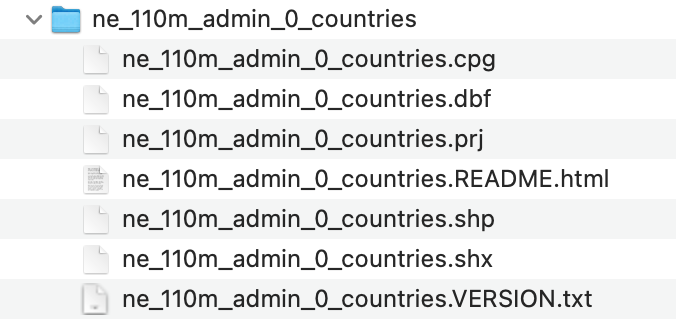

```{r xaringan-themer, include=FALSE, warning=FALSE}
library(xaringanthemer)
style_mono_accent(base_color = "#B31B1B",
                  text_font_size = "1.4rem")
xaringanExtra::use_xaringan_extra(c("tile_view"))
```

```{r setup, include=FALSE}
library(knitr)
opts_chunk$set(warning = FALSE, message = FALSE, 
                      #cache = TRUE,
                      fig.retina = 3, fig.align = "center",
                      fig.width=14, fig.height=7)
```

```{r packages-data, include=FALSE}
library(tidyverse)
library(sf)
library(patchwork)
library(glue)
library(maps)

set.seed(1234)

options("digits" = 2, "width" = 90)
```

```{r world-data, include=FALSE}
world_shapes <- read_sf("data/ne_110m_admin_0_countries/ne_110m_admin_0_countries.shp") %>% 
  filter(ISO_A3 != "ATA")
```

```{r county-data, include=FALSE}
counties <- st_as_sf(map("county", plot = FALSE, fill = TRUE))
counties <- subset(counties, grepl("new york,", counties$ID))
counties <- counties %>% 
  separate(ID, c("state", "county"), ",") %>% 
  select(-state)
```


class: center, middle

# Space

.class-info[

**Week 11**

AEM 2850 / 5850 : R for Business Analytics<br>
Cornell Dyson<br>
Spring 2023

Acknowledgements: 
[Andrew Heiss](https://datavizm20.classes.andrewheiss.com), 
[Claus Wilke](https://wilkelab.org/SDS375/), 
<!-- [Grant McDermott](https://github.com/uo-ec607/lectures), -->
<!-- [Jenny Bryan](https://stat545.com/join-cheatsheet.html), -->
[Allison Horst](https://github.com/allisonhorst/stats-illustrations)

]

---

# Announcements

Mini Project 1 due April 1 ([link](https://aem2850.toddgerarden.com/assignment/01-mini-project/))

Extra office hours slots at [aem2850.youcanbook.me](https://aem2850.youcanbook.me)

**Thursday's in-class example = this week's lab**
- Idea is that you can complete it without working over break

Questions before we get started?


---

# Plan for today

[Prologue](#prologue)

[Adding data to maps as layers](#data-on-maps)

[Geospatial visualizations in R](#gis-in-r)

[A quick primer on projections (for reference)](#projections)

Disclaimer: I am not an expert on working with geospatial data. I just want to give you a sense of the possibilities!

---
class: inverse, center, middle
name: prologue

# Prologue

---

# John Snow and 1854 cholera epidemic

.pull-left.center[
<figure>
  
</figure>
]

--

.pull-right[
10% of the population of Soho died in a week (!!)

Miasma theory said it was because the air was bad
]

???

https://en.wikipedia.org/wiki/John_Snow

---

background-image: url("img/10/john-snow-cholera-map.jpg")
background-position: center
background-size: contain

???

https://commons.wikimedia.org/wiki/File:Snow-cholera-map-1.jpg

---

# The Broad Street pump

.pull-left.center[
<figure>
  
</figure>
]

.pull-right.center[
<figure>
  
</figure>
]

???

https://nl.wikibooks.org/wiki/Bestand:Snow-cholera-map.jpg

https://upload.wikimedia.org/wikipedia/commons/c/cb/John_Snow_memorial_and_pub.jpg

---

# Geospatial data can help us...

Visualize business data for internal purposes

Study business activities

--

- Example: Dyson Profs. Addoum, Ng, and Ortiz-Bobea have studied how extreme temperatures affect business sales, productivity, and earnings

.center[
<figure>
  
  
  
</figure>
]


---

# Addoum et al: Temperatures

.center[
<figure>
  
</figure>
]

???

Jawad M Addoum, David T Ng, Ariel Ortiz-Bobea, Temperature Shocks and Establishment Sales, The Review of Financial Studies, Volume 33, Issue 3, March 2020, Pages 1331–1366, [https://doi.org/10.1093/rfs/hhz126](https://doi.org/10.1093/rfs/hhz126)

---

# Addoum et al: Temperature Shocks

.center[
<figure>
  
</figure>
]

???

Jawad M Addoum, David T Ng, Ariel Ortiz-Bobea, Temperature Shocks and Establishment Sales, The Review of Financial Studies, Volume 33, Issue 3, March 2020, Pages 1331–1366, [https://doi.org/10.1093/rfs/hhz126](https://doi.org/10.1093/rfs/hhz126)

---

# Addoum et al: Establishments

.center[
<figure>
  
</figure>
]

???

Jawad M Addoum, David T Ng, Ariel Ortiz-Bobea, Temperature Shocks and Establishment Sales, The Review of Financial Studies, Volume 33, Issue 3, March 2020, Pages 1331–1366, [https://doi.org/10.1093/rfs/hhz126](https://doi.org/10.1093/rfs/hhz126)

---

# Temperature Shocks and Establishment Sales

.center[
<figure>
  
  
</figure>
]

???

Jawad M Addoum, David T Ng, Ariel Ortiz-Bobea, Temperature Shocks and Establishment Sales, The Review of Financial Studies, Volume 33, Issue 3, March 2020, Pages 1331–1366, [https://doi.org/10.1093/rfs/hhz126](https://doi.org/10.1093/rfs/hhz126)

---

# Choropleth maps can be great

.center[
<figure>
  
</figure>
]

???

Jawad M Addoum, David T Ng, Ariel Ortiz-Bobea, Temperature Shocks and Establishment Sales, The Review of Financial Studies, Volume 33, Issue 3, March 2020, Pages 1331–1366, [https://doi.org/10.1093/rfs/hhz126](https://doi.org/10.1093/rfs/hhz126)

---

# Choropleth maps can be misleading. Why?

.center[
<figure>
  
</figure>
]

???

https://thehill.com/blogs/blog-briefing-room/332927-trump-will-hang-map-of-2016-election-results-in-the-white-house

---

# Land doesn't vote

.center[
<video controls>
  <source src="img/10/election-map.mp4" type="video/mp4">
</video>
]

???

https://demcastusa.com/2019/11/11/land-doesnt-vote-people-do-this-electoral-map-tells-the-real-story/

[Cryptic command](https://stackoverflow.com/questions/31781238/using-ffmpeg-to-convert-gif-to-mp4-output-doesnt-play-on-android) to convert gif to mp4: 

```text
ffmpeg -r 30 -i input.gif -movflags faststart -pix_fmt yuv420p -vf "scale=trunc(iw/2)*2:trunc(ih/2)*2" out.mp4
```

---

# Cartogram heatmaps may be preferable

.center[
<figure>
  
</figure>
]

Each hexagon corresponds to one electoral vote

???

http://metrocosm.com/election-2016-map-3d/

---

# Or: use other layers to represent data

.center[
<figure>
  
</figure>
]

???

https://xkcd.com/1939/


---
class: inverse, center, middle
name: data-on-maps

# Adding data to maps as layers

---

# Maps show data in a geospatial context

```{r echo=FALSE, out.width='60%'}
knitr::include_graphics("https://clauswilke.com/dataviz/geospatial_data_files/figure-html/sfbay-overview-1.png")
```

???

Wind turbines in the San Francisco Bay Area

Figure from [Claus O. Wilke. Fundamentals of Data Visualization. O'Reilly, 2019.](https://clauswilke.com/dataviz)

---

# Maps are composed of several distinct layers

```{r echo=FALSE, out.width='60%'}
knitr::include_graphics("https://clauswilke.com/dataviz/geospatial_data_files/figure-html/sfbay-layers-1.png")
```

???

Wind turbines in the San Francisco Bay Area

Figure from [Claus O. Wilke. Fundamentals of Data Visualization. O'Reilly, 2019.](https://clauswilke.com/dataviz)

---

# The idea of aesthetic mappings still applies

```{r echo=FALSE, out.width='60%'}
knitr::include_graphics("https://clauswilke.com/dataviz/geospatial_data_files/figure-html/shiloh-map-1.png")
```

???

Location of individual wind turbines in the Shiloh Wind Farm

Figure from [Claus O. Wilke. Fundamentals of Data Visualization. O'Reilly, 2019.](https://clauswilke.com/dataviz)

---

# Examples: maps with lines

.center[
<figure>
  
  <figcaption><a href="https://www.census.gov/dataviz/visualizations/051/" target="_blank">US Census Bureau: Net migration between California and other states</a></figcaption>
</figure>
]

???

https://www.census.gov/dataviz/visualizations/051/

---

# Examples: maps with points

.center[
<figure>
  
  <figcaption><a href="https://www.nytimes.com/interactive/2022/03/15/opinion/ukraine-refugee-crisis.html" target="_blank">The New York Times, "Refugees from Ukraine, since Feb. 24"</a></figcaption>
</figure>
]

???

https://www.nytimes.com/interactive/2022/03/15/opinion/ukraine-refugee-crisis.html

---

# Examples: maps with points

.center[
<figure>
  
  <figcaption><a href="https://www.flickr.com/photos/walkingsf/4672195208/in/album-72157624209158632/" target="_blank">Photos taken in DC: blue = locals; red = tourists; yellow = unknown</a></figcaption>
</figure>
]

???

https://www.flickr.com/photos/walkingsf/4672195208/in/album-72157624209158632/

---
class: inverse, center, middle
name: gis-in-r

# Geospatial visualizations in R

---

# Aesthetic mappings meet mapping

```{r lat-long-example, echo=FALSE, fig.width=7, fig.height=7}
point_example <- tibble(x = 2, y = 1) %>%
  mutate(label = glue("{x} x, {y} y\n{y} lat, {x} lon"))
lat_labs <- tibble(x = -3, y = seq(-2, 3, 1), label = "Latitude")
lon_labs <- tibble(x = seq(-2, 3, 1), y = -2, label = "Longitude")

ggplot() +
  geom_point(data = point_example, aes(x = x, y = y), size = 5) +
  geom_label(data = point_example, aes(x = x, y = y, label = label),
             nudge_y = 0.8, size = 8,
             family = "Fira Sans Condensed",) +
  geom_text(data = lat_labs, aes(x = x, y = y, label = label),
            hjust = 0.5, vjust = -0.3, size = 6,
            family = "Fira Sans Condensed",) +
  geom_text(data = lon_labs, aes(x = x, y = y, label = label),
            hjust = 1.1, vjust = -0.5, angle = 90, size = 6,
            family = "Fira Sans Condensed", ) +
  geom_hline(yintercept = 0) +
  geom_vline(xintercept = 0) +
  scale_x_continuous(breaks = seq(-2, 3, 1)) +
  scale_y_continuous(breaks = seq(-2, 3, 1)) +
  coord_equal(xlim = c(-3.5, 3), ylim = c(-3, 3)) +
  labs(x = NULL, y = NULL, caption = "via @sarahbellmaps") +
  # labs(x = NULL, y = NULL) +
  theme_minimal(base_family = "Fira Sans Condensed") +
  theme(panel.grid.minor = element_blank(),
        axis.text = element_blank(),
        plot.caption = element_text(size = rel(1), margin = margin(t = 15), color = "grey50"))
```

---

# The **sf** package: simple features in R

```{r echo=FALSE, out.width='75%'}
knitr::include_graphics("img/10/sf.png")
```

???

Source: [Allison Horst](https://github.com/allisonhorst/stats-illustrations)

---

# Shapefiles

Geographic information is shared as **shapefiles**

--

These are *not* like regular single CSV files!

--

Shapefiles come as zipped files with a bunch of different files inside

.center[
<figure>
  
</figure>
]

---

# `sf` makes it easy in R

**Simple features** standardize how spatial objects are represented by computers

--

`sf` represents simple features as native R objects

--

Goal is to present information about *spatial geometries* according to some *attribute* (e.g., population, business data, etc.)

--

To make it easy to combine *attributes* with *spatial geometries*, `sf` stores feature geometries in the data frame column `geometry`

---

# Structure of an `sf` data frame

.small-code[
```{r demo-read-shapefile, eval=FALSE}
library(sf)
world_shapes <- read_sf("data/ne_110m_admin_0_countries/ne_110m_admin_0_countries.shp")
world_shapes %>% select(TYPE, GEOUNIT, ISO_A3, geometry)
```

```{r show-shapefile, echo=FALSE}
world_shapes %>% 
  select(TYPE, GEOUNIT, ISO_A3, geometry)
```
]

---

# `sf` data frames are data frames

```{r}
class(world_shapes)
world_shapes %>% 
  filter(NAME == "United States of America") %>% 
  select(NAME, TYPE, ISO_A3, geometry)
```

---

# The magic `geometry` column

To make a map using `ggplot`, all you need to do is &nbsp; `+ geom_sf()`

.left-code[
```{r simple-map, tidy=FALSE, message=FALSE, fig.show="hide", fig.dim=c(4, 3), out.width="100%"}
world_shapes %>% 
  ggplot() +
  geom_sf() #<<
```
]

.right-plot[
`)
]

---

# Changing projections

Use `coord_sf()` to change projections (see end for background on projections)

.left-code[
```{r change-projection, tidy=FALSE, message=FALSE, fig.show="hide", fig.dim=c(4, 3), out.width="100%"}
world_shapes %>% 
  ggplot() +
  geom_sf() +
  coord_sf(crs = "+proj=merc") #<<
```
]

.right-plot[
`)
]

---

# Changing projections

Use `coord_sf()` to change projections (see end for background on projections)

.left-code[
```{r change-projection1, tidy=FALSE, message=FALSE, fig.show="hide", fig.dim=c(4, 3), out.width="100%"}
world_shapes %>% 
  ggplot() +
  geom_sf() +
  coord_sf(crs = "+proj=robin") #<<
```
]

.right-plot[
`)
]

---

# Let's zoom in on New York

.left-code[
```{r nys-map, tidy=FALSE, message=FALSE, fig.show="hide", fig.dim=c(4, 3), out.width="100%"}
# counties object created in the background
head(counties, 5)
counties %>% #<<
  ggplot() + #<<
  geom_sf()  #<<
```
]

.right-plot[
`)
]

---

# We can filter like normal

All regular data frame operations work

.left-code[
```{r filter-map-data, tidy=FALSE, message=FALSE, fig.show="hide", fig.dim=c(4, 3), out.width="100%"}
counties %>% 
  filter(county == "tompkins") %>%  #<<
  ggplot() +
  geom_sf()
```
]

.right-plot[
`)
]

---

# We can use aesthetics like normal

All regular ggplot layers and aesthetics work

.left-code[
```{r add-aes, tidy=FALSE, message=FALSE, fig.show="hide", fig.dim=c(4, 3), out.width="100%"}
counties %>%
  ggplot(aes(fill = (county=="tompkins"))) + #<<
  geom_sf() +
  guides(fill = "none") + # omit legend
  scale_fill_viridis_d()  # nicer colors
```
]

.right-plot[
`)
]

---

# We can do a lot more!

`sf` is for all GIS stuff

--

Draw maps

--

Calculate distances between points

--

Count observations in a given area

--

Anything else related to geography!

--

See [here](https://bookdown.org/robinlovelace/geocompr/intro.html) or [here](https://bookdown.org/lexcomber/brunsdoncomber2e/Ch5.html) for full textbooks


---

# Example: compute the area of NY counties

```{r}
counties %>% 
  mutate(area = st_area(counties)) # sf::st_area() computes areas #<<
```

---

# Fill counties by area

.left-code[
```{r nys-add-aes, tidy=FALSE, message=FALSE, fig.show="hide", fig.dim=c(4, 3), out.width="100%"}
counties %>% 
  mutate(area = as.numeric(st_area(counties))) %>% #<<
  ggplot(aes(fill = area)) + #<<
  geom_sf() +
  scale_fill_viridis_c(alpha = 0.5) +
  theme_minimal()
```
]

.right-plot[
`)
]

---

# No `geometry` column?

Make your own with `st_as_sf()`

.less-left.small-code[
```{r convert-fake, echo=FALSE}
other_data <- tribble(
  ~city, ~long, ~lat,
  "Cornell", -76.475266, 42.454323,
  "Cancun", -86.84656, 21.17429
)
```

```{r show-other}
other_data
```
]

--

.more-right.small-code[
```{r show-converted}
other_data %>% 
  st_as_sf(coords = c("long", "lat"), #<< 
           crs = st_crs("EPSG:4326")) #<<
```
]

---

# `geom_sf()` is today’s standard

You'll sometimes find older tutorials and StackOverflow answers about using `geom_map()` or **ggmap** or other things

--

Those still work, but they don't use the same magical **sf** system with easy-to-convert projections and other GIS stuff

--

Stick with **sf** and `geom_sf()` and your life will be easy

---

# Where to find shapefiles

--

[Natural Earth](https://www.naturalearthdata.com/) for international maps

--

[US Census Bureau](https://www.census.gov/geographies/mapping-files/time-series/geo/carto-boundary-file.html) for US maps

--

For anything else…

--

.center[
<figure>
  
</figure>
]

---

# Scales

.pull-left-3[
<figure>
  
</figure>

.small.center[1:10m = 1:10,000,000]

.small.center[1 cm = 100 km]
]

.pull-middle-3[
<figure>
  
</figure>

.small.center[1:50m = 1:50,000,000]

.small.center[ 1cm = 500 km]
]

.pull-right-3[
<figure>
  
</figure>

.small.center[1:110m = 1:110,000,000]

.small.center[1 cm = 1,100 km]
]

--

&nbsp;

Using too high of a resolution makes your maps slow and huge

---
class: inverse, center, middle
name: projections

# A quick primer on projections

---

# A quick primer on projections

[All world maps are wrong according to Vox](https://www.youtube.com/watch?v=kIID5FDi2JQ). Why?

--

Impossible to represent spherical surface as a plane without distortions

--

Projections "project" 3D surface down to 2D

--

Some preserve land shape, some preserve size, etc.

--

Let's look at some examples


---

# World projections

```{r projections, echo=FALSE, fig.width=8, fig.height=3.75, out.width="100%"}
base_map <- ggplot() + 
  geom_sf(data = world_shapes, fill = "#B2B1F9", size = 0.1, color = "#0D0887") +
  theme_void(base_family = "Fira Sans Condensed") + 
  theme(plot.margin = unit(c(0.5, 0.5, 0.5, 0.5), "lines"),
        plot.title = element_text(margin = margin(b = 3), face = "bold"),
        plot.caption = element_text(family = "Consolas", color = "grey50"))

# Longitude/latitude
map_lat_lon <- base_map +
  coord_sf(crs = "+proj=longlat +ellps=WGS84 +datum=WGS84 +no_def") +
  labs(title = "Longitude-latitude")

# Robinson
map_robinson <- base_map +
  coord_sf(crs = "+proj=robin") +
  # coord_sf(crs = 54030, datum = NA) +  # Robinson
  labs(title = "Robinson")

# Mercator (ew)
map_mercator <- base_map +
  coord_sf(crs = "+proj=merc") +
  # coord_sf(crs = 54004, datum = NA) +  # Mercator
  labs(title = "Mercator")

# Gall Peters
map_gall_peters <- base_map +
  coord_sf(crs = st_crs("ESRI:54002"), datum = NA) +  # Gall Peters / Equidistant cylindrical
  labs(title = "Gall-Peters")

(map_lat_lon / map_mercator) | (map_gall_peters / map_robinson) 

# Equal earth
# base_map +
#   coord_sf(crs = "+proj=eqearth +wktext") +  # Equal earth 
#   labs(title = "Equal Earth",
#        caption = 'crs = "+proj=eqearth +wktext"')
```

---

# US projections

```{r us-projections, echo=FALSE, fig.width=8, fig.height=3.75, out.width="100%"}
us_states <- read_sf("data/cb_2018_us_state_20m/cb_2018_us_state_20m.shp")

states_48 <- us_states %>% 
  filter(!(STUSPS %in% c("HI", "AK", "PR")))

map_nad83 <- ggplot() +
  geom_sf(data = states_48, fill = "#B2B1F9", size = 0.25, color = "#0D0887") +
  labs(title = "NAD83") +
  coord_sf(crs = st_crs("EPSG:4269"), datum = NA) +
  theme_void(base_family = "Fira Sans Condensed") + 
  theme(plot.margin = unit(c(0.5, 0.5, 0.5, 0.5), "lines"),
        plot.title = element_text(margin = margin(b = 3), face = "bold"),
        plot.caption = element_text(family = "Consolas", color = "grey50"))

map_albers <- ggplot() +
  geom_sf(data = states_48, fill = "#B2B1F9", size = 0.25, color = "#0D0887") +
  labs(title = "Albers") +
  coord_sf(crs = st_crs("ESRI:102003"), datum = NA) +
  theme_void(base_family = "Fira Sans Condensed") + 
  theme(plot.margin = unit(c(0.5, 0.5, 0.5, 0.5), "lines"),
        plot.title = element_text(margin = margin(b = 3), face = "bold"),
        plot.caption = element_text(family = "Consolas", color = "grey50"))

map_nad83 | map_albers
```

---

# Which projection is best?

--

None of them

--

There are no good or bad projections

--

There are good and bad projections for a particular use case

---

# Reference: Finding projection codes

[spatialreference.org](https://spatialreference.org/ref/epsg/)

[epsg.io](https://epsg.io/)

[proj.org](https://proj.org/operations/projections/index.html)

.small[[This](https://www.earthdatascience.org/courses/earth-analytics/spatial-data-r/understand-epsg-wkt-and-other-crs-definition-file-types/) is an excellent overview of how this all works]

.small[And [this](https://web.archive.org/web/20200225021219/https://www.nceas.ucsb.edu/~frazier/RSpatialGuides/OverviewCoordinateReferenceSystems.pdf) is a really really helpful overview of all these moving parts]

---
class: inverse, center, middle

# Have a nice spring break!

