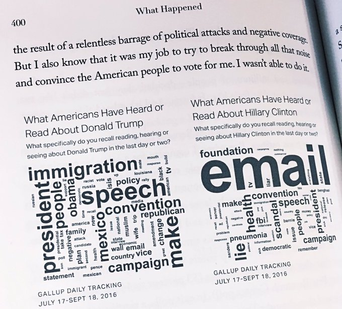

```{r xaringan-themer, include=FALSE, warning=FALSE}
library(xaringanthemer)
style_mono_accent(base_color = "#B31B1B",
                  text_font_size = "1.4rem")
xaringanExtra::use_xaringan_extra(c("tile_view"))
```

```{r setup, include=FALSE}
library(knitr)
opts_chunk$set(warning = FALSE, message = FALSE, 
                      #cache = TRUE,
                      fig.retina = 3, fig.align = "center",
                      fig.width=14, fig.height=7)
```

```{r packages-data, include=FALSE}
library(tidyverse)
library(tidytext)
# install.packages("textdata") # needed for AFINN and NRC sentiment lexicons

# devtools::install_github("bradleyboehmke/harrypotter")
library(harrypotter)
set.seed(1234)

options("digits" = 2, "width" = 90)

hp <- tibble(book = c("Philosopher's Stone", "Chamber of Secrets", 
                      "Prisoner of Azkaban", "Goblet of Fire", 
                      "Order of the Phoenix", "Half-Blood Prince",
                      "Deathly Hallows"),
             raw_text = list(philosophers_stone, chamber_of_secrets, 
                             prisoner_of_azkaban, goblet_of_fire, 
                             order_of_the_phoenix, half_blood_prince,
                             deathly_hallows)) %>% 
  mutate(text_data = map(raw_text, ~{
    tibble(text = .x) %>% 
      mutate(chapter = 1:n())
  })) %>% 
  select(book, text_data) %>% 
  unnest(text_data) %>% 
  mutate(book = fct_inorder(book))
```


class: center, middle

# Text

.class-info[

**Week 12**

AEM 2850 / 5850 : R for Business Analytics<br>
Cornell Dyson<br>
Spring 2023

Acknowledgements: 
[Andrew Heiss](https://datavizm20.classes.andrewheiss.com)
<!-- [Claus Wilke](https://wilkelab.org/SDS375/),  -->
<!-- [Grant McDermott](https://github.com/uo-ec607/lectures), -->
<!-- [Jenny Bryan](https://stat545.com/join-cheatsheet.html), -->
<!-- [Allison Horst](https://github.com/allisonhorst/stats-illustrations) -->

]

---

# Announcements

I hope you had a nice spring break!

Reminder: [Cornell still requires masks in classrooms as of now](https://covid.cornell.edu/prevention/face-coverings/)

Mini project 1 grades will be posted soon
- Peer-review survey forthcoming

Mini project 2 details will be released in the next 0-1 weeks

Questions before we get started?


---

# Plan for today

[Course progress](#progress)

[Prologue](#prologue)

[Text mining with R](#tidytext)

---
class: inverse, center, middle
name: progress

# Course progress

---

# Course objectives reminder

1. Develop basic proficiency in `R` programming
2. Understand data structures and manipulation
3. Describe effective techniques for data visualization and communication
4. Construct effective data visualizations
5. Utilize course concepts and tools for business applications

---

# Where we've been (weeks 1-4)

1. **Develop basic proficiency in `R` programming**
2. **Understand data structures and manipulation**
3. Describe effective techniques for data visualization and communication
4. Construct effective data visualizations
5. Utilize course concepts and tools for business applications

---

# Where we've been (weeks 5-10)

1. Develop basic proficiency in `R` programming
2. Understand data structures and manipulation
3. **Describe effective techniques for data visualization and communication**
4. **Construct effective data visualizations**
5. **Utilize course concepts and tools for business applications**

---

# Where we're going next (weeks 11+)

1. Develop basic proficiency in `R` programming
2. Understand data structures and manipulation
3. Describe effective techniques for data visualization and communication
4. Construct effective data visualizations
5. Utilize course concepts and tools for business applications

All of the above, plus special topics! Tentative plan:
- Week 11: Text
- Week 12: Functions and iteration
- Week 13: Prediction
- Week 14: Causal inference
- Week 15: Wrap up

---

# Schedule overview

#### Weeks 1-4: Programming Foundations

#### Weeks 5-10: Data Visualization Foundations

#### Weeks 11+: Special Topics (mix of programming and dataviz)

See [aem2850.toddgerarden.com/schedule](https://aem2850.toddgerarden.com/schedule/) for details


---
class: inverse, center, middle
name: prologue

# Prologue

---

# Text comes in many forms

The `schrute` package contains transcripts of all episodes of [The Office](https://www.imdb.com/title/tt0386676/) (US)

```{r}
library(schrute)
theoffice # this is an object from the schrute package
```

---

# Text can be analyzed in many ways

&nbsp;

.center[
<figure>
  
</figure>
]

---

# Take word clouds, the pie chart of text

**Why are word clouds bad?**

--

- Poor grammar (of graphics)
  - Usually the only aesthetic is size
  - Color, position, etc. contain no content
- Raw word frequency is not always informative

--

**Why are word clouds good?**

--

- Can visualize one-word descriptions
- Can highlight a single dominant word or phrase
- Can make before/after comparisons

---

# Some cases are okay

.pull-left[
.center[
<figure>
  
</figure>
]
]

.pull-right[
Trump word cloud is uninformative

Clinton word cloud is okay
- Highlights email as the **single** dominant narrative about Hillary Clinton prior to the 2016 election
]

???

https://twitter.com/s_soroka/status/907941270735278085

---

# Twitter before and after breakups (4-grams)

.center[
<figure>
  
</figure>
]

--

Better yet: use other methods to analyze and visualize text

???

Twitter before and after breakups

https://arxiv.org/abs/1409.5980

https://www.vice.com/en/article/ezvaba/what-our-breakups-look-like-on-twitter

---

background-image: url("img/11/he-she-julia.png")
background-position: center
background-size: cover

???

https://pudding.cool/2017/08/screen-direction/

---

background-image: url("img/11/minimap-1.png")
background-position: center
background-size: contain

???

https://juliasilge.com/blog/song-lyrics-across/


---
class: inverse, center, middle
name: tidytext

# Text mining with R

---

# Core concepts and techniques

--

Tokens, lemmas, and parts of speech

--

Sentiment analysis

--

tf-idf

--

Topics and LDA

--

Fingerprinting

---

# Core concepts and techniques

**Tokens**, lemmas, and parts of speech

**Sentiment analysis**

**tf-idf**

Topics and LDA

Fingerprinting

**We will cover tokens, sentiment analysis, and tf-idf** (time permitting)

---

# The tidytext package

.pull-left[
We will use the `tidytext` package

`tidytext` brings tidy data concepts and `tidyverse` tools to text analysis
]

.pull-right.center[
<figure>
  
</figure>
]

???

https://www.tidytextmining.com/


---

# Regular text

```{r show-hp1, echo=FALSE, comment=NA}
harrypotter::philosophers_stone[1] %>% 
  str_trunc(100 * 14) %>% 
  str_wrap(100) %>% 
  cat("\n")
```

---

# Text as data

Text can be stored in data frames as character strings

Here, each row corresponds to a chapter

```{r tidy-hp1, echo=FALSE}
hp1_data <- tibble(text = harrypotter::philosophers_stone) %>%
  mutate(
    chapter = 1:n() # here, each row is a chapter #<<
    ) %>% 
  relocate(chapter)
```

```{r tidy-hp1-print}
head(hp1_data)
```

---

# Tidy text and tokens

Tidy text format: a table with one **token** per row

--

What is a token?

--

- Any meaningful unit of text used for analysis

--

- Often words, but also letters, n-grams, sentences, paragraphs, chapters, etc.

--

The relevant token depends on the analysis you are doing

--

So the definition of tidy text depends on what you are doing!

--

**Tokenization** is the process of splitting text into tokens

---

# Tokenization: words

`tidytext::unnest_tokens` tokenizes **words** by default
- Optionally: characters, ngrams, sentences, lines, paragraphs, etc.

--

.pull-left[
```{r hp1-word, eval=FALSE}
hp1_data %>% 
  unnest_tokens(  # convert data to tokens
    input = text, # split text column #<<
    output = word,# make new word column #<<
    ) %>%
  relocate(word)  # move new column to front
```
.small[Note: `unnest_tokens()` expects **output** before **input** if you don't name arguments]
]

--

.pull-right[
```{r hp1-wordr, echo=FALSE}
hp1_data %>% 
  unnest_tokens(   # convert data to tokens
    input = text,   # split text column #<<
    output = word, # make new word column #<<
    ) %>%
  relocate(word) # move new column to front #<<
```
]

---

# We can treat tokens like any other data

.pull-left[
For example, we can count them:

```{r hp1-word-count, eval=FALSE}
hp1_data %>% 
  unnest_tokens(
    input = text, 
    output = word, 
    ) %>%        
  count(word, sort = TRUE) #<<
```
]

.pull-right[
```{r hp1-word-countr, echo=FALSE}
hp1_data %>% 
  unnest_tokens(
    input = text, 
    output = word, 
    ) %>%        
  count(word, sort = TRUE) #<<
```
]

What do you notice about the most common words?

---

# Raw word frequency is not always informative

.left-code[
```{r word-count-plot, fig.show="hide", fig.dim=c(4, 3), out.width="100%"}
hp1_data %>% 
  unnest_tokens(word, text) %>% 
  count(word, sort = TRUE) %>% 
  slice_max(order_by = n, # order rows by count #<<
            n = 10) %>%   # slice top 10 rows #<<
  ggplot(aes(x = n, 
             y = fct_reorder(word, n))) +
  geom_col() +
  labs(x = NULL, y = NULL) +
  theme_bw()
```

How can we make this better?
]

.right-plot[
`)
]

---

# Stop words

We can filter out common **stop words** that we want to ignore

```{r show-stop-words}
stop_words # this is an object from the tidytext package
```

---

# Token frequency: words

.left-code[
```{r hp-words, fig.show="hide", fig.dim=c(4, 3), out.width="100%"}
hp1_data %>% 
  unnest_tokens(word, text) %>% 
  anti_join(stop_words, by = "word") %>% #<<
  count(word, sort = TRUE) %>% 
  slice_max(order_by = n,
            n = 10) %>%
  ggplot(aes(x = n, 
             y = fct_reorder(word, n))) +
  geom_col() +
  labs(x = NULL, y = NULL) +
  theme_bw()
```

That's better!
]

.right-plot[
`)
]


---

# Tokenization: n-grams

**n** contiguous tokens are an **n-gram**

Example: two consecutive words are a bigram

--

.pull-left[
```{r hp1-bigram, eval=FALSE}
hp1_data %>% 
  unnest_tokens(
    input = text, 
    output = bigram,  # new column bigram #<<
    token = "ngrams", # we want ngrams #<<
    n = 2) %>%        # we want bigrams #<<
  relocate(bigram)
```
]

.pull-right[
```{r hp1-bigramr, echo=FALSE}
hp1_data %>% 
  unnest_tokens(
    input = text, 
    output = bigram,  # call new column bigram #<<
    token = "ngrams", # we want ngrams #<<
    n = 2) %>%        # we want bigrams #<<
  relocate(bigram)
```
]

---

# Token frequency: n-grams

```{r hp-bigrams, echo=FALSE, fig.width=8, fig.height=3.75, out.width="100%"}
hp_bigrams <- hp %>% 
  unnest_tokens(bigram, text, token = "ngrams", n = 2) %>% 
  separate(bigram, c("word1", "word2"), sep = " ") %>% 
  filter(!word1 %in% stop_words$word) %>%
  filter(!word2 %in% stop_words$word) %>% 
  unite(bigram, word1, word2, sep = " ") %>% 
  group_by(book) %>% 
  count(bigram, sort = TRUE) %>% 
  top_n(3, n) %>% 
  ungroup() %>% 
  mutate(bigram = fct_inorder(bigram))

ggplot(hp_bigrams, aes(x = n, y = fct_rev(bigram), fill = book)) +
  geom_col() +
  guides(fill = "none") +
  labs(x = NULL, y = NULL) +
  scale_fill_viridis_d() +
  facet_wrap(vars(book), scales = "free_y") +
  theme_bw()
```

---

# Token frequency: n-gram ratios

```{r hp-he-she, cache = TRUE, echo=FALSE, fig.width=8, fig.height=3.75, out.width="75%"}
hp_pronouns <- c("he", "she") # not apologizing for j k rowling here

bigram_he_she_counts <- hp %>%
  unnest_tokens(bigram, text, token = "ngrams", n = 2)  %>%
  count(bigram, sort = TRUE) %>%
  # split the bigram column into two columns
  separate(bigram, c("word1", "word2"), sep = " ") %>%
  # only choose rows where the first word is he or she #<<
  filter(word1 %in% hp_pronouns) %>% #<<
  # count unique pairs of words
  count(word1, word2, wt = n, sort = TRUE) %>%
  rename(total = n)

word_ratios <- bigram_he_she_counts %>%
  # look at each of the second words
  group_by(word2) %>%
  # keep rows where the second word appears 10+ times
  filter(sum(total) > 10) %>%
  ungroup() %>%
  # pivot out the word1 column so that there's a column named "he" and one named "she"
  pivot_wider(names_from = word1, values_from = total) %>% 
  # filter out missing he/she cases (subjective choice!)
  filter(!is.na(he) & !is.na(she)) %>% 
  # convert word2 counts to frequencies by he/she (normalization)
  mutate_if(is.numeric, ~ (.) / sum(.)) %>%
  # compute logged ratio of the she counts to he counts
  mutate(logratio = log2(she / he)) %>%
  # sort by that ratio
  arrange(desc(logratio))

plot_word_ratios <- word_ratios %>%
  # this gets the words in the right order---we take the absolute value, select
  # only rows where the log ratio is bigger than 0, and then take the top 15 words
  mutate(abslogratio = abs(logratio)) %>%
  group_by(logratio < 0) %>%
  slice_max(abslogratio, n = 5) %>%
  ungroup()

plot_word_ratios %>% 
  ggplot(aes(logratio, 
             fct_reorder(word2, logratio), 
             fill = logratio < 0)) +
  geom_col() +
  labs(y = "How much more/less likely", x = NULL) +
  scale_fill_manual(name = "", labels = c("More 'she'", "More 'he'"),
                    values = c("#3D9970", "#FF851B"),
                    guide = guide_legend(reverse = TRUE)) +
  scale_x_continuous(breaks = seq(-3, 3),
                     labels = c("8x", "4x", "2x",
                                "Same", "2x", "4x", "8x")) +
  theme_bw() +
  theme(legend.position = "bottom")
```

How would you make this?

.small[This is not an endorsement of J. K. Rowling's [views on sex and gender](https://en.wikipedia.org/wiki/Political_views_of_J._K._Rowling#Transgender_people)!]

---

# Token frequency: n-gram ratios

1. Identify and count words associated with "he", "she"

.pull-left[
```{r hp-he-she-counts, eval=FALSE}
hp_pronouns <- c("he", "she") # not apologizing for j k rowling here

bigram_he_she_counts <- hp %>%
  unnest_tokens(bigram, text, token = "ngrams", n = 2)  %>%
  count(bigram, sort = TRUE) %>%
  # split the bigram column into two columns
  separate(bigram, c("word1", "word2"), sep = " ") %>%
  # only choose rows where the first word is he or she #<<
  filter(word1 %in% hp_pronouns) %>% #<<
  # count unique pairs of words
  count(word1, word2, wt = n, sort = TRUE) %>%
  rename(total = n)
```
]

--

.pull-right[
```{r hp-he-she-countsr, echo=FALSE}
hp_pronouns <- c("he", "she") # not apologizing for j k rowling here

hp %>%
  unnest_tokens(bigram, text, token = "ngrams", n = 2)  %>%
  count(bigram, sort = TRUE) %>%
  # split the bigram column into two columns
  separate(bigram, c("word1", "word2"), sep = " ") %>%
  # only choose rows where the first word is he or she #<<
  filter(word1 %in% hp_pronouns) %>% #<<
  # count unique pairs of words
  count(word1, word2, wt = n, sort = TRUE) %>%
  rename(total = n)
```
]


---

# Token frequency: n-gram ratios

2. Compute ratios for the most common bigrams

.pull-left[
```{r hp-he-she-ratios, eval=FALSE}
word_ratios <- bigram_he_she_counts %>%
  # look at each of the second words
  group_by(word2) %>%
  # keep rows where the second word appears 10+ times
  filter(sum(total) > 10) %>%
  ungroup() %>%
  # pivot out the word1 column so that there's a column named "he" and one named "she"
  pivot_wider(names_from = word1, values_from = total) %>% 
  # filter out missing he/she cases (subjective choice!)
  filter(!is.na(he) & !is.na(she)) %>% 
  # convert word2 counts to frequencies by he/she (normalization)
  mutate_if(is.numeric, ~ (.) / sum(.)) %>%
  # compute logged ratio of the she counts to he counts
  mutate(logratio = log2(she / he)) %>%
  # sort by that ratio
  arrange(desc(logratio))

word_ratios
```
]

--

.pull-right[
```{r hp-he-she-ratiosr, echo=FALSE}
bigram_he_she_counts %>%
  # look at each of the second words
  group_by(word2) %>%
  # keep rows where the second word appears 10+ times
  filter(sum(total) > 10) %>%
  ungroup() %>%
  # pivot out the word1 column so that there's a column named "he" and one named "she"
  pivot_wider(names_from = word1, values_from = total) %>% 
  # filter out missing he/she cases (subjective choice!)
  filter(!is.na(he) & !is.na(she)) %>% 
  # convert word2 counts to frequencies by he/she (normalization)
  mutate_if(is.numeric, ~ (.) / sum(.)) %>%
  # compute logged ratio of the she counts to he counts
  mutate(logratio = log2(she / he)) %>%
  # sort by that ratio
  arrange(desc(logratio))
```
]

---

# Token frequency: n-gram ratios

3. Rearrange the data for plotting

.pull-left[
```{r hp-he-she-rearrange, eval=FALSE, fig.width=8, fig.height=3.75, out.width="85%"}
plot_word_ratios <- word_ratios %>%
  mutate(abslogratio = abs(logratio)) %>%
  group_by(logratio < 0) %>%
  slice_max(abslogratio, n = 5) %>%
  ungroup()

plot_word_ratios
```
]

--

.pull-right[
```{r hp-he-she-rearranger, echo=FALSE, fig.width=8, fig.height=3.75, out.width="85%"}
word_ratios %>%
  # this gets the words in the right order---we take the absolute value, select
  # only rows where the log ratio is bigger than 0, and then take the top 15 words
  mutate(abslogratio = abs(logratio)) %>%
  group_by(logratio < 0) %>%
  slice_max(abslogratio, n = 5) %>%
  ungroup()
```
]

---

# Token frequency: n-gram ratios

4. Plot the data

.pull-left.small-code[
```{r hp-he-she-plot, eval=FALSE, fig.width=8, fig.height=3.75, out.width="85%"}
plot_word_ratios %>% 
  ggplot(aes(logratio, 
             fct_reorder(word2, logratio), 
             fill = logratio < 0)) +
  geom_col() +
  labs(y = "How much more/less likely", x = NULL) +
  scale_fill_manual(name = "", labels = c("More 'she'", "More 'he'"),
                    values = c("#3D9970", "#FF851B"),
                    guide = guide_legend(reverse = TRUE)) +
  scale_x_continuous(breaks = seq(-3, 3),
                     labels = c("8x", "4x", "2x",
                                "Same", "2x", "4x", "8x")) +
  theme_bw() +
  theme(legend.position = "bottom")
```
]

--

.pull-right[
```{r hp-he-she-plotr, echo=FALSE, fig.width=8, fig.height=3.75, out.width="85%"}
plot_word_ratios %>% 
  ggplot(aes(logratio, 
             fct_reorder(word2, logratio), 
             fill = logratio < 0)) +
  geom_col() +
  labs(y = "How much more/less likely", x = NULL) +
  scale_fill_manual(name = "", labels = c("More 'she'", "More 'he'"),
                    values = c("#3D9970", "#FF851B"),
                    guide = guide_legend(reverse = TRUE)) +
  scale_x_continuous(breaks = seq(-3, 3),
                     labels = c("8x", "4x", "2x",
                                "Same", "2x", "4x", "8x")) +
  theme_bw() +
  theme(legend.position = "bottom")
```
]

---

# Sentiment analysis

Simple approach: quantify sentiment of each word in a corpus, then sum them up

--

.pull-left-3.small-code[
```{r comment=NA}
get_sentiments("bing")
```
]

--

.pull-middle-3.small-code[
```{r comment=NA}
get_sentiments("afinn")
```
]

--

.pull-right-3.small-code[
```{r comment=NA}
get_sentiments("nrc")
```
]

---

# Harry Potter sentiment analysis

```{r hp-net-sentiment, cache=TRUE, echo=FALSE, fig.width=8, fig.height=3.75, out.width="100%"}
# https://rstudio-pubs-static.s3.amazonaws.com/300624_8260952d1f0346969e65f41a97006bf5.html
hp_sentiment <- hp %>%
  unnest_tokens(word, text) %>%
  group_by(book) %>%
  mutate(word_count = 1:n(),
         index = word_count %/% 500 + 1) %>%
  inner_join(get_sentiments("bing")) %>%
  count(book, index = index, sentiment) %>%
  pivot_wider(names_from = sentiment, values_from = n) %>%
  mutate(net_sentiment = positive - negative)

ggplot(hp_sentiment,
       aes(x = index, y = net_sentiment, fill = net_sentiment > 0)) +
  geom_col() +
  guides(fill = "none") +
  labs(x = NULL, y = "Net sentiment") +
  facet_wrap(vars(book), scales = "free_x") +
  theme_bw()
```

---

# tf-idf

Term frequency-inverse document frequency

tf-idf is a measure of how important a term is to a document within a broader collection or corpus

$$
\begin{aligned}
tf(\text{term}) &= \frac{n_{\text{term}}}{n_{\text{terms in document}}} \\
idf(\text{term}) &= \ln{\left(\frac{n_{\text{documents}}}{n_{\text{documents containing term}}}\right)} \\
tf\text{-}idf(\text{term}) &= tf(\text{term}) \times idf(\text{term})
\end{aligned}
$$

---

# Harry Potter tf-idf

```{r hp-tf-idf, echo=FALSE, fig.width=8, fig.height=3.75, out.width="100%"}
# Get a list of words in all the books
hp_words <- hp %>% 
  unnest_tokens(word, text) %>% 
  count(book, word, sort = TRUE)

# Add the tf-idf for these words
hp_tf_idf <- hp_words %>% 
  bind_tf_idf(word, book, n) %>% 
  arrange(desc(tf_idf))

# Get the top 3 words in each book
hp_tf_idf_plot <- hp_tf_idf %>% 
  group_by(book) %>% 
  slice_max(tf_idf, n = 3) %>% 
  ungroup()

ggplot(hp_tf_idf_plot, aes(y = fct_reorder(word, tf_idf), x = tf_idf, fill = book)) +
  geom_col() +
  guides(fill = "none") +
  labs(y = "tf-idf", x = NULL) +
  facet_wrap(~ book, scales = "free") +
  labs(y = NULL) +
  theme_bw()
```

