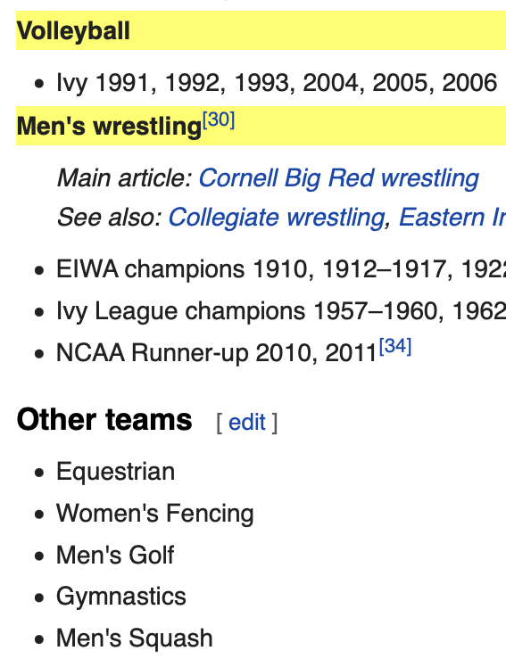
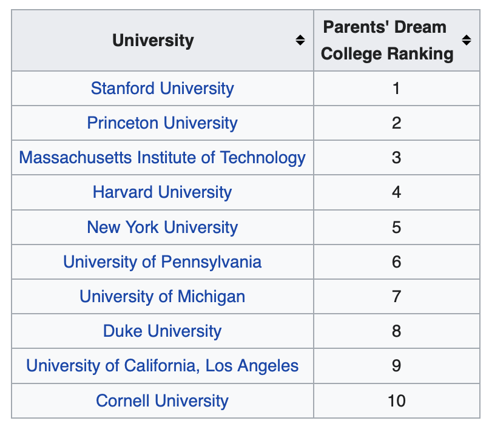

```{r xaringan-themer, include=FALSE, warning=FALSE}
library(xaringanthemer)
style_mono_accent(base_color = "#B31B1B",
                  text_font_size = "1.4rem")
xaringanExtra::use_xaringan_extra(c("tile_view"))
```

```{r setup, include=FALSE}
library(knitr)
opts_chunk$set(warning = FALSE, message = FALSE, 
                      #cache = TRUE,
                      fig.retina = 3, fig.align = "center",
                      fig.width=14, fig.height=7)
```

```{r packages-data, include=FALSE}
library(tidyverse)
```


class: center, middle

# Web scraping

.class-info[

**Week 13**

AEM 2850 / 5850 : R for Business Analytics<br>
Cornell Dyson<br>
Spring 2025

<!-- Acknowledgements:  -->
<!-- [Andrew Heiss](https://datavizm20.classes.andrewheiss.com) -->
<!-- [Claus Wilke](https://wilkelab.org/SDS375/) -->
<!-- [Grant McDermott](https://github.com/uo-ec607/lectures) -->
<!-- [Jenny Bryan](https://stat545.com/join-cheatsheet.html), -->
<!-- [Allison Horst](https://github.com/allisonhorst/stats-illustrations) -->
<!-- [Ed Rubin](https://github.com/edrubin/EC524W22) -->
]

---

# Announcements

Only two full weeks left!

<!-- Group project graded, will discuss at end of class -->

Remaining deadlines:
  - Homework-13 will be due Monday
  - Homework-14 will be our example in class next Thursday
  - Prelim 2 on May 6 in class (two weeks from today)
    <!-- - I will give more guidance on this soon -->

Questions before we get started?

---

# Plan for today

[Web scraping basics](#web-scraping-basics)

[Web scraping with rvest](#rvest)
  - [Cornell sports](#cornell-sports)
  - [College rankings](#college-rankings)

[Group project debrief](#group-project)

---
class: inverse, center, middle
name: web-scraping-basics

# Web scraping basics

---
# What is web scraping?

--

Getting data or "content" off the web and onto our computers

--

We get content off the web all the time!
- Copy and paste
- Read and take notes
- Screenshot

--

The goal of web **scraping** is to write computer code to help us automate this process and store the results in a machine-readable format


---

# Why would we want to scrape data?

When is web scraping useful?

--

- When the data is publicly available

- When you can't get the data in a more convenient format

--

When is web scraping not useful?

--

- When data is publicly available in other formats (e.g., csv)

- When the site owner offers a way to access data directly (e.g., via an API)

--

Web scraping is time consuming and costly (for both you and "them")

---

# Server-side vs client-side content

### 1. Server-side

- Host server "builds" site and sends HTML code that our browser renders
- All the information is embedded in the website's HTML

--

### 2. Client-side

- Site contains an empty template of HTML and CSS
- When we visit, our browser sends a *request* to the host server
- The server sends a *response* script that our browser uses to populate the HTML template with information we want

--

**We will focus on server-side web scraping due to time constraints**

---

# What is HTML?

--

HTML stands for "HyperText Markup Language" and looks like this:

```{r eval=FALSE}
<html>
<head>
  <title>Page title</title>
</head>
<body>
  <h1 id='first'>A heading</h1>
  <p>Some text &amp; <b>some bold text.</b></p>
  
</body>
```

---

# What is HTML?

HTML has a hierarchical structure formed by **elements** that consist of:
1. a start tag
  - optional attributes
2. contents
3. an end tag

???

Source: [https://rvest.tidyverse.org/articles/rvest.html](https://rvest.tidyverse.org/articles/rvest.html)


---

# What is HTML?

HTML has a hierarchical structure formed by **elements** that consist of:
1. a start tag (e.g., `<h1>`)
  - optional attributes (e.g., `id='first'`)
2. contents in between tags (e.g., `A heading`)
3. an end tag (e.g., `</h1>`)

```{r eval=FALSE}
<html>
<head>
  <title>Page title</title>
</head>
<body>
  <h1 id='first'>A heading</h1> #<<
  <p>Some text &amp; <b>some bold text.</b></p>
  
</body>
```

???

Source: [https://rvest.tidyverse.org/articles/rvest.html](https://rvest.tidyverse.org/articles/rvest.html)


---

# What is HTML?

**Elements**

- There are over 100 HTML elements
- Google tags to learn about them as needed

--

**Contents**

- Most elements can have content in between start and end tags
- Content can be text or more elements (as **children**)

--

**Attributes**

- Attributes like `id` and `class` are used with CSS to control page appearance
- These attributes are useful for scraping data

???

Source: [https://rvest.tidyverse.org/articles/rvest.html](https://rvest.tidyverse.org/articles/rvest.html)

---

# What is CSS?

--

CSS stands for **C**ascading **S**tyle **S**heets

- Tool for defining visual appearance of HTML

--

**CSS selectors** help identify what we want to scrape

--

We will learn by example using the extension/bookmarklet [SelectorGadget](https://selectorgadget.com)

???

Source: [https://rvest.tidyverse.org/articles/rvest.html](https://rvest.tidyverse.org/articles/rvest.html)

---
class: inverse, center, middle
name: rvest

# Web scraping with rvest


---

# The rvest package

[rvest](https://rvest.tidyverse.org/index.html) (as in "harvest") is part of the tidyverse

```{r}
library(rvest) # installed with tidyverse but needs to be loaded
```

--

We will cover several functions that make it easy to scrape data from web pages:
- `read_html` reads HTML, much like `read_csv` reads .csv files
- `html_element(s)` find HTML elements using CSS selectors or XPath expressions
- `html_text2` retrieves text from HTML elements
- `html_table` parses HTML tables into data frames

--

Let's learn these commands by working through two examples

---
name: cornell-sports

# Example 1: Cornell Big Red on Wikipedia

How could we scrape a list of varsity sports?

.center[
<figure>
  <a href="https://en.wikipedia.org/wiki/Cornell_Big_Red">
    
  </a>
</figure>
]

???

Source: https://en.wikipedia.org/wiki/Cornell_Big_Red

---

# Option 1: use `dt` tag to get headings

<figure>
  
</figure>

???

Source: https://en.wikipedia.org/wiki/Cornell_Big_Red

---

# Scraping text using `dt` tag

Step 1: use `read_html()` to read in html from the url of interest

```{r}
big_red <- read_html("https://en.wikipedia.org/wiki/Cornell_Big_Red") #<<

big_red
```

---

# Scraping text using `dt` tag

Step 2: use `html_elements()` to extract every instance of a `dt` tag

```{r eval = FALSE}
big_red <- read_html("https://en.wikipedia.org/wiki/Cornell_Big_Red")

big_red |> 
  html_elements("dt") |> # dt tag is for terms in a description list #<<
  head(8)
```

```{r echo = FALSE}
# (use separate chunks to avoid reading html from site repeatedly)
big_red |> 
  html_elements("dt") |> # dt tag is for terms in a description list #<<
  head(8)
```

---

# Scraping text using `dt` tag

Step 3: use `html_text2()` to convert the sports to a character vector

```{r eval = FALSE}
big_red <- read_html("https://en.wikipedia.org/wiki/Cornell_Big_Red")

big_red_text <- big_red |> 
  html_elements("dt") |> # dt tag is for terms in a description list
  html_text2()           # convert html to text #<<

head(big_red_text)       # looks good!
```

```{r echo = FALSE}
# (use separate chunks to avoid reading html from site repeatedly)
big_red_text <- big_red |> 
  html_elements("dt") |> # dt tag is for terms in a description list
  html_text2()           # convert html to text #<<

head(big_red_text)       # looks good!
```

--

.less-left[
```{r}
length(big_red_text) # hmm...
```
]

--

.more-right[
```{r}
tail(big_red_text) # uh-oh...
```
]

--

That doesn't seem right...

---

# What went wrong?

--

.less-left[
1. Got irrelevant data
]

.more-right[
<figure>
  
</figure>
]

---

# What went wrong?

.less-left[
1. Got irrelevant data

2. Didn't get relevant data
]

.more-right.center[
<figure>
  
</figure>
]

---

# Option 2: use `.wikitable` tag to get table

.center[
<figure>
  
</figure>
]

???

Source: https://en.wikipedia.org/wiki/Cornell_Big_Red

---

# Scraping tables using `.wikitable` tag

Step 1: use `read_html()` to read in html from the url of interest

```{r eval=FALSE}
big_red <- read_html("https://en.wikipedia.org/wiki/Cornell_Big_Red") #<<
```

--

Step 2: use `html_element()` to extract the first table element

```{r}
big_red |> 
  html_element(".wikitable")   # extract the first .wikitable #<<
```

---

# Scraping tables using `.wikitable` tag

Step 3: use `html_table()` to convert the table into a data frame

```{r}
big_red_table <- big_red |> 
  html_element(".wikitable") |> # extract the first .wikitable
  html_table()                  # convert html to a data frame #<<

head(big_red_table, 8)
```

---

# Scraped data frames are data frames

```{r echo=FALSE, eval=FALSE}
full_join(
  big_red_table |> select(1) |> mutate(sport = `Men's sports`),
  big_red_table |> select(2) |> mutate(sport = `Women's sports`),
  join_by(sport)
) |> 
  arrange(sport)
```


```{r echo=FALSE, eval=FALSE}
tidy_big_red <- full_join(
  big_red_table |> select(sport = 1) |> mutate(mens = TRUE),
  big_red_table |> select(sport = 2) |> mutate(womens = TRUE),
  join_by(sport)
) |> 
  arrange(sport) |> 
  filter(sport != "" & !str_detect(sport, "^†")) |> 
  pivot_longer(-sport, names_to = "gender", values_to = "has_team")
```

```{r}
tidy_big_red <- big_red_table |> 
  pivot_longer(everything(), names_to = "gender", values_to = "sport") |> 
  filter(sport != "" & !str_detect(sport, "^†")) # remove things that aren't sports

tidy_big_red
```

---

# Scraped data frames are data frames

What function(s) could we use to determine how many gender category-sport pairs there are in `tidy_big_red`?

--

.pull-left[
```{r}
tidy_big_red |> 
  count()
```
]

.pull-right[
```{r}
tidy_big_red |> 
  nrow()
```
]

--

(Or we could have gone back one slide to look at the tibble header...)

---

# Scraped data frames are data frames

What function(s) could we use to determine how many distinct sports there are in `tidy_big_red`?

--

.pull-left[
```{r}
tidy_big_red |> 
  distinct(sport) |> 
  count()
```
]

.pull-right[
```{r}
tidy_big_red |> 
  select(sport) |> 
  n_distinct()
```
]

---

# Scraped data frames are data frames

What function could we use to determine how many distinct sports are there for each gender category?

--

```{r}
tidy_big_red |> 
  count(gender)
```

---
name: college-rankings

# Example 2: College rankings on Wikipedia

How could we scrape college rankings?

.center[
<figure>
  <a href="https://web.archive.org/web/20220405170508/https://en.wikipedia.org/wiki/College_and_university_rankings_in_the_United_States">
    
  </a>
</figure>
]

.tiny[
*The site has changed over time, so we will scrape an archive from [The Wayback Machine](https://web.archive.org/web/20220405170508/https://en.wikipedia.org/wiki/College_and_university_rankings_in_the_United_States). One of web scraping's many challenges!*
]

???

Source: https://en.wikipedia.org/wiki/College_and_university_rankings_in_the_United_States#U.S._News_&_World_Report_Best_Colleges_Ranking

---

# Use `.wikitable` tag to get the first table

```{r}
rankings <- read_html("https://web.archive.org/web/20220405170508/https://en.wikipedia.org/wiki/College_and_university_rankings_in_the_United_States")

first_table <- rankings |> 
  html_element(".wikitable") |> # extract the first .wikitable #<<
  html_table()                  # convert html to a data frame #<<

first_table
```

---

# Scraped data frames are data frames

How does Cornell stack up?

--

How could we find it within a table with many other schools?

--

```{r}
first_table |> 
  select(uni = 1, rank = 2) |>       # select and rename the first two columns
  filter(str_detect(uni, "Cornell")) # use pattern matching to find Cornell #<<
```

---

# What if CSS selectors match multiple tables?

.pull-left[
<figure>
    
</figure>
]

.pull-right[
<figure>
    
</figure>
]

---

# What if CSS selectors match multiple tables?

#### Multiple options:

#### 1. Tweak CSS selectors to uniquely identify element (if possible)

#### 2. Scrape all of them, then use familiar R tools to extract data

--

Let's try option 2

---

# Scrape all the tables

Use `html_elements()` to extract all matching elements

```{r}
all_tables <- rankings |> 
  html_elements(".wikitable") |> # extract all the .wikitables #<<
  html_table()                   # convert html to a data frame
```

--

```{r}
class(all_tables) # we get a list of tables
```

--

```{r}
length(all_tables) # 11 tables, to be exact
```

---

# How could we extract individual tables?

```{r echo=FALSE}
head(all_tables[[1]][,1:2], 3)
```

```{r echo=FALSE}
head(all_tables[[7]], 3)
```

```{r echo=FALSE}
head(all_tables[[8]], 3)
```

---

# String matching again!

```{r}
# use str_detect() to search for tables with "Parents"
str_detect(all_tables, "Parents")
```

--

```{r}
# or use str_which() to get position of matching object(s)
str_which(all_tables, "Parents")
```


---

# You are fulfilling your parents' dreams

```{r highlight.output = c(3,14)}
# now extract table(s) with "Parents"
# below we use `[]` syntax to extract the table by index
# this is because because all_tables is a list, not a data frame
all_tables[str_detect(all_tables, "Parents")]
```


---
class: inverse, center, middle
name: group-project

# Group project

---

# Overall feedback

Good job!

Overall we were pleased with everyone's work

This assignment was meant to push you, and it was interesting to see the approaches different groups took

---

# Group project highlights

Many groups included things like executive summaries, a table of contents, etc. to tie the report together

At least one group went above and beyond by providing a secondary visualization that they thought improved on the one we had asked for

Some very clear slide decks with key visualizations and takeaways
- Groups rose to the challenge of using our old tools to output something new
- One group added some real polish in post-processing
- Fun fact: quarto can use powerpoint templates

---

# Grading

Median grade was 90%

We will post scores along with feedback on canvas

Please email me, Victor, and Xiaorui if you have any questions about grading
- Do this in a single email so we all have access to the same information
