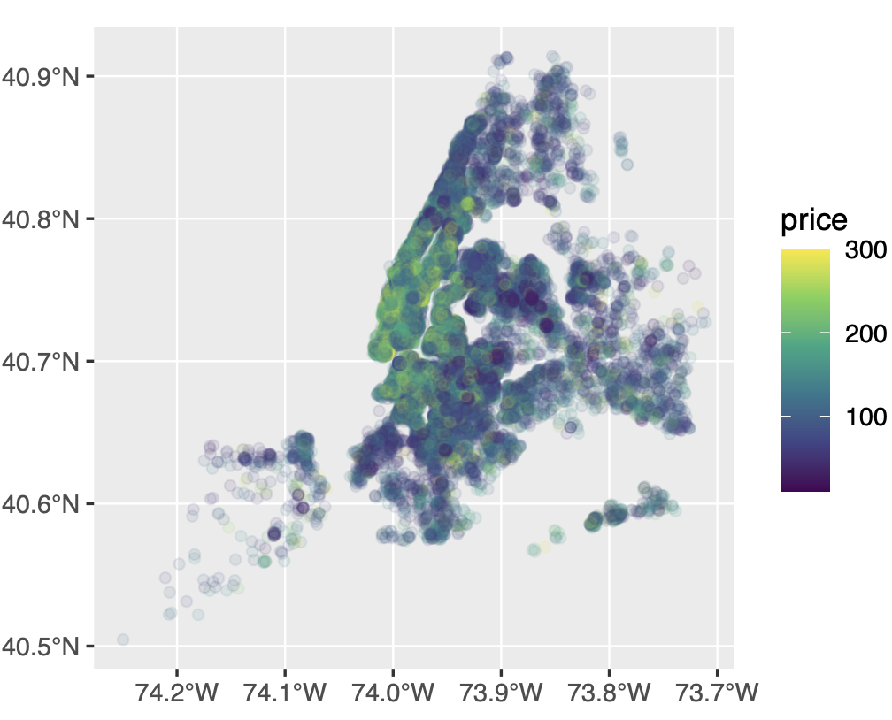
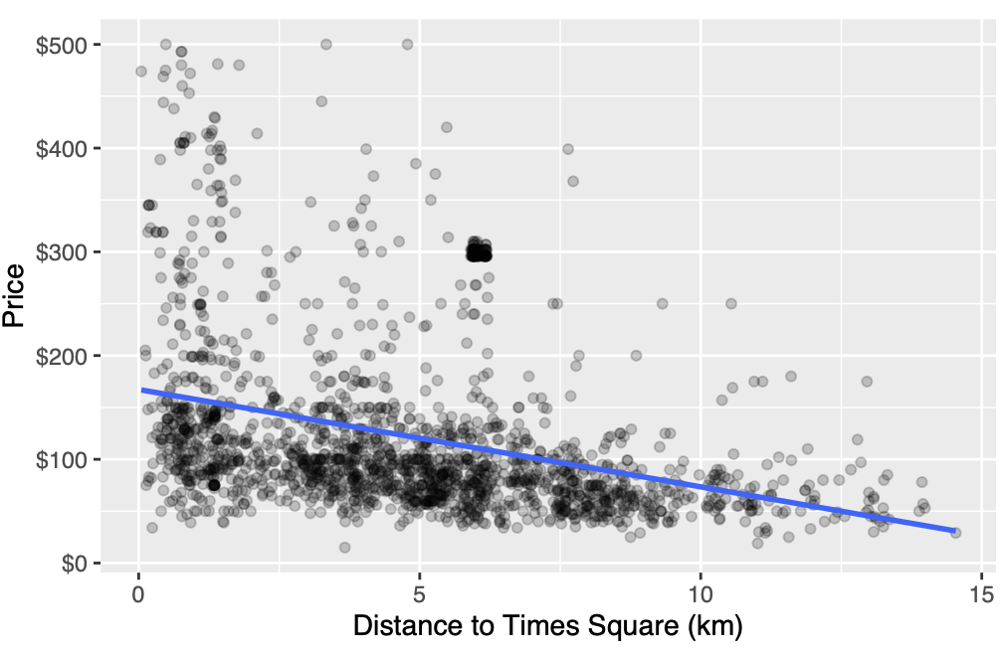

```{r xaringan-themer, include=FALSE, warning=FALSE}
library(xaringanthemer)
style_mono_accent(base_color = "#B31B1B",
                  text_font_size = "1.4rem")
xaringanExtra::use_xaringan_extra(c("tile_view"))
```

```{r setup, include=FALSE}
library(knitr)
opts_chunk$set(warning = FALSE, message = FALSE, 
                      #cache = TRUE,
                      fig.retina = 3, fig.align = "center",
                      fig.width=14, fig.height=7)
```

```{r packages-data, include=FALSE}
library(tidyverse)
library(FNN)
library(parsnip)
# install.packages("ranger")
# install.packages("ISLR")
library(DT)
library(janitor)
library(glmnet)
# install.packages("recipes")
library(recipes)
library(magrittr)
```

```{r colors, include=FALSE}
# Define colors
red_pink   = "#e64173"
turquoise  = "#20B2AA"
orange     = "#FFA500"
red        = "#fb6107"
blue       = "#3b3b9a"
green      = "#8bb174"
grey_light = "grey70"
grey_mid   = "grey50"
grey_dark  = "grey20"
purple     = "#6A5ACD"
slate      = "#222222"
```


class: center, middle

# Prediction

.class-info[

**Week 13**

AEM 2850: R for Business Analytics<br>
Cornell Dyson<br>
Spring 2022

Acknowledgements: 
<!-- [Andrew Heiss](https://datavizm20.classes.andrewheiss.com) -->
<!-- [Claus Wilke](https://wilkelab.org/SDS375/) -->
<!-- [Grant McDermott](https://github.com/uo-ec607/lectures) -->
<!-- [Jenny Bryan](https://stat545.com/join-cheatsheet.html), -->
<!-- [Allison Horst](https://github.com/allisonhorst/stats-illustrations) -->
[Ed Rubin](https://github.com/edrubin/EC524W22)
]

---

# Announcements

Final project:
- Open-ended
- Choose your own groups of 3 by this Friday
- Choose your own data (soon!)
- We will post more guidance this week
- Due May 19 at 4:30pm

Questions before we get started?

---

# Creative answers to Lab 12, Question 7

<figure>
  
</figure>

---

# Creative answers to Lab 12, Question 7

<figure>
  
</figure>

---

# Plan for today

[Prologue](#prologue)

[Linear regression](#ols)

[Shrinkage methods](#shrinkage-methods)

[Ridge regression](#ridge-regression)

[Lasso](#lasso)

[Classification on Thursday, time permitting](#classification)

---
class: inverse, center, middle
name: prologue

# Prologue

---

# Prediction vs causal inference

.pull-left[
**What is prediction?**
]

--

.pull-right[
**What is causal inference?**
]

--

.pull-left[
Why is prediction useful in business?
]

--

.pull-right[
Why is causal inference useful?
]


---

# Prediction vs causal inference

What do prediction and causal inference mean in this setting?

$$\color{#B31B1B}{\text{Y}_{i}} = \text{X}_{i} \color{#B31B1B}{\beta} + u_i$$

--

In our week on **relationships**, we estimated $\color{#B31B1B}{\hat\beta}$ to quantify *associations*

--

This week: *prediction* of $Y_i$, *i.e.,* constructing $\color{#B31B1B}{\hat{\text{Y}}_{i}}$?

--

Next week: *causal inference* on $\beta$

--

**This is not a methods class!**

---

# Prediction

Can we just use OLS like we did before?

--

**It depends**

---
exclude: true

```{r, data prediction types, include = F, cache = T}
# Generate data
n = 1e3
set.seed(123)
tmp_df <- tibble(
  x = runif(n = n, min = -10, max = 10),
  er = rnorm(n = n, sd = 70),
  y = 0.3* x^2 + sqrt(abs(er)) - 17
) %>% mutate(y = ifelse(y > 0, y, 5 - x + 0.03 * er)) %>% mutate(y = abs(y)^0.7)
# Estimate
knn_df <- tibble(
  x = seq(-10, 10, by = 0.1),
  y = knn.reg(
    train = tmp_df[,"x"] %>% as.matrix(),
    test = tibble(x = seq(-10, 10, by = 0.1)),
    y = tmp_df[,"y"] %>% as.matrix(),
    k = 100
  )$pred
)
knn_c_df <- tibble(
  x = seq(-10, 10, by = 0.1),
  y = knn.reg(
    train = tmp_df[,"x"] %>% as.matrix(),
    test = tibble(x = seq(-10, 10, by = 0.1)),
    y = tmp_df[,"y"] %>% as.matrix(),
    k = 10
  )$pred
)
# Random forest
rf_model <- rand_forest(mode = "regression", mtry = 1, trees = 10000) %>%
  set_engine("ranger", seed = 12345, num.threads = 10) %>%
  fit_xy(y = tmp_df[,"y"], x = tmp_df[,"x"])
# Predict onto testing data
rf_df <- tibble(
  y = predict(rf_model, new_data = tibble(x = seq(-10, 10, by = 0.1)))$.pred,
  x = seq(-10, 10, by = 0.1)
)
# The plot
gg_basic <- ggplot(data = tmp_df, aes(x, y)) +
  geom_hline(yintercept = 0) +
  geom_vline(xintercept = 0) +
  geom_point(size = 3.5, shape = 19, alpha = 0.05) +
  geom_point(size = 3.5, shape = 1, alpha = 0.2) +
  theme_void(base_family = "Fira Sans Book") +
  xlab("Y") + ylab("X") +
  theme(
    axis.title.y.left = element_text(size = 18, hjust = 0, vjust = 0),
    axis.title.x.bottom = element_text(size = 18, hjust = 0.5, vjust = 0.5, angle = 0)
    )
```

---
name: graph-example

.white[blah]
```{r, plot points, echo = F}
gg_basic
```

---
.pink[Linear regression]
```{r, plot ols, echo = F}
gg_basic +
geom_smooth(method = "lm", se = F, color = red_pink, size = 1.25)
```

---
.pink[Linear regression], .turquoise[linear regression] $\color{#20B2AA}{\left( x^4 \right)}$
```{r, plot ols poly, echo = F}
gg_basic +
geom_smooth(method = "lm", se = F, color = red_pink, size = 1.25) +
geom_smooth(method = "lm", formula = y ~ poly(x, 4), se = F, color = turquoise, size = 1.25)
```

---
.pink[Linear regression], .turquoise[linear regression] $\color{#20B2AA}{\left( x^4 \right)}$, .purple[KNN (100)]
```{r, plot knn, echo = F}
gg_basic +
geom_smooth(method = "lm", se = F, color = red_pink, size = 1.25) +
geom_smooth(method = "lm", formula = y ~ poly(x, 4), se = F, color = turquoise, size = 1.25) +
geom_path(data = knn_df, color = purple, size = 1.25)
```

---
.pink[Linear regression], .turquoise[linear regression] $\color{#20B2AA}{\left( x^4 \right)}$, .purple[KNN (100)], .orange[KNN (10)]
```{r, plot knn more, echo = F}
gg_basic +
geom_smooth(method = "lm", se = F, color = red_pink, size = 1.25) +
geom_smooth(method = "lm", formula = y ~ poly(x, 4), se = F, color = turquoise, size = 1.25) +
geom_path(data = knn_df, color = purple, size = 1.25) +
geom_path(data = knn_c_df, color = orange, size = 1.25)
```

---
.pink[Linear regression], .turquoise[linear regression] $\color{#20B2AA}{\left( x^4 \right)}$, .purple[KNN (100)], .orange[KNN (10)], .slate[random forest]
```{r, plot rf, echo = F}
gg_basic +
geom_smooth(method = "lm", se = F, color = red_pink, size = 1.25) +
geom_smooth(method = "lm", formula = y ~ poly(x, 4), se = F, color = turquoise, size = 1.25) +
geom_path(data = knn_df, color = purple, size = 1.25) +
geom_path(data = knn_c_df, color = orange, size = 1.25) +
geom_path(data = rf_df, color = slate, size = 1.25)
```

---

# Tradeoffs

In prediction, we constantly face tradeoffs, _e.g._,
- **flexibility** and **.slate[parametric structure]** (and interpretability)
- performance in **training** and **.slate[test]** samples
- **variance** and **.slate[bias]**

--

Many machine-learning (ML) techniques/algorithms optimize these tradeoffs

But it's important to understand them, and sometimes tailor to your use case

---

# Applications: Amazon machine learning

```{r, amazon-img, echo = F, out.width = '70%'}

```

???
https://aws.amazon.com/machine-learning/

---

# Applications: Demand forecasting

```{r, demand-forecasting-img, echo = F, out.width = '100%'}

```

???
https://aws.amazon.com/forecast/

---

# Applications: Uber

```{r, uber-img, echo = F, out.width = '75%'}
knitr::include_graphics("img/13/ml-uber.png")
```

???
https://eng.uber.com/michelangelo-machine-learning-platform/

---

# Applications: UberEATS delivery times

```{r, ubereats-img, echo = F, out.width = '65%'}

```

???
https://eng.uber.com/michelangelo-machine-learning-platform/

---

# Applications: Economic activity

```{r, oil-img, echo = F, out.width = '75%'}
knitr::include_graphics("img/13/ml-oil.png")
```

???
https://www.wired.com/2015/03/orbital-insight/


---
class: inverse, center, middle
name: ols

# Linear regression

---

# Why revisit linear regression?

--

New perspective: **predicting** rather than estimating relationships

--

Many fancy statistical learning approaches are just linear regression with some tweaks

???

ISL, p. 59; emphasis added

---

# Linear regression

OLS for short

$$\color{#B31B1B}{y_{i}} = x_{i} \color{#B31B1B}{\beta} + e_i$$

--

OLS minimizes errors. What are errors?

--

$$
\begin{align}
  e_i = \color{#B31B1B}{y_i} - \color{#222222}{\hat{y}_i}
\end{align}
$$

--

OLS minimizes errors in a specific sense. What sense?

--

$$
\begin{align}
  \text{RSS} = e_1^2 + e_2^2 + \cdots + e_n^2 = \sum_{i=1}^n e_i^2
\end{align}
$$
--

$\color{#B31B1B}{\hat{\beta}}$ minimizes **sum of squared errors** (SSE), aka **residual sum of squares** (RSS)

---

# Choosing prediction models

.pull-left[
$$y_i = \beta_0 + \beta_1 x_i + e_i$$
]

.pull-right[
$$y_i = \beta_0 + \beta_1 x_i + \beta_2 x^2_i + e_i$$
]

**How to choose?**

--

1. Define a measure of performance/fit
2. Choose the model that performs better

--

Sounds easy, right?

---

# Performance

**R-squared** is a common way to assess fit of linear regression:

$$
\begin{align}
  R^2 = \dfrac{\text{TSS} - \text{RSS}}{\text{TSS}} = 1 - \dfrac{\text{RSS}}{\text{TSS}} \quad \text{where} \quad \text{TSS} = \sum_{i=1}^{n} \left( y_i - \overline{y} \right)^2
\end{align}
$$

--

Which model will have a better R-squared? Why?

.pull-left[
$$y_i = \beta_0 + \beta_1 x_i + e_i$$
]

.pull-right[
$$y_i = \beta_0 + \beta_1 x_i + \beta_2 x^2_i + e_i$$
]

--

**Add a new variable:** RSS $\downarrow$ and TSS is unchanged. Thus, R-squared increases

---

# Performance

Does anyone see a potential problem with this?
- What if we use $n$ predictors for $n$ data points?

--

**Overfitting**

--

Wait, what is overfitting?

--

Overfitting is when a model is too good at predicting the data it was estimated on, but predictions fail on other data

---

# Example

Let's see how R-squared does with simulated data on 500 very weak predictors

To address overfitting, we can compare **in-** vs. **out-of-sample** performance

---
exclude: true

```{r, overfit-data-gen, eval = F}
stopifnot(FALSE) # this code was not run
# instead the rds output file was available from ed rubin's repo

library(pacman)
p_load(parallel, stringr, data.table, magrittr, here)
# Set parameters
set.seed(123)
N = 2e3
n = 500
p = n - 1
# Generate data
X = matrix(data = rnorm(n = N*p), ncol = p)
β = matrix(data = rnorm(p, sd = 0.005), ncol = 1)
y = X %*% β + matrix(rnorm(N, sd = 0.01), ncol = 1)
# Create a data table
pop_dt = X %>% data.matrix() %>% as.data.table()
setnames(pop_dt, paste0("x", str_pad(1:p, 4, "left", 0)))
pop_dt[, y := y %>% unlist()]
# Subset
sub_dt = pop_dt[1:n,]
out_dt = pop_dt[(n+1):N,]
Nn = N - n
# For j in 1 to p: fit a model, record R2 and RSE
fit_dt = mclapply(X = seq(1, p, by = 5), mc.cores = 12, FUN = function(j) {
  # Fit a model with the the first j variables
  lm_j = lm(y ~ ., data = sub_dt[, c(1:j,p+1), with = F])
  # Unseen data performance
  y_hat = predict(lm_j, newdata = out_dt[, c(1:j,p+1), with = F])
  out_rss = sum((out_dt[,y] - y_hat)^2)
  out_tss = sum((out_dt[,y] - mean(out_dt[,y]))^2)
  # Return data table
  data.table(
    p = j,
    in_rse = summary(lm_j)$sigma,
    in_r2 = summary(lm_j)$r.squared,
    in_r2_adj = summary(lm_j)$adj.r.squared,
    in_aic = AIC(lm_j),
    in_bic = BIC(lm_j),
    out_rse = sqrt(1 / (Nn - j - 1) * out_rss),
    out_r2 = 1 - out_rss/out_tss,
    out_r2_adj = 1 - ((out_rss) / (Nn - j - 1)) / ((out_tss) / (Nn-1))
  )
}) %>% rbindlist()
# Save results
saveRDS(
  object = fit_dt,
  file = "data/prediction-overfit-data.rds"
)
```

```{r, overfit-data-load}
# Load the data
fit_dt = read_rds("data/prediction-overfit-data.rds")
```

---

**.slate[In-sample R-squared]** mechanically increases as we add predictors
<br>
**.white[Out-of-sample R-squared does not]**

```{r, overfit-plot-r2, echo = F, fig.height = 6.25}
ggplot(data = fit_dt, aes(x = p, y = in_r2)) +
  geom_hline(yintercept = 0) +
  geom_line() +
  geom_point() +
  geom_line(aes(y = out_r2), color = NA) +
  geom_point(aes(y = out_r2), color = NA) +
  scale_y_continuous(expression(R^2)) +
  scale_x_continuous("Number of predictors") + #, labels = comma) +
  theme_minimal(base_size = 24, base_family = "Fira Sans Book")
```

---

**.slate[In-sample R-squared]** mechanically increases as we add predictors
<br>
**Out-of-sample R-squared does not**

```{r, overfit-plot-r2-both, echo = F, fig.height = 6.25}
ggplot(data = fit_dt, aes(x = p, y = in_r2)) +
  geom_hline(yintercept = 0) +
  geom_line() +
  geom_point() +
  geom_line(aes(y = out_r2), color = red_pink) +
  geom_point(aes(y = out_r2), color = red_pink) +
  scale_y_continuous(expression(R^2)) +
  scale_x_continuous("Number of predictors") + #, labels = comma) +
  theme_minimal(base_size = 24, base_family = "Fira Sans Book")
```

Adjusted R-squared, residual standard error, AIC, BIC all suffer similarly

---

# Model selection

We want a method to optimally select a (linear) model while balancing variance and bias and avoiding overfitting

--

Two options:

1. **Subset selection** chooses a (sub)set of $p$ potential predictors by brute force search (and more sophisticated variants)

2. **Shrinkage** fits a model using all $p$ variables but "shrinks" its coefficients

--

We will focus on shrinkage methods today


---
class: inverse, center, middle
name: shrinkage-methods

# Shrinkage methods

---

# Shrinkage methods

1. Fit a model that contains all $p$ predictors
2. Simultaneously: shrink coefficients toward zero

*Idea:* Penalize the model for coefficients as they move away from zero

---

# Shrinkage methods

How could shrinking coefficients toward zero help our predictions?

--

Remember we face a tradeoff between bias and variance

--

- Shrinking our coefficients toward zero **reduces the model's variance**
- **Penalizing** our model for **larger coefficients** shrinks them toward zero
- The **optimal penalty** will balance reduced variance with increased bias

--

Now you understand shrinkage methods!
- **Ridge regression**
- **Lasso**
- **Elasticnet**


???
Model variance: imagine the extreme case: a model whose coefficients are all zeros has no variance


---
class: inverse, center, middle
name: ridge-regression

# Ridge regression

---
# Ridge regression

**Least-squares regression** gets $\hat{\beta}_j$'s by minimizing RSS, _i.e._,
$$
\begin{align}
  \min_{\hat{\beta}} \text{RSS} = \min_{\hat{\beta}} \sum_{i=1}^{n} e_i^2 = \min_{\hat{\beta}} \sum_{i=1}^{n} \bigg( \color{#FFA500}{y_i} - \color{#6A5ACD}{\underbrace{\left[ \hat{\beta}_0 + \hat{\beta}_1 x_{i,1} + \cdots + \hat{\beta}_p x_{i,p} \right]}_{=\hat{y}_i}} \bigg)^2
\end{align}
$$

--

**Ridge regression** makes a small change: minimize the (weighted) sum of RSS plus a shrinkage penalty

--

$$
\begin{align}
  \min_{\hat{\beta}^R} \sum_{i=1}^{n} \bigg( \color{#FFA500}{y_i} - \color{#6A5ACD}{\hat{y}_i} \bigg)^2 + \color{#e64173}{\lambda \sum_{j=1}^{p} \beta_j^2}
\end{align}
$$

---

# Ridge regression

.pull-left[
**Ridge regression**
$$
\begin{align}
\min_{\hat{\beta}^R} \sum_{i=1}^{n} \bigg( \color{#FFA500}{y_i} - \color{#6A5ACD}{\hat{y}_i} \bigg)^2 + \color{#e64173}{\lambda \sum_{j=1}^{p} \beta_j^2}
\end{align}
$$
]

.pull-right[
**.slate[Least squares]**
$$
\begin{align}
\min_{\hat{\beta}} \sum_{i=1}^{n} \bigg( \color{#FFA500}{y_i} - \color{#6A5ACD}{\hat{y}_i} \bigg)^2
\end{align}
$$
]

<br>

$\color{#e64173}{\lambda}\enspace (\geq0)$ is a tuning parameter for the harshness of the penalty

$\color{#e64173}{\lambda} = 0$ implies no penalty: we are back to least squares

--

Each value of $\color{#e64173}{\lambda}$ produces a new set of coefficents


---
## $\lambda$ and penalization

$\lambda$ determines how much ridge "cares about" RSS vs coefficients


Choosing a *good* value for $\lambda$ is key.
- If $\lambda$ is too small, we might as well use OLS
- If $\lambda$ is too large, we might as well not have any predictors

--

How do we choose $\lambda$?

--

**Cross validation**

---

# Cross validation in one slide

**Cross validation** is a resampling method used to test error, evaluate performance, or select a model

--

Basic idea:
1. split data up into two subsets
2. use one subset of data to **train** the model
3. use the other subset to **test** the model

--

By validating model out of sample in the test data, cross-validation prevents overfitting in the training data


---

# Example data: Credit card balance data

Let's explore shrinkage methods using data from *ISL*'s R package `ISLR`

--

```{r, credit-data, echo = F}
# Print it
datatable(
  ISLR::Credit,
  height = '40%',
  rownames = F,
  options = list(
    dom = 't',
    pageLength = '7',
    headerCallback = DT::JS(
      "function(thead) {",
      "  $(thead).css('font-size', '55%');",
      "}"
    )
  )
) %>% formatStyle(
  columns = 1:nrow(ISLR::Credit),
  fontSize = "65%",
  textAlign = "center",
  paddingLeft = "0em",
  paddingBottom = "0.3em",
  paddingTop = "0.3em"
) %>%
formatRound("Income", 1)
```

<br>

The `Credit` dataset has `r nrow(ISLR::Credit)` observations on `r ncol(ISLR::Credit)-1` predictors


---
exclude: true

# Ridge regression example

Let's return to the credit dataset—and [pre-processing with `tidymodels`](https://www.kaggle.com/edwardarubin/intro-tidymodels-preprocessing)

Recall We have 11 predictors and a numeric outcome `balance`.

We can standardize our .b[predictors] using `step_normalize()` from `recipes`:

```{r, credit-data-work, echo=FALSE}
# load the credit dataset
credit_df <- ISLR::Credit %>% clean_names()
# processing recipe: Define ID, standardize, create dummies, rename (lowercase)
credit_recipe <- credit_df %>% recipe(balance ~ .) %>% 
  update_role(id, new_role = "id variable") %>% 
  step_normalize(all_predictors() & all_numeric()) %>% 
  step_dummy(all_predictors() & all_nominal()) %>% 
  step_rename_at(everything(), fn = str_to_lower)
# Time to juice
credit_clean <- credit_recipe %>% prep() %>% juice()
```


---

# Ridge regression with glmnet

For ridge and lasso regression, we will use `glmnet::glmnet()`

--

The **.slate[key arguments]** for `glmnet()` are

- `x` a .b[matrix] of predictors
- `y` outcome variable as a vector
- `standardize` (`T` or `F`)
- `alpha` elasticnet parameter
  - **`alpha=0` gives ridge**
  - `alpha=1` gives lasso
- `lambda` tuning parameter (sequence of numbers)
- `nlambda` alternatively, R picks a sequence of values for $\lambda$

---

# Ridge regression with glmnet

We just need to define a decreasing sequence for $\lambda$, and then we're set

```{r, ex-ridge-glmnet}
# define our range of lambdas (glmnet wants decreasing range)
lambdas <- 10^seq(from = 5, to = -2, length = 100)
# fit ridge regression
est_ridge <- glmnet(
  x = credit_clean %>% dplyr::select(-balance, -id) %>% as.matrix(),
  y = credit_clean$balance,
  standardize = F, # data are pre-standardized
  alpha = 0,       # ridge regression
  lambda = lambdas
  )
```

The `glmnet` output contains estimated coefficients for each $\lambda$


---

# Ridge regression coefficents

```{r, plot-ridge-glmnet, echo = F}
ridge_df <- est_ridge %>% coef() %>% t() %>% as.matrix() %>% as.data.frame()
ridge_df %<>% dplyr::select(-1) %>% mutate(lambda = est_ridge$lambda)
ridge_df %<>% gather(key = "variable", value = "coefficient", -lambda)
ridge_df %>% 
  ggplot(aes(x = lambda, y = coefficient, color = variable)) +
  geom_line() +
  scale_x_continuous(
    expression(lambda),
    labels = c("0.1", "10", "1,000", "100,000"),
    breaks = c(0.1, 10, 1000, 100000),
    trans = "log10"
    ) +
  scale_y_continuous("Ridge coefficient") +
  scale_color_viridis_d("Predictor", option = "magma", end = 0.9) +
  theme_minimal(base_size = 24, base_family = "Fira Sans Book") +
  theme(legend.position = "bottom")
```


---

# Ridge regression with cross-validation

`glmnet` provides a convenient cross-validation function: `cv.glmnet()`

```{r, cv-ridge, cache = F}
# define our lambdas
lambdas <- 10^seq(from = 5, to = -2, length = 100)
# cross validation
ridge_cv <- cv.glmnet( #<<
  x = credit_clean %>% dplyr::select(-balance, -id) %>% as.matrix(),
  y = credit_clean$balance,
  standardize = F, # data are pre-standardized
  alpha = 0,       # ridge regression
  lambda = lambdas,
  # new: how we make decisions and number of folds #<<
  type.measure = "mse", #<<
  nfolds = 5 # number of folds for k-fold cv #<<
  )
```

---

# Cross-validated RMSE and $\lambda$

Which $\lambda$ minimizes cross-validated RMSE?

```{r, plot-cv-ridge, echo = F, fig.height = 6}
# Create data frame of our results
ridge_cv_df = data.frame(
  lambda = ridge_cv$lambda,
  rmse = sqrt(ridge_cv$cvm)
)
# Plot
ggplot(
  data = ridge_cv_df,
  aes(x = lambda, y = rmse)
) +
geom_line() +
geom_point(
  data = ridge_cv_df %>% filter(rmse == min(rmse)),
  size = 3.5,
  color = red_pink
) +
scale_y_continuous("RMSE") +
scale_x_continuous(
  expression(lambda),
  trans = "log10",
  labels = c("0.1", "10", "1,000", "100,000"),
  breaks = c(0.1, 10, 1000, 100000),
) +
theme_minimal(base_size = 24, base_family = "Fira Sans Book")
```

---

# A model with fewer, weaker predictors

```{r, cv-ridge2, cache = F}
# Define our lambdas
lambdas <- 10^seq(from = 5, to = -2, length = 100)
# Cross validation
ridge_cv2 <- cv.glmnet(
  x = credit_clean %>% dplyr::select(-balance, -rating, -limit, -income) %>% as.matrix(), #<<
  y = credit_clean$balance,
  alpha = 0,
  standardize = T,
  lambda = lambdas,
  # how we make decisions and number of folds
  type.measure = "mse",
  nfolds = 5
)
```

---

# Cross-validated RMSE and $\lambda$

How does RMSE compare? How does optimal $\lambda$ compare? Why?

```{r, plot-cv-ridge2, echo = F, fig.height = 6}
# Create data frame of our results
ridge_cv_df2 <- data.frame(
  lambda = ridge_cv2$lambda,
  rmse = sqrt(ridge_cv2$cvm)
)
# Plot
ggplot(
  data = ridge_cv_df2,
  aes(x = lambda, y = rmse)
) +
geom_line() +
geom_point(
  data = ridge_cv_df2 %>% filter(rmse == min(rmse)),
  size = 3.5,
  color = red_pink
) +
scale_y_continuous("RMSE") +
scale_x_continuous(
  expression(lambda),
  trans = "log10",
  labels = c("0.1", "10", "1,000", "100,000"),
  breaks = c(0.1, 10, 1000, 100000),
) +
theme_minimal(base_size = 24, base_family = "Fira Sans Book")
```


---

# Ridge regression predictions in R

Once you find $\lambda$ via cross validation,

1\. Fit your model on the full dataset using the optimal $\lambda$
```{r, ridge-final-1, eval = F}
# fit final model
final_ridge <- glmnet(
  x = credit_clean %>% dplyr::select(-balance, -id) %>% as.matrix(),
  y = credit_clean$balance,
  standardize = T,
  alpha = 0,
  lambda = ridge_cv$lambda.min # optimal lambda $<<
)
```

---

# Ridge regression predictions in R

Once you find $\lambda$ via cross validation,

1\. Fit your model on the full dataset using the optimal $\lambda$

2\. Make predictions
```{r, ridge-final-2, eval = F}
predict(
  final_ridge, # our final model
  type = "response", # predict y
  s = ridge_cv$lambda.min, # optimal lambda
  # x's to use for predicting y:
  newx = credit_clean %>% dplyr::select(-balance, -id) %>% as.matrix()
)
```
---
class: inverse, center, middle
name: lasso

# Lasso

---
# Lasso

**Lasso** simply replaces ridge's squared coefficients with absolute values

--

**.slate[Ridge regression]**
$$
\begin{align}
\min_{\hat{\beta}^R} \sum_{i=1}^{n} \big( \color{#FFA500}{y_i} - \color{#6A5ACD}{\hat{y}_i} \big)^2 + \color{#8AA19E}{\lambda \sum_{j=1}^{p} \beta_j^2}
\end{align}
$$

**Lasso**
$$
\begin{align}
\min_{\hat{\beta}^L} \sum_{i=1}^{n} \big( \color{#FFA500}{y_i} - \color{#6A5ACD}{\hat{y}_i} \big)^2 + \color{#B31B1B}{\lambda \sum_{j=1}^{p} \big|\beta_j\big|}
\end{align}
$$

---

# Shrinkage with lasso

Unlike ridge, lasso's penalty does not increase with the size of $\beta_j$.

You always pay $\color{#B31B1B}{\lambda}$ to increase $\big|\beta_j\big|$ by one unit.

--

The only way to avoid lasso's penalty is to **set coefficents to zero**

--

This feature has two **.slate[benefits]**
1. Some coefficients will be **set to zero**—we get "sparse" models
1. Lasso can be used for subset/feature **selection**

--

We still need to select $\color{#B31B1B}{\lambda}$ carefully

---

# Lasso with glmnet

We can also use `glmnet()` for lasso.

.ex[Recall] The .hi-slate[key arguments] for `glmnet()` are

- `x` a .b[matrix] of predictors
- `y` outcome variable as a vector
- `standardize` (`T` or `F`)
- `alpha` elasticnet parameter
  - `alpha=0` gives ridge
  - **`alpha=1` gives lasso**
- `lambda` tuning parameter (sequence of numbers)
- `nlambda` alternatively, R picks a sequence of values for $\lambda$

---

# Lasso with glmnet

Again, we define a decreasing sequence for $\lambda$, and we're set

```{r, ex-lasso-glmnet}
# define our range of lambdas (glmnet wants decreasing range)
lambdas <- 10^seq(from = 5, to = -2, length = 100)
# fit lasso regression
est_lasso <- glmnet(
  x = credit_clean %>% dplyr::select(-balance, -id) %>% as.matrix(),
  y = credit_clean$balance,
  standardize = F,
  alpha = 1, #<<
  lambda = lambdas
  )
```

The `glmnet` output (`est_lasso` here) contains estimated coefficients for $\lambda$. You can use `predict()` to get coefficients for additional values of $\lambda$.

---

# Lasso coefficents

```{r, plot-lasso-glmnet, echo = F}
lasso_df = est_lasso %>% coef() %>% t() %>% as.matrix() %>% as.data.frame()
lasso_df %<>% dplyr::select(-1) %>% mutate(lambda = est_lasso$lambda)
lasso_df %<>% gather(key = "variable", value = "coefficient", -lambda)
ggplot(
  data = lasso_df,
  aes(x = lambda, y = coefficient, color = variable)
) +
geom_line() +
scale_x_continuous(
  expression(lambda),
  labels = c("0.1", "10", "1,000", "100,000"),
  breaks = c(0.1, 10, 1000, 100000),
  trans = "log10"
) +
scale_y_continuous("Lasso coefficient") +
scale_color_viridis_d("Predictor", option = "magma", end = 0.9) +
theme_minimal(base_size = 24, base_family = "Fira Sans Book") +
theme(legend.position = "bottom")
```

---

# Before: Ridge regression coefficents

```{r, plot-ridge-glmnet-2, echo = F}
ridge_df <- est_ridge %>% coef() %>% t() %>% as.matrix() %>% as.data.frame()
ridge_df %<>% dplyr::select(-1) %>% mutate(lambda = est_ridge$lambda)
ridge_df %<>% gather(key = "variable", value = "coefficient", -lambda)
ggplot(
  data = ridge_df,
  aes(x = lambda, y = coefficient, color = variable)
) +
geom_line() +
scale_x_continuous(
  expression(lambda),
  labels = c("0.1", "10", "1,000", "100,000"),
  breaks = c(0.1, 10, 1000, 100000),
  trans = "log10"
) +
scale_y_continuous("Ridge coefficient") +
scale_color_viridis_d("Predictor", option = "magma", end = 0.9) +
theme_minimal(base_size = 24, base_family = "Fira Sans Book") +
theme(legend.position = "bottom")
```

What differences do you notice?

---

# Lasso with cross-validation

We can also cross validate $\lambda$ with `cv.glmnet()`

```{r, cv-lasso, cache = T}
# Define our lambdas
lambdas = 10^seq(from = 5, to = -2, length = 100)
# Cross validation
lasso_cv = cv.glmnet( #<<
  x = credit_clean %>% dplyr::select(-balance, -id) %>% as.matrix(),
  y = credit_clean$balance,
  alpha = 1,
  standardize = F,
  lambda = lambdas,
  type.measure = "mse", #<<
  nfolds = 5 #<<
)
```

---

# Cross-validated RMSE and $\lambda$

Which $\lambda$ minimizes cross-validated RMSE?

```{r, plot-cv-lasso, echo = F, fig.height = 6}
# Create data frame of our results
lasso_cv_df = data.frame(
  lambda = lasso_cv$lambda,
  rmse = sqrt(lasso_cv$cvm)
)
# Plot
ggplot(
  data = lasso_cv_df,
  aes(x = lambda, y = rmse)
) +
geom_line() +
geom_point(
  data = lasso_cv_df %>% filter(rmse == min(rmse)),
  size = 3.5,
  color = "#B31B1B"
) +
scale_y_continuous("RMSE") +
scale_x_continuous(
  expression(lambda),
  trans = "log10",
  labels = c("0.1", "10", "1,000", "100,000"),
  breaks = c(0.1, 10, 1000, 100000),
) +
theme_minimal(base_size = 24, base_family = "Fira Sans Book")
```

---

# A model with fewer, weaker predictors

```{r, cv-lasso2, cache = T, include = F}
# Define our lambdas
lambdas = 10^seq(from = 5, to = -2, length = 100)
# Cross validation
lasso_cv2 = cv.glmnet(
  x = credit_clean %>% dplyr::select(-balance, -rating, -limit, -income, -id) %>% as.matrix(),
  y = credit_clean$balance,
  alpha = 1,
  standardize = F,
  lambda = lambdas,
  # New: How we make decisions and number of folds
  type.measure = "mse",
  nfolds = 5
)
```

```{r, plot-cv-lasso2, echo = F, fig.height = 6}
# Create data frame of our results
lasso_cv_df2 = data.frame(
  lambda = lasso_cv2$lambda,
  rmse = sqrt(lasso_cv2$cvm)
)
# Plot
ggplot(
  data = lasso_cv_df2,
  aes(x = lambda, y = rmse)
) +
geom_line() +
geom_point(
  data = lasso_cv_df2 %>% filter(rmse == min(rmse)),
  size = 3.5,
  color = "#B31B1B"
) +
scale_y_continuous("RMSE") +
scale_x_continuous(
  expression(lambda),
  trans = "log10",
  labels = c("0.1", "10", "1,000", "100,000"),
  breaks = c(0.1, 10, 1000, 100000),
) +
theme_minimal(base_size = 24, base_family = "Fira Sans Book")
```

How does RMSE compare? How does optimal $\lambda$ compare? Why?

---

# Ridge or lasso?

.pull-left[
**Ridge regression**
<br>.b[+] shrinks $\hat{\beta}_j$ *near* 0
<br>.b[-] many small $\hat\beta_j$
<br>.b[-] doesn't work for selection
<br>.b[-] difficult to interpret output
<br>.b[+] better when all $\beta_j\neq$ 0
<br><br> *Best:* $p$ is large & $\beta_j\approx\beta_k$
]

.pull-right[
**Lasso**
<br>.b[+] shrinks $\hat{\beta}_j$ *to* 0
<br>.b[+] many $\hat\beta_j=$ 0
<br>.b[+] great for selection
<br>.b[+] sparse models easier to interpret
<br>.b[-] implicitly assumes some $\beta=$ 0
<br><br> *Best:* $p$ is large & many $\beta_j\approx$ 0
]

--

> [N]either ridge... nor the lasso will universally dominate the other.

*ISL, p. 224*


---

# Why not both?

.hi-blue[Elasticnet] combines .pink[ridge regression] and .grey[lasso].

--

$$
\begin{align}
\min_{\beta^E} \sum_{i=1}^{n} \big( \color{#FFA500}{y_i} - \color{#6A5ACD}{\hat{y}_i} \big)^2 + \color{#181485}{(1-\alpha)} \color{#e64173}{\lambda \sum_{j=1}^{p} \beta_j^2} + \color{#181485}{\alpha} \color{#8AA19E}{\lambda \sum_{j=1}^{p} \big|\beta_j\big|}
\end{align}
$$

We now have two tuning parameters: $\lambda$ (penalty) and $\color{#181485}{\alpha}$ (mixture).

--

Remember the `alpha` argument in `glmnet()`?

- $\color{#e64173}{\alpha = 0}$ specifies ridge
- $\color{#8AA19E}{\alpha=1}$ specifies lasso


---
class: inverse, center, middle
name: classification

# Classification

---

# Classification

Thursday, time permitting!

<!-- ed lecture 6, ITSL chapter 1, 4, stocks example -->


<!-- --- -->

<!-- # Prediction models -->

<!-- Prediction can be applied outside the world of linear regression... -->

<!-- -- -->

<!-- **Multi-class** classification problems -->
<!-- - Rather than {0,1}, we need to classify $y_i$ into 1 of K classes -->

<!-- -- -->

<!-- **Text analysis** and **image recognition** -->
<!-- - Comb though sentences (pixels) to glean insights from relationships -->

<!-- -- -->

<!-- **Unsupervised learning** -->
<!-- - You don't know groupings, but you think there are relevant groups -->

<!-- ??? -->

<!-- **Multi-class** classification problems -->
<!-- - _e.g._, ER patients: {heart attack, drug overdose, stroke, nothing} -->

<!-- **Text analysis** and **image recognition** -->
<!-- - _e.g._, detect sentiments in tweets or roof-top solar in satellite imagery -->

<!-- **Unsupervised learning** -->
<!-- - _e.g._, classify spatial data into groups -->


