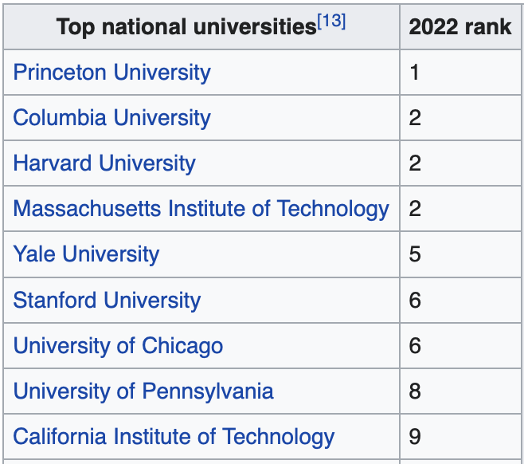

```{r xaringan-themer, include=FALSE, warning=FALSE}
library(xaringanthemer)
style_mono_accent(base_color = "#B31B1B",
                  text_font_size = "1.4rem")
xaringanExtra::use_xaringan_extra(c("tile_view"))
```

```{r setup, include=FALSE}
library(knitr)
opts_chunk$set(warning = FALSE, message = FALSE, 
                      #cache = TRUE,
                      fig.retina = 3, fig.align = "center",
                      fig.width=14, fig.height=7)
```

```{r packages-data, include=FALSE}
library(tidyverse)
```


class: center, middle

# Web scraping

.class-info[

**Week 14**

AEM 2850 / 5850 : R for Business Analytics<br>
Cornell Dyson<br>
Spring 2023

<!-- Acknowledgements:  -->
<!-- [Andrew Heiss](https://datavizm20.classes.andrewheiss.com) -->
<!-- [Claus Wilke](https://wilkelab.org/SDS375/) -->
<!-- [Grant McDermott](https://github.com/uo-ec607/lectures) -->
<!-- [Jenny Bryan](https://stat545.com/join-cheatsheet.html), -->
<!-- [Allison Horst](https://github.com/allisonhorst/stats-illustrations) -->
<!-- [Ed Rubin](https://github.com/edrubin/EC524W22) -->
]

---

# Announcements

Final project groups posted on canvas

Choose final project data and plan by this Thursday

- More details in a few minutes

Questions before we get started?

---

# Plan for today

[Course evaluations](#course-evals)

[Final project guidance](#final-project)

[Web scraping basics](#web-scraping-basics)

[Web scraping with rvest](#rvest)
  - [Cornell sports](#cornell-sports)
  - [College rankings](#college-rankings)

---
class: inverse, center, middle
name: course-evals

# Course evaluations

---

# Course evaluations

I take feedback seriously and will use it to improve this course!

Extra useful since this is the first offering of AEM 2850

--

Concrete suggestions are most helpful

--

**I would appreciate your feedback through two channels:**

1. Reflection - Week 15 - Course Feedback Survey
2. University course evaluations

--

Both will be anonymous

---

# University course evaluations

Anonymous: we just get summary reports, after grades are submitted

I will give you time to complete them in class next Tuesday

**I will award a bonus point on Reflection 15 for completing evaluations**

Thank you in advance for your feedback!

---
class: inverse, center, middle
name: final-project

# Final project

---

# Where to start?

The final project is intentionally open-ended: I want you to choose a topic and dataset that are as interesting and useful to you as possible

--

Since we do not have examples from past years, here are a few random ideas:

- Write a program to automate an investment plan
- Use functions to compute business analytics metrics for different companies
- Study the relationship twitter activity and a company's performance
- Construct a prediction model for future stock price movements
- Develop a pricing strategy for a specific product

--

See [the preliminary guidance](https://aem2850.toddgerarden.com/assignment/final-project/) on the course site for more details on these

---

# Key steps and timeline

### ~~Step 1: Choose a group by Friday, April 29~~

### Step 2: Choose data and make a plan by Thursday, May 5

### Step 3: Execute your plan

### Step 4: Submit your final project by Thursday, May 19 at 4:30pm

---

# Step 2: Choose data and make a plan

I posted a list of data sources for inspiration [on the course site](https://aem2850.toddgerarden.com/resource/data/)

You can also start by coming up with a project idea and then finding data

--

**Your project must use at least one of the following special topics:**

- space
- text
- functions
- prediction methods
- web scraping

--

Submit a few sentences describing your data, plan, and special topic(s) on canvas

---

# Expectations and grading

I will post more detailed instructions and a grading rubric over the next week

What do I expect? How long should it be? etc.

- As a rule of thumb, this project is worth 130/50 = 2.6x mini project 1
- I will adjust my expectations accordingly
- So you might want to adjust your effort

Any questions?

---
class: inverse, center, middle
name: web-scraping-basics

# Web scraping basics

---
# What is web scraping?

--

Getting data or "content" off the web and onto our computers

--

We get content off the web all the time!
- Copy and paste
- Read and take notes
- Screenshot

--

The goal of web **scraping** is to write computer code to help us automate this process and store the results in a machine-readable format


---

# Why would we want to scrape data?

When is web scraping useful?

--

- When the data is publicly available

- When you can't get the data in a more convenient format

--

When is web scraping not useful?

--

- When data is publicly available in other formats (e.g., csv)

- When the site owner offers a way to access data directly

--

Web scraping is time consuming and costly (for both you and "them")

---

# Server-side vs client-side content

### 1. Server-side

- Host server "builds" site and sends HTML code that our browser renders
- All the information is embedded in the website's HTML

--

### 2. Client-side

- Site contains an empty template of HTML and CSS
- When we visit, our browser sends a *request* to the host server
- The server sends a *response* script that our browser uses to populate the HTML template with information we want

--

**We will focus on server-side web scraping due to time constraints**

---

# What is HTML?

--

HTML stands for "HyperText Markup Language" and looks like this:

```{r eval=FALSE}
<html>
<head>
  <title>Page title</title>
</head>
<body>
  <h1 id='first'>A heading</h1>
  <p>Some text &amp; <b>some bold text.</b></p>
  
</body>
```

---

# What is HTML?

HTML has a hierarchical structure formed by **elements** that consist of:
1. a start tag
  - optional attributes
2. an end tag
3. contents in between tags

???

Source: [https://rvest.tidyverse.org/articles/rvest.html](https://rvest.tidyverse.org/articles/rvest.html)


---

# What is HTML?

HTML has a hierarchical structure formed by **elements** that consist of:
1. a start tag (e.g., `<h1>`)
  - optional attributes (e.g., `id='first'`)
2. an end tag (e.g., `</h1>`)
3. contents in between tags (e.g., `A heading`)

```{r eval=FALSE}
<html>
<head>
  <title>Page title</title>
</head>
<body>
  <h1 id='first'>A heading</h1> #<<
  <p>Some text &amp; <b>some bold text.</b></p>
  
</body>
```

???

Source: [https://rvest.tidyverse.org/articles/rvest.html](https://rvest.tidyverse.org/articles/rvest.html)


---

# What is HTML?

**Elements**

- There are over 100 HTML elements
- Google tags to learn about them as needed

--

**Contents**

- Most elements can have content in between start and end tags
- Content can be text or more elements (as **children**)

--

**Attributes**

- Attributes like `id` and `class` are used with CSS to control page appearance
- These attributes are useful for scraping data

???

Source: [https://rvest.tidyverse.org/articles/rvest.html](https://rvest.tidyverse.org/articles/rvest.html)

---

# What is CSS?

--

CSS stands for **C**ascading **S**tyle **S**heets

- Tool for defining visual appearance of HTML

--

**CSS selectors** help identify what we want to scrape

--

We will learn by example using the extension/bookmarklet [SelectorGadget](https://selectorgadget.com)

???

Source: [https://rvest.tidyverse.org/articles/rvest.html](https://rvest.tidyverse.org/articles/rvest.html)

---
class: inverse, center, middle
name: rvest

# Web scraping with rvest


---

# The rvest package

[rvest](https://rvest.tidyverse.org/index.html) (as in "harvest") is part of the tidyverse

```{r}
library(rvest) # installed with tidyverse but needs to be loaded
```

--

We will cover several functions that make it easy to scrape data from web pages:
- `read_html` reads HTML, much like `read_csv` reads .csv files
- `html_element(s)` find HTML elements using CSS selectors or XPath expressions
- `html_text2` retrieves text from HTML elements
- `html_table` parses HTML tables into data frames

--

Let's learn these commands by working through two examples

---
name: cornell-sports

# Example 1: Cornell Big Red on Wikipedia

How could we scrape a list of varsity sports?

.center[
<figure>
  <a href="https://en.wikipedia.org/wiki/Cornell_Big_Red">
    
  </a>
</figure>
]

???

Source: https://en.wikipedia.org/wiki/Cornell_Big_Red

---

# Option 1: use `dt` tag to get headings

<figure>
  
</figure>

???

Source: https://en.wikipedia.org/wiki/Cornell_Big_Red

---

# Scraping text using `dt` tag

Use `html_elements()` and `html_text2()` to extract the sports

```{r}
big_red <- read_html("https://en.wikipedia.org/wiki/Cornell_Big_Red")

big_red_text <- big_red %>% 
  html_elements("dt") %>% # dt tag is for terms in a description list #<<
  html_text2() # convert html to text #<<

head(big_red_text) # looks good!
```

--

```{r}
tail(big_red_text) # uh-oh...
```

--

That doesn't seem right...

---

# What went wrong?

--

.less-left[
1. Got irrelevant data
]

.more-right[
<figure>
  
</figure>
]

---

# What went wrong?

.less-left[
1. Got irrelevant data

2. Didn't get relevant data
]

.more-right.center[
<figure>
  
</figure>
]

---

# Option 2: use `.wikitable` tag to get table

.center[
<figure>
  
</figure>
]

???

Source: https://en.wikipedia.org/wiki/Cornell_Big_Red

---

# Scraping tables using `.wikitable` tag

Use `html_element()` to extract the first table element

```{r}
big_red %>% 
  html_element(".wikitable") #<<
```

---

# Scraping tables using `.wikitable` tag

Then use `html_table()` to convert the table into a data frame

```{r}
big_red %>% 
  html_element(".wikitable") %>%
  html_table() %>%  # convert html to a data frame #<<
  head(8)
```

---
name: college-rankings

# Example 2: College rankings on Wikipedia

How could we scrape college rankings?

.center[
<figure>
  <a href="https://en.wikipedia.org/wiki/College_and_university_rankings_in_the_United_States">
    
  </a>
</figure>
]

???

Source: https://en.wikipedia.org/wiki/College_and_university_rankings_in_the_United_States#U.S._News_&_World_Report_Best_Colleges_Ranking

---

# Use `.wikitable` tag to get the first table

```{r}
rankings <- read_html("https://en.wikipedia.org/wiki/College_and_university_rankings_in_the_United_States")

first_table <- rankings %>% 
  html_element(".wikitable") %>% 
  html_table()

first_table
```

---

# Scraped data frames are data frames

How does Cornell stack up?

```{r}
first_table %>% 
  select(c(1,2)) %>% 
  rename(uni = 1,
         rank = 2) %>% 
  filter(str_detect(uni, "Cornell"))
```

---

# What if CSS selectors match multiple tables?

.pull-left[
<figure>
    
</figure>
]

.pull-right[
<figure>
    
</figure>
]

---

# What if CSS selectors match multiple tables?

#### Multiple options:

#### 1. Tweak CSS selectors to uniquely identify element (if possible)

#### 2. Scrape all of them, then use familiar R tools to extract data

--

Let's try option 2

---

# Scrape all the tables

Use `html_elements()` to extract all matching elements

```{r}
all_tables <- rankings %>% 
  html_elements(".wikitable") %>% # get all the tables #<<
  html_table() # convert html to a data frame
```

--

```{r}
class(all_tables) # we get a list of tables

length(all_tables) # 11 tables, to be exact
```

---

# How could we extract individual tables?

```{r echo=FALSE}
head(all_tables[[1]][,1:2], 3)
```

```{r echo=FALSE}
head(all_tables[[7]], 3)
```

```{r echo=FALSE}
head(all_tables[[8]], 3)
```

---

# String matching!

```{r}
# use str_detect() to search for tables with "Parents"
str_detect(all_tables, "Parents")
```

--

```{r}
# or use str_which() to get position of matching object(s)
str_which(all_tables, "Parents")
```


---

# You are fulfilling your parents' dreams

```{r highlight.output = c(3,14)}
# now extract table(s) with "Parents"
all_tables[str_detect(all_tables, "Parents")]
```
